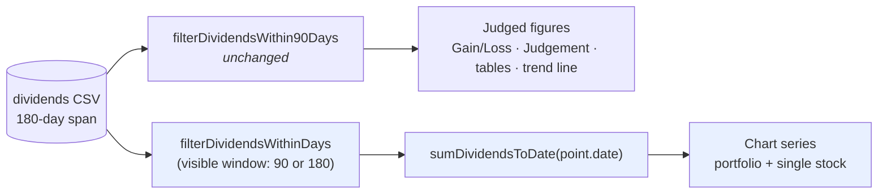

# SITC $1 special dividend: 90-day credit verified; 180-day view now credits it (Issue #817)

## Summary

NYSE:SITC paid a **US$1.00/share** special dividend, ex-dividend **2026-08-03**
(~23% of a ~US$4.30 share). Two deliverables rode this issue: **verify** the
90-day results credit it, and **fix** the 180-day chart view, which plotted the
ex-date price fall with no offsetting credit because every chart series filtered
dividends through a fixed 90-day window. Closes #817.

**1. Verification — the 90-day credit is correct, no code change needed.** Every
processed prediction whose 90-day window covers 2026-08-03 carries the dividend
(details below).

**2. Fix — the chart series now credits dividends over the VISIBLE window.** A
dividend that goes ex between day 91 and day 180 is credited on its ex-date
instead of leaving a naked price cliff. Points on or before day 90 are
arithmetically unchanged, and the **judged** figures (Gain/Loss, Judgement, the
tables and their workings, the trend line) stay capped at the fixed 90-day
window per the #717 precedent — this is display-only.

### Changes

- `docs/projection.js` — two new shared kernels:
  - `filterDividendsWithinDays(dividends, scoreDate, days)` — the window filter
    generalised to any window length (end inclusive).
    `filterDividendsWithin90Days` now delegates to it at 90 days, so there is
    one window rule, not two.
  - `sumDividendsToDate(dividends, date)` — the cash gone ex on or before a
    plotted point, so each point carries the dividends actually in hand by then
    and the series steps up on the ex-date.
- `docs/app.js`:
  - New `getDividendsWithinChartWindow(stockSymbol)` and `chartWindowDays()` —
    the dividend list trimmed to the same window `prepareChartData` plots
    (`GRQProjection.deviceWindowDays`), so the credit and the price series cover
    one period. The existing `getDividendsWithin90Days` is untouched and still
    feeds every judged figure.
  - `calculatePortfolioData` — the per-point credit and the ex-dividend markers
    now use the visible window instead of a hard-coded 90 days.
  - `prepareChartData` single-stock series — the "Actual" line was a **price-only**
    return that ignored dividends entirely, so it disagreed with the card's
    Gain/Loss and with its own trend line (both of which credit dividends). It
    now composes `calculatePerformanceReturn` + `sumDividendsToDate`, making the
    line a true total return. The unused `exDivDates` local went with it.
- `docs/sw.js` + the version-bearing docs files — `APP_VERSION` bumped
  **1.1.88 → 1.1.89** via `scripts/bump_version.ts` so cached dashboards pick up
  the new `app.js`/`projection.js`.
- `README.md` — the `?window=90|180` section documents the window-scoped
  dividend credit, the SITC worked example, and the display-only boundary.
- `Cargo.lock` — `quality.sh` runs `cargo update`; `aho-corasick 1.1.5` and
  `clap`/`clap_builder 4.6.5` were kept, and `regex-automata` was pinned back to
  **0.4.16** because 0.4.17/0.4.18 are inside the 24h supply-chain quarantine
  (`helpers/bump_quarantine_gate.ts` fails closed on them). `cargo audit` is
  clean.

### Verification findings — the 90-day credit (deliverable 1)

Checked every 2026 prediction date whose 90-day window covers the ex-date
(score dates **2026-05-05 → 2026-08-03**) against its published
`<date>-dividends.csv`:

| Result                                       | Count |
| -------------------------------------------- | ----: |
| Holds SITC **and** carries `2026-08-03,NYSE:SITC,1` | **37** |
| Holds SITC but missing the row               |     0 |
| Does not hold SITC (nothing to credit)       |    16 |

Two dates in range — **2026-07-05** and **2026-07-06** — have no dividend CSV at
all because they have no market-data CSV either: they were promoted in the most
recent run and are not yet processed. That is a **pre-existing** data-pipeline
gap, not a dividend bug; `tests/market_data_presence_test.ts` already fails on
`main` for exactly those two dates (confirmed by re-running it on a clean
checkout), and it is the one red check in this PR.

`src/utils.rs` credits `calculate_dividends_for_period(score_date … score_date +
90d)` into `total_return_percent`, and the dashboard credits
`filterDividendsWithin90Days` — both windows are end-**inclusive**, so a score
date of exactly 2026-05-05 (day 90 = 2026-08-03) is credited. **No fix was
needed on the 90-day path.**

One timing note for reviewers: the committed market-data CSVs still end
**2026-07-31**, so the 3 August ex-date price fall is not published yet while the
US$1.00 credit already is. The dividend CSVs are generated over **180 days**
(`create_dividend_csv`), which is why the display fix has the data it needs. The
90-day figures will re-settle when the next market-data refresh lands the
post-ex prices.

### Data flow



## Evidence

Playwright MCP was unavailable in this run environment, so — following the
`scripts/gen_issue_592_evidence.ts` precedent — the evidence is rendered from
the **real shipped kernels over real published data**, composed exactly as
`docs/app.js` now does.

SITC itself cannot be drawn yet (its ex-date price fall is not in the committed
CSVs, see above). **NASDAQ:IMPP on the 2026-02-17 prediction** is the same shape
with data on both sides: a **US$0.546875** dividend (~15% of the US$3.545 buy
price) gone ex on **day 128** — inside the 180-day chart window, outside the
90-day judgement window.


```
$ deno run --allow-read --allow-write scripts/gen_issue_817_evidence.ts
buy price: $3.5450 on 2026-02-16
dividend: $0.546875 ex 2026-06-24 (day 128)
90-day filter credits 0 dividend(s); 180-day window credits 1
final point: before 32.72% -> after 48.15% (+15.43 pp)
```

The grey line is the old behaviour (dividend filtered out at 90 days, ex-date
fall uncredited); the blue line is the fix. The two are identical up to the
ex-date, confirming the ≤ day-90 segment is untouched.

## Test Plan

New `tests/dividend_window_credit_test.ts` (9 tests), driving the real
`docs/projection.js` kernels — RED before the change (`filterDividendsWithinDays
is not a function`), green after:

- `filterDividendsWithinDays` — a day-142 dividend (SITC's, from the 2026-03-14
  prediction) is dropped by a 90-day window and kept by a 180-day one; the
  window end is inclusive; a null/undefined/empty list yields nothing.
- `filterDividendsWithin90Days` — unchanged behaviour, and provably equal to the
  general filter at 90 days.
- `sumDividendsToDate` — credits only the cash gone ex on or before the point,
  inclusive on the ex-date; zero for a null/undefined/empty list.
- **Regression:** the 180-day chart series credits SITC's US$1.00 on the ex-date
  (+~17.5 pp against the pure price return) and not the day before.
- **Boundary:** the 90-day judgement window still credits nothing for a day-142
  dividend, and a chart point on day 90 credits exactly what the old 90-day path
  credited — so the blue segment cannot move.

Full suite: `deno test --allow-read --allow-env tests/*.ts` → **1436 passed, 1
failed**, the failure being the pre-existing `market_data_presence_test.ts` gate
for 2026-07-05/06 described above (fails identically on `main`).
`cargo test --all-targets --all-features` → all green; `cargo clippy`,
`cargo fmt --check`, `deno lint`, `deno check`, `cargo audit` and the
supply-chain quarantine gate all pass.
