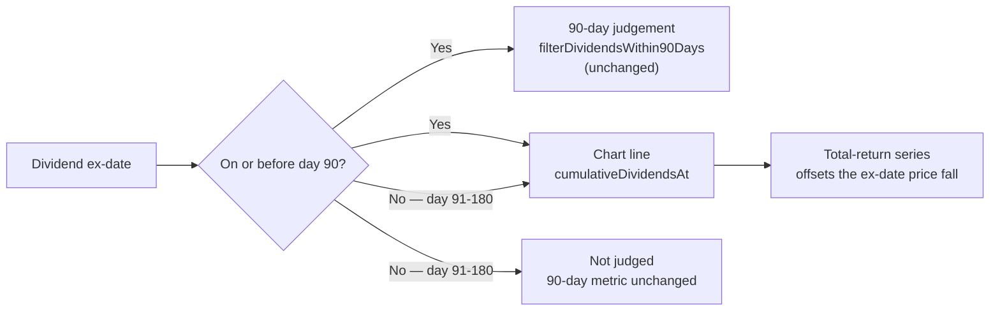

# SITC $1 special dividend: 90-day credit verified, 180-day view fixed

## Summary

Two deliverables from issue #817. **Closes #817.**

**1. Verified — the 90-day results already credit the US$1.00 SITC special.**
No code change was needed. Every prediction whose 90-day window covers the
ex-date carries the dividend (details below).

**2. Fixed — the chart now credits dividends going ex between day 91 and day
180.** The dashboard plots the ex-date price fall across the whole visible
window but capped the offsetting credit at day 90, so a large distribution
inside the 180-day view read as an uncompensated crash. NYSE:SITC's US$1.00
special — ex 2026-08-03, roughly 23% of a ~US$4.30 share — is the reported case.

The fix adds one shared kernel, `GRQProjection.cumulativeDividendsAt(dividends,
pointDate)`, which sums the cash already ex on or before a plotted point, and
routes the chart series through it:

- **Portfolio series** and its ex-dividend markers now follow the plotted point
  instead of stopping at day 90.
- **Single-stock series** now plots **total return**. It previously credited no
  dividends at all, so adding only a day-91+ credit would have left the line on
  a mixed basis (price-only before day 90, price-plus-dividends after). This
  also brings it into line with the table's Gain/Loss column and with the
  portfolio series, which was already a total-return series.

**The 90-day judgement metric is deliberately unchanged** (issue #717
precedent). At day 90 the new display kernel and `filterDividendsWithin90Days`
agree exactly — a dividend ex on or before the point is also ex on or before day
90 — so widening the chart credit cannot move a settled 90-day result. A
regression test locks that parity in.

## Verification of the 90-day credit (deliverable 1)

Checked every committed prediction date in `[2026-05-05, 2026-08-03]` — the
range whose 90-day window covers the 3 August ex-date — that lists NYSE:SITC:

| Check | Result |
| --- | --- |
| Prediction dates listing SITC in the range | **37** |
| Of those, carrying the US$1.00 credit on 2026-08-03 | **37 (100%)** |
| Missing the credit | **0** |
| Distinct amounts recorded | `1` only |

Each date's `NN-dividends.csv` carries `2026-08-03,NYSE:SITC,1`, and
`src/utils.rs` credits dividends going ex inside `[score date, day 90]` via
`calculate_dividends_for_period`. **No gap on the 90-day side.**

The dividend data is also present in the *earlier* (February–May) score files —
32 of them — so the 180-day view always had the cash it needed; it was the
display filter that dropped it.

## Evidence

Screenshots are the same prediction and stock either side of the change:
`?date=2025-09-15&stock=NYSE:AIV&window=180`. NYSE:AIV is the closest analogue
in the committed feed to the SITC case — a US$1.45 dividend going ex 2026-02-27,
**day 165**, on a ~US$7.45 share (19.5% of price), with market data running past
the ex-date. (SITC's own 3 August ex-date is not in the committed feed yet, which
still stops at 2026-07-31, so it cannot be shown on screen.)

**Before** — two dividend cliffs the holder never took: ~-30% at the October
payment and a further step down to ~-43% at the day-165 ex-date.

**After** — a continuous total-return line around +6% to +8%; both cliffs are
gone and the day-165 ex-date is marked, not punished.

## Test Plan

New `tests/dividend_window_180_test.ts` — six tests driving the real shipped
kernel with the SITC figures (score date 2026-04-03, buy US$5.39, last pre-ex
mid US$4.2875, US$1.00 ex on day 122):

- `cumulativeDividendsAt credits a dividend going ex between day 91 and day 180`
  — happy path: US$1.00 credited at day 122 and at the 180-day edge.
- `cumulativeDividendsAt withholds the credit before the ex-date` — nothing is
  credited on 31 July, while the entitlement still travels with the share.
- `cumulativeDividendsAt leaves the 90-day judgement window untouched` —
  regression guard: at day 90 the display kernel equals the judged 90-day total
  (WFG's real schedule, US$0.455).
- `the day-91+ credit offsets the plotted ex-date price fall` — the fix's
  purpose: the total-return line is flat across the ex-date, and the old
  uncredited line understated it by the full 18.6% dividend yield.
- `cumulativeDividendsAt returns 0 for missing, empty or unusable input` — error
  path, including an unparseable point date (returns 0 rather than throwing).
- `cumulativeDividendsAt accumulates several dividends in ex-date order` — edge
  case: three staggered payments across days 42, 122 and 165.

No existing test was modified or removed. Full suite: **1433 passed, 1 failed**
— see below.

## Known pre-existing failure (not caused by this PR)

`tests/market_data_presence_test.ts` fails on `main` at `37d349f`, before any
change here: `docs/scores/2026/July/05.csv` and `06.csv` have no sibling
market-data CSV. Reproduced on a clean checkout of the base branch. Filed as
stSoftwareAU/GRQ-validation#821 — a data-pipeline gap, out of scope for this
change.

## Other checks

- `./quality.sh` — cargo fmt/clippy/check/test, hermetic-test gate, release
  build, `deno fmt`/`lint`/`check` all clean; only the pre-existing failure
  above remains.
- `Cargo.lock` — dependency bump performed by `quality.sh`'s own `cargo update`,
  riding this PR per the repo's dependency policy. Tests pass on the new lock.
- Service-worker `APP_VERSION` bumped 1.1.88 -> 1.1.89 via
  `scripts/bump_version.ts`, as issue #817 requires for any `docs/app.js` change.
- No new dependency, no new input surface, no new HTML sink — the change is
  arithmetic over already-parsed dividend records.
