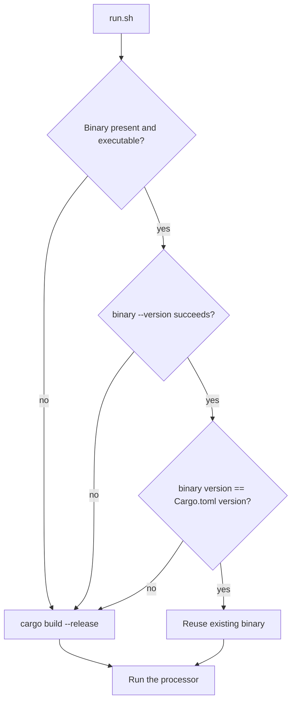
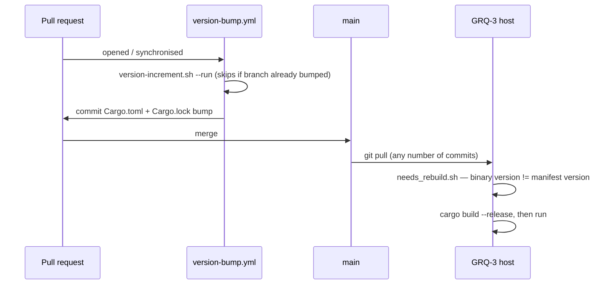

## Summary

The GRQ-3 scorer stage failed every cycle: `run.sh` passes `--market-data-path`
(added in #808), but the deployed `target/release/grq-validation` predated that
change and exited 1 with `error: unexpected argument '--market-data-path'
found`. The rebuild check only diffed `HEAD~1..HEAD`, so a multi-commit pull
whose *latest* commit touched neither `src/` nor `Cargo.toml` reused the stale
binary indefinitely. Closes #818 (recurrence of #816).

The fix adopts the version-number logic used in NEAT-AI-scorer:

- **`scripts/needs_rebuild.sh`** — the rebuild decision is now the deployed
  binary's `--version` against `[package].version` in `Cargo.toml`. A mismatch,
  a missing binary, or a `--version` probe that fails (a pre-clap binary) all
  force a rebuild; an unreadable manifest exits 2 and `run.sh` aborts rather
  than silently reusing the old binary.
- **`scripts/version-increment.sh`** — the guarded Cargo version-increment
  helper ported from NEAT-AI-scorer#20 (`--get-version`, `--bump-patch`,
  `--already-bumped`, `--run`), with the defaults adapted to this repo
  (manifest `Cargo.toml`, base ref `origin/main`). It also updates the
  package's own `Cargo.lock` entry so `cargo --locked` (CI, #124) still builds.
- **`.github/workflows/version-bump.yml`** — the existing Version Bump job now
  runs `version-increment.sh --run` alongside the dashboard app-version bump
  and stages `Cargo.toml`/`Cargo.lock` with it, so every merged change carries
  a new version.

Deploying this recovers GRQ-3 on the next cycle: this PR's own bump to `0.1.11`
makes the stale binary mismatch immediately, forcing a rebuild.

### One deliberate deviation from the ported design

NEAT-AI-scorer ships the bump as a **separate** `version-increment.yml`
workflow. This repo already has `version-bump.yml`, which commits and pushes to
the PR head branch; a second pushing workflow would race with it on the same
ref. The Cargo bump was therefore folded into that job — same guard, same
idempotency, one commit, no race.

### Deno regression avoided

None needed — the new helpers are shell scripts invoked by `run.sh` and the
existing Deno-based CI job; no Node tooling was introduced.

### Two dependent changes

- `helpers/bump_quarantine_gate.ts` now ignores Cargo.lock entries with no
  `source` key. Workspace members (this repo's own crate) are not fetched from
  a registry, so crates.io has no publish time for them — with the version now
  auto-bumped on every PR, the gate would have failed closed on **every** PR.
- `tests/contributing_changelog_test.ts` — **documented test change.** The old
  assertion required a `CHANGELOG.md` section for the exact current
  `Cargo.toml` version. With the version auto-incremented per PR that fails on
  every PR and would fill the changelog with empty sections. It is replaced by
  two assertions on the invariant that still matters: the changelog documents
  at least one released version, and never claims a release *ahead* of the
  shipped package version. No test was removed or commented out.
- `tests/bump_quarantine_gate_test.ts` — the Cargo.lock fixtures gained the
  `source` line real lock files always carry; the existing assertions are
  unchanged.

`quality.sh` also refreshed `regex-automata` 0.4.16 → 0.4.18 (published
2026-08-04, outside the 24 h quarantine window).

## Evidence

Backend/CLI change — no web interface to screenshot. The evidence is the
regression test plus a manual reproduction against the pre-fix `run.sh`, using
a stale stub binary that mimics the deployed one:

```text
$ bash run.sh          # run.sh at HEAD~ (the HEAD~1..HEAD diff check)
Checking if rebuild is needed
error: Could not access 'HEAD~1'
No rebuild needed, using existing binary
Running GRQ validation program
error: unexpected argument '--market-data-path' found
ERROR: Program failed
EXIT=1

$ bash run.sh          # run.sh with this change
Checking if rebuild is needed
rebuild: binary is 0.0.1 but Cargo.toml declares 0.0.2
Building Rust program
Build completed successfully
Running GRQ validation program
REBUILT BINARY RAN: --docs-path docs --market-data-path … --dividend-data-path …
Automated run completed successfully
```

Rebuild decision:



Where the version comes from:



`quality.sh` passes end to end (fmt, clippy, `cargo check`, `cargo test`,
hermetic-test gate, coverage, release build, Deno test/lint/check).

## Test Plan

New — `tests/rebuild_check_test.rs` (7 tests):

- `a_matching_binary_needs_no_rebuild` — exit 1, no rebuild.
- `a_stale_binary_forces_a_rebuild` — the GRQ-3 case; exit 0 naming both
  versions.
- `a_missing_binary_forces_a_rebuild`.
- `a_binary_without_version_support_forces_a_rebuild` — a failed `--version`
  probe is proof of staleness, never swallowed.
- `an_unreadable_manifest_fails_loudly` — exit 2, not "up to date".
- `run_sh_rebuilds_a_stale_binary_instead_of_running_it` — **the regression
  test.** Drives the real `run.sh` against a synthetic crate with a stale stub
  that rejects `--market-data-path`; fails against the pre-fix `run.sh`
  (reproduced above) and passes after it.
- `run_sh_reuses_a_current_binary` — a matching binary is not rebuilt.

New — `tests/version_increment_test.rs` (12 tests): `--get-version` happy path
and both fail-loud paths (missing manifest, absent version); `--bump-patch`
dry-run vs write, dependency versions left untouched, `Cargo.lock` kept in
step, non-semver rejected; `--run` bumping, skipping once the branch has
bumped, and staying conservative when the base ref is unreachable;
`--already-bumped` exit codes; missing-mode usage error.

Modified:

- `tests/version_bump_workflow_test.ts` — two added tests: the workflow runs
  the Cargo increment, and stages `Cargo.toml` with `Cargo.lock`.
- `tests/bump_quarantine_gate_test.ts` — added
  `diffCargoLock ignores the workspace member's own version bump`.
- `tests/contributing_changelog_test.ts` — the changed invariant described
  above.
