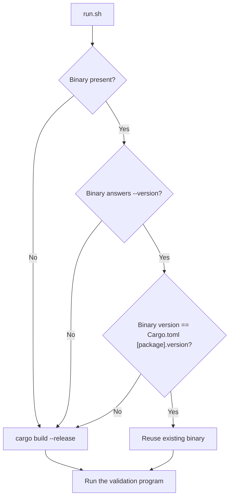
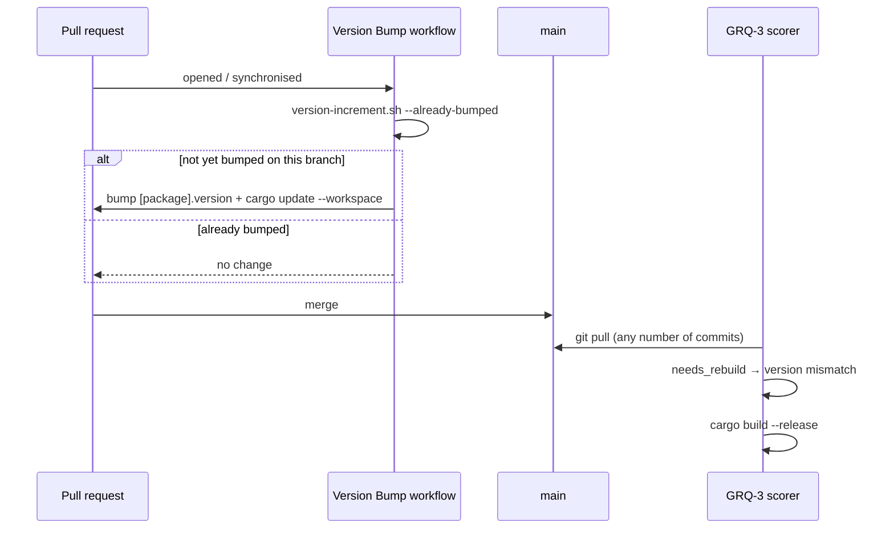

# Fix the stale-binary rebuild check in run.sh (Issue #818)

## Summary

The scorer stage on GRQ-3 failed every cycle: `run.sh` passes
`--market-data-path` (added in #803/#808) but the deployed
`target/release/grq-validation` binary predated that change and exited 1 with
`error: unexpected argument '--market-data-path' found`. The rebuild check only
diffed `HEAD~1..HEAD` for changes under `src/` or `Cargo.toml`, so a pull that
landed several commits at once reused the stale binary whenever the newest
commit happened to touch neither path. This recurred #816.

Following nleck's direction, the fix adopts NEAT-AI-scorer's version-number
logic:

- **`scripts/version-increment.sh`** — ported from NEAT-AI-scorer
  (NEAT-AI-scorer#20) with this repo's defaults (`./Cargo.toml`, `origin/main`).
  Reads, compares and patch-bumps `[package].version`, and short-circuits when
  the branch already differs from its base so a CI re-run cannot ratchet the
  version twice.
- **Version Bump workflow** — now also increments `[package].version` on every
  pull request and refreshes `Cargo.lock` (CI builds `--locked`), so every
  merged change carries a new version. The bump rides the *existing* job rather
  than a second workflow: two workflows pushing to the same PR head ref would
  race.
- **`scripts/needs_rebuild.sh`** — replaces the `HEAD~1..HEAD` diff. `run.sh`
  now rebuilds when the binary's `--version` differs from `[package].version`,
  when the binary is missing, or when it cannot answer `--version` at all (a
  pre-clap-version binary). An unreadable manifest fails loud rather than being
  masked as a clean check.

Merging this recovers GRQ-3 on its next cycle: this PR's own bump (0.1.10 →
0.1.11) makes the deployed binary mismatch immediately, forcing a rebuild.

Closes #818.

## Evidence

Backend/CLI change — no web interface to screenshot. Verified by the tests below
plus a live check against the freshly built release binary:

```console
$ ./target/release/grq-validation --version
grq-validation 0.1.11

$ # current binary — no rebuild
$ bash -c '. scripts/needs_rebuild.sh; needs_rebuild target/release/grq-validation Cargo.toml; echo "rebuild=$?: $REBUILD_REASON"'
rebuild=1: binary version 0.1.11 matches Cargo.toml

$ # the #818 failure: manifest ahead of the deployed binary
$ bash -c '. scripts/needs_rebuild.sh; needs_rebuild target/release/grq-validation /tmp/ahead/Cargo.toml; echo "rebuild=$?: $REBUILD_REASON"'
rebuild=0: binary version 0.1.11 does not match Cargo.toml version 0.1.12
```





## Test Plan

Added:

- `tests/rebuild_check_test.rs` — sources the real `scripts/needs_rebuild.sh`
  and calls `needs_rebuild` against stand-in binaries: missing binary, stale
  binary (the #818 regression case: reports 0.1.9 against a 0.1.11 manifest), a
  binary that rejects `--version`, a binary that prints nothing, a matching
  binary (reused), an unreadable manifest (fails loud, no verdict), and the
  repository's own binary/manifest pair.
- `tests/version_increment_test.rs` — runs `scripts/version-increment.sh` against
  throw-away manifests and git repositories: `--get-version`, missing manifest,
  `--bump-patch` (write and `--dry-run`), non-semver rejection,
  `--already-bumped` both ways, `--run` bumping once then skipping, an
  unreachable base ref, usage errors, and the shipped defaults resolving to this
  repository's manifest.
- `tests/version_bump_workflow_test.ts` — two new cases: the workflow runs
  `scripts/version-increment.sh --run` against a manifest, and it refreshes and
  stages `Cargo.lock` alongside `Cargo.toml`.

Modified (documented business-logic change):

- `tests/contributing_changelog_test.ts` — "CHANGELOG.md is seeded with the
  current Cargo.toml version" became "CHANGELOG.md documents no release ahead of
  Cargo.toml". The package version is now a CI-incremented build identifier
  rather than a release, so requiring a hand-written changelog section per pull
  request would fill the log with empty entries. The surviving invariant is
  still derived, not prose: the changelog must document at least one release and
  may never claim a release the manifest has not reached.

Full `./quality.sh` passes (fmt, clippy, check, `cargo test`, hermetic-test
gate, coverage, release build, Deno test/fmt/lint/check).
