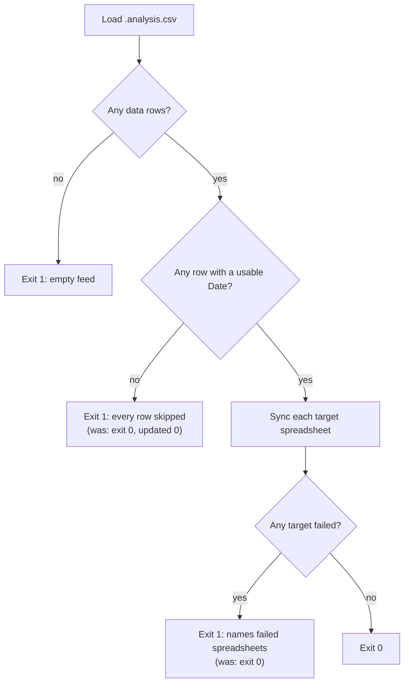

# Fix analysis-sync "Date is empty" WARN flood and silent success

## Summary

The `[WARN] Skipping <ticker> due to invalid Date '': Date is empty` flood in
`GRQ-3-scorer.log` does not originate in GRQ-validation — it comes from the
`analysis-sync` binary in **stSoftwareAU/GRQ-actual**, invoked by
`stSoftwareAU/GRQ` `worker/score_client.sh` with the primary
`GRQ-portfolio/best/.analysis.csv`. The fix was therefore made where the root
cause lives (per the cross-repo root-cause rule) and is documented here.
Closes #819.

### Root cause

`analysis-sync/src/csv_loader.rs` dropped every source row whose `Date` column
would not parse, logging one `warn!` per row, and returned the (empty) row set
as a normal success. `main.rs` then produced
`analysis-sync completed: 1 spreadsheet(s), total updated 0, appended 0` and
exited **0**. A feed with an entirely blank `Date` column — or a parser that
stopped recognising the column — was therefore indistinguishable from "nothing
needed updating". A second fail-loud violation sat alongside it: per-spreadsheet
sync errors were logged with `error!` and then swallowed, so a run in which
every target failed still exited 0.

Whether the blank dates are an upstream feed fault or a parser regression cannot
be determined from the log alone (the Analysis sheet is not reachable from this
run). The fix makes the next occurrence self-diagnosing and non-silent rather
than guessing between the two.

### Change (in stSoftwareAU/GRQ-actual, branch `fix/analysis-sync-fail-loud-819`)

- `csv_loader` returns a `SourceLoad` (usable rows, `data_rows`,
  `skipped_invalid_date`, sample stocks). Per-row detail moved to `debug!`; one
  `warn!` summarises the skipped count, the resolved `Date` column index, and
  sample tickers — hundreds of lines become one.
- New `source_health::assert_source_usable` exits non-zero **before any
  spreadsheet is touched** when the CSV has no data rows, or when every data row
  was skipped for an unparsable `Date`.
- `main::assert_all_targets_synced` makes a failed spreadsheet sync a non-zero
  exit instead of a logged-and-ignored error.
- A partially skipped feed still syncs — only a feed with nothing usable is a
  hard failure.
- `analysis-sync` version bumped 0.2.13 → 0.2.14; README documents the failure
  behaviour.



## Evidence

No web interface is involved — `analysis-sync` is a CLI. Evidence is the
released binary's behaviour on a CSV that reproduces the logged fault (three
rows, all with an empty `Date`):

```text
$ analysis-sync --spreadsheet-id demo --analysis-csv /tmp/empty-dates.csv
[WARN ] Skipped 3 of 3 row(s) in /tmp/empty-dates.csv: Date column (header index 1) did not parse; e.g. NYSE:USAC, NASDAQ:SWBI, NYSE:INN
Error: Source analysis CSV /tmp/empty-dates.csv yielded 0 usable rows out of 3 data row(s): every row was skipped for an unparsable Date (e.g. NYSE:USAC, NASDAQ:SWBI, NYSE:INN). Check whether the Analysis sheet's Date column is populated (feed fault) or has changed format (parser fault).
exit=1
```

Before the change the same input produced three `[WARN] Skipping …` lines,
`total updated 0`, and exit 0. A partially skipped feed still proceeds past the
gate (verified with a two-row CSV where one date parses).

`./quality.sh` in GRQ-actual passes cleanly (fmt, clippy `-D warnings`, check,
34 `analysis-sync` tests, doc build, release build).

## Test Plan

Added in `stSoftwareAU/GRQ-actual`:

- `csv_loader::tests::load_source_analysis_csv_counts_rows_skipped_for_empty_dates`
  — regression test reproducing the logged fault: three rows with blank dates
  yield zero usable rows, `data_rows == 3`, `skipped_invalid_date == 3`.
- `csv_loader::tests::load_source_analysis_csv_reports_zero_data_rows_for_header_only_csv`
- `source_health::tests::errors_when_every_data_row_was_skipped` — fails against
  the unfixed code, which returned success.
- `source_health::tests::errors_when_csv_has_no_data_rows`
- `source_health::tests::accepts_a_load_with_usable_rows` — a partial skip must
  not fail.
- `tests::assert_all_targets_synced_errors_and_names_failed_spreadsheets` and
  `tests::assert_all_targets_synced_is_ok_when_nothing_failed`.

Existing `analysis-sync` tests were updated only for the new `SourceLoad` return
type; none were removed or disabled.

## Remaining human step

This run could not open the pull request in `stSoftwareAU/GRQ-actual` — the
worker's write allowlist is limited to `stSoftwareAU/GRQ-validation`. The branch
`fix/analysis-sync-fail-loud-819` is **pushed** and ready; a human needs to open
and merge it against `Develop`, then redeploy the scorer host. See the
`needs-human` comment on #819.
