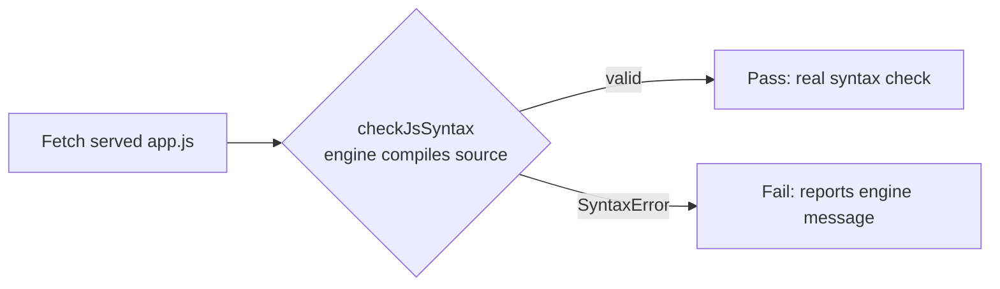

## Summary

`scripts/debug/test_page_load.ts` "checked" the served page by running regexes
and substring greps over its **source text**: it scanned `app.js` for
adjacent `const`/`let`/`var`/`function` duplicate declarations and checked the
HTML for the literal substrings `<title>` and `app.js`. None of that asserted
observable behaviour — the duplicate-declaration regexes only matched
declarations that were textually *adjacent* (so they missed real duplicates and
broke on any reformat), and the substring checks verified nothing a user can
see. (In fact `docs/index.html` sets its title via JavaScript and has no
literal `<title>` element, so the old `<title>` grep was already meaningless.)

This replaces the grep-as-assertion logic with genuine, behaviour-based checks:

- Added `helpers/js_syntax.ts` with `checkJsSyntax()`, which validates
  JavaScript by **compiling** it with the engine (parse-only, never executed).
  Compilation rejects real syntax errors — including non-adjacent lexical
  redeclarations — regardless of formatting, which is exactly what the brittle
  regexes pretended to do.
- Rewrote the debug script to assert **observable** behaviour: the page and
  `app.js` are served (HTTP 200) and `app.js` parses as valid JavaScript via
  `checkJsSyntax()`. The `<title>`/`app.js` substring greps and the
  duplicate-declaration regex array are gone.
- Added `tests/js_syntax_test.ts` exercising the real helper (happy path,
  empty input, non-adjacent duplicate `const`, malformed syntax, and the
  production `docs/app.js`).

Closes #82.

### Deno regression avoided

Validated `app.js` syntax with the engine's own `Function` constructor and
`deno test` rather than introducing a Node bundler or linter to the Deno repo.

## Evidence

Backend/CLI change — no web UI to screenshot. Verified via the new and existing
Deno tests and the full quality gate.

- `deno test --allow-read tests/*.ts` → `199 passed, 0 failed` (includes the 5
  new `checkJsSyntax` tests).
- `./quality.sh` → `Quality checks completed successfully!` (exit 0).
- The `rejects non-adjacent duplicate const` test reproduces the case the old
  adjacency regex silently passed, and now fails correctly.

## Test Plan

- Added `tests/js_syntax_test.ts`:
  - `checkJsSyntax - accepts valid JavaScript` (happy path)
  - `checkJsSyntax - empty source is valid` (edge case)
  - `checkJsSyntax - rejects non-adjacent duplicate const` (regression for the
    regex blind spot)
  - `checkJsSyntax - rejects malformed syntax` (error path)
  - `checkJsSyntax - production docs/app.js parses cleanly` (real asset)
- Rewrote `scripts/debug/test_page_load.ts` to assert HTTP 200 plus genuine
  `app.js` syntax validity; removed the source-grep blocks.
- No existing tests were removed or disabled.
