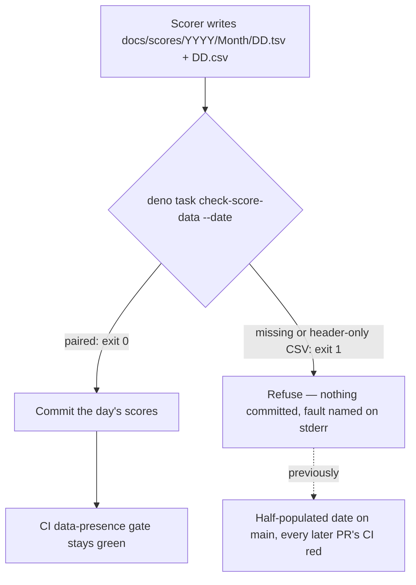

# Refuse to promote a score date with no market data (Issue #821)

## Summary

The data-presence gate failed on `main` because `docs/scores/2026/July/05.tsv`
and `06.tsv` were promoted for two dates on which the scorer had fetched no
market data — the sibling `05.csv`/`06.csv` were never written — so `./quality.sh`
and every PR's CI run failed for reasons unrelated to the PR under review.

The issue offered two fixes: backfill the two CSVs, or make the daily promotion
job refuse to promote a date it cannot pair with market data. **The backfill
already landed** in PR #820 (`cd97202`, "Backfill missing market data for
2026-07-05/06"), so the gate is green on `main` today. This PR closes the
remaining hole — the root cause — so the same half-populated date cannot reach
`main` again.

`scripts/check_score_data_pairing.ts` is the stable entry point the external
daily scorer invokes immediately **before** its commit, alongside the existing
`deno task refresh-indices`:

```bash
deno task check-score-data --date 2026-08-05   # the date being promoted
deno task check-score-data                     # sweep every committed date
```

Its contract is the mirror image of the refresh-indices wrapper: that wrapper
must never block the commit, this guard exists to block it. It exits non-zero
and names every offending path whenever a prediction TSV has no sibling
market-data CSV carrying rows beyond the header. It never passes vacuously
either — an empty score tree, a requested date whose TSV was never written, and
a malformed `--date` all fail loud.

The CI gate in `tests/market_data_presence_test.ts` is unchanged and remains the
backstop; it was correct and has not been relaxed. Its emptiness rule is now
imported from the guard so both share one source of truth.

Closes #821.

## Evidence

Backend/CLI change — no web interface to screenshot. Verified by running the new
guard against the offending tree, checked out at `37d349f` (the commit named in
the issue) in a scratch worktree:

```text
$ deno run --allow-read scripts/check_score_data_pairing.ts \
    --scores-dir /tmp/grq-821-repro/docs/scores --date 2026-07-05 --date 2026-07-06
check_score_data_pairing: REFUSING to promote — the following prediction dates have no market data:
  /tmp/grq-821-repro/docs/scores/2026/July/05.csv (missing)
  /tmp/grq-821-repro/docs/scores/2026/July/06.csv (missing)
exit=1
```

Had the scorer called the guard on 2026-07-05, the two dates would never have
been committed. Against the current tree it passes:

```text
$ deno task check-score-data
check_score_data_pairing: market data paired for 364 committed prediction dates
exit=0
```

Where the guard sits in the daily flow:



`./quality.sh < /dev/null` passes cleanly (exit 0), including the previously
failing data-presence gate.

`cargo update` inside `quality.sh` proposed `regex-automata` 0.4.16 → 0.4.18.
That release was ~23h 50m old at the time of the run, inside the 24h
supply-chain quarantine (#1613), so the lockfile bump was reverted rather than
shipped.

## Test Plan

New — `tests/score_data_pairing_test.ts` (15 tests, all calling the real guard
with injected in-memory trees plus the live repo tree):

- **Regression** — `refuses to promote a date whose market-data CSV is missing`
  reproduces the exact 2026-07-05 / 06 failure: exit 1 naming `05.csv (missing)`
  while the paired `06` date is not reported.
- Happy path — `promotion proceeds when the date is paired` (exit 0), and
  `the committed tree passes the guard` against the real `docs/scores`.
- Error paths — header-only CSV, a requested date with no prediction file, an
  invalid `--date`, and an empty score tree all exit 1 with a named fault.
- Whole-tree sweep with no `--date`.
- `predictionTsvPath` date mapping plus rejection of malformed/impossible dates
  (`2026-7-5`, `20260705`, `2026-13-01`, `not-a-date`, empty).
- `collectPredictionTsvs` collects day-numbered TSVs and ignores `-analysis.csv`
  helper files.
- `parseArgs` happy path, defaults, unknown flag, and value-less `--date`.

Modified — `tests/market_data_presence_test.ts`: the local `isMarketDataCsvEmpty`
definition is replaced by an import from the guard (single source of truth). No
test was removed or weakened; all six existing tests still run against the
imported function and pass.
