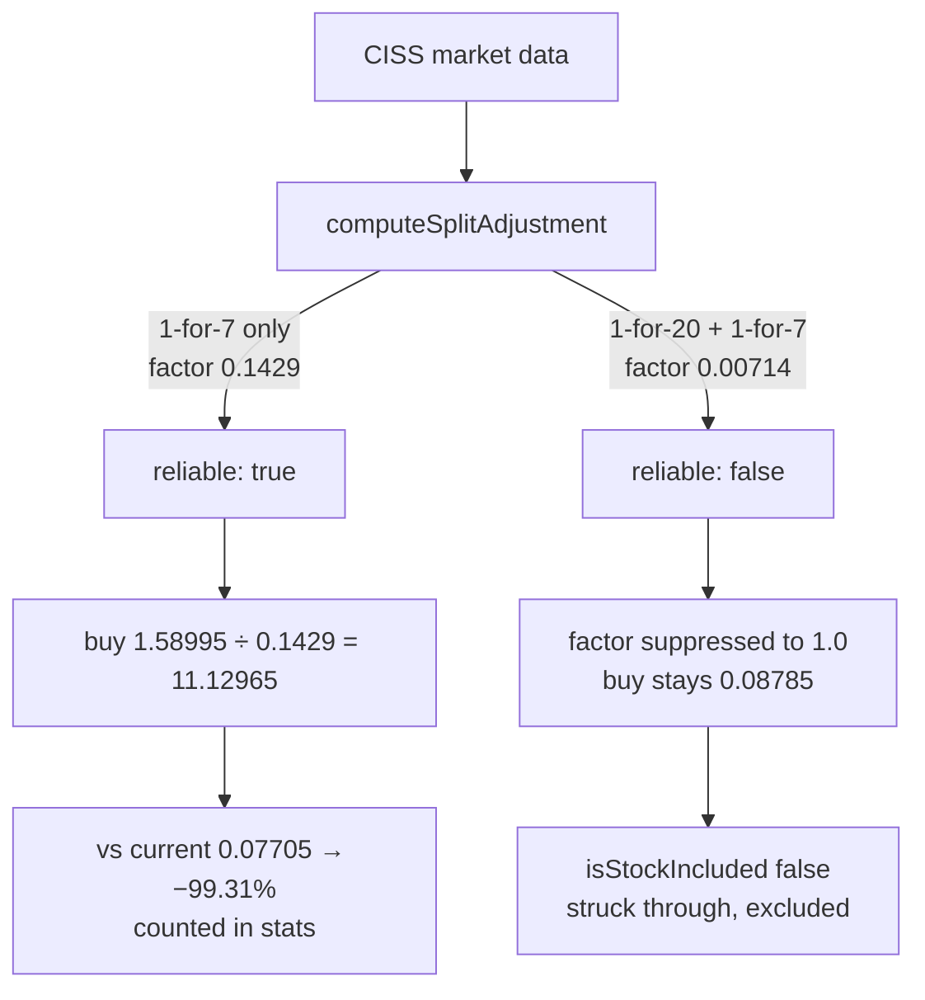

# PR Summary — Verify NASDAQ:CISS reverse-split handling (issue #828)

## Summary

The huge loss reported for `NASDAQ:CISS` (C3is Inc) on the 2026-02-18 score page
was verified against the committed market data and the shared split kernels in
`docs/projection.js`. **The loss is genuine, not a reverse-split artefact — no
display defect was found**, so this PR adds the regression tests that lock the
verified behaviour in. Closes #828.

Verification (all figures reproduced by the new tests):

| Score date | Splits after the score date               | Cumulative factor | Reliable | Outcome                                          |
| ---------- | ----------------------------------------- | ----------------- | -------- | ------------------------------------------------ |
| 2026-02-18 | 1-for-7 (2026-04-27)                      | 0.1429            | yes      | buy 11.12965 → 0.07705 = **−99.31%**, counted     |
| 2026-01-23 | 1-for-20 (2026-01-26) + 1-for-7           | 0.00714           | no       | factor suppressed to 1.0, excluded (strikethrough) |

- **2026-02-18** — the single 1-for-7 reverse split clears every threshold
  (magnitude 7 ≤ the 10:1 `MAX_PLAUSIBLE_COEFFICIENT` cap; observed price ratio
  0.140 vs the 0.1429 coefficient, inside the ±15% cross-check; 0.1429 ≥ the
  1/50 floor). The buy midpoint `(1.7199 + 1.46) / 2 = 1.58995` is restated onto
  the post-split basis as `11.12965`, and the latest post-split midpoint is
  `0.07705` — both sides on the same basis, so the ~−99.3% figure is a real
  collapse from dilution.
- **2026-01-23** — the additional 1-for-20 event (magnitude 20) exceeds the 10:1
  cap and drags the cumulative factor to 0.00714, below the 1/50 reverse-split
  floor, so `computeSplitAdjustment` flags the series unreliable, no factor is
  applied, and CISS is excluded from every aggregate — the designed #292/#293
  behaviour.

No production code changed.

## Evidence

Backend/kernel change only — no web interface was altered, so no screenshot was
captured. The evidence is the test run against frozen extracts of the real
committed market data, exercising the real `docs/projection.js` kernels
(`computeSplitAdjustment`, `getSplitAdjustment`, `getBuyPrice`,
`currentPriceFromLatest`, `calculatePerformanceReturn`, `isStockIncluded`):

```text
running 4 tests from ./tests/ciss_reverse_split_test.ts
CISS 2026-02-18 - single 1-for-7 reverse split is reliable and applied ... ok
CISS 2026-02-18 - reported ~-99% loss is genuine, not a split artefact ... ok
CISS 2026-01-23 - implausible 1-for-20 split flags the series unreliable ... ok
CISS 2026-01-23 - unreliable series is excluded from the stats ... ok

ok | 4 passed | 0 failed (4ms)
```

The tests were mutation-checked: raising `MAX_PLAUSIBLE_COEFFICIENT` to 100 and
`MAX_CUMULATIVE_FACTOR` to 5000 in `docs/projection.js` fails the two 2026-01-23
tests, confirming they detect a real regression in the guard rather than passing
vacuously. `docs/projection.js` was restored unchanged afterwards.



`./quality.sh` passes cleanly.

## Test Plan

- Added `tests/ciss_reverse_split_test.ts` with four tests:
  - `CISS 2026-02-18 - single 1-for-7 reverse split is reliable and applied` —
    factor is 1/7 and reliable, and `getSplitAdjustment` applies it.
  - `CISS 2026-02-18 - reported ~-99% loss is genuine, not a split artefact` —
    buy price 11.12965, current 0.07705, return −99.31%, `isStockIncluded` true.
  - `CISS 2026-01-23 - implausible 1-for-20 split flags the series unreliable` —
    cumulative 0.00714 breaches the 1/50 floor, `reliable` false, applied factor
    suppressed to 1.0.
  - `CISS 2026-01-23 - unreliable series is excluded from the stats` — buy price
    is the raw midpoint 0.08785 and `isStockIncluded` is false.
- Added frozen fixtures `tests/fixtures/ciss_reverse_split_feb18.csv` and
  `tests/fixtures/ciss_reverse_split_jan23.csv`, extracted verbatim from
  `docs/scores/2026/February/18.csv` and `docs/scores/2026/January/23.csv`.
- Documented both fixtures in `tests/fixtures/README.md`.
