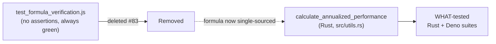

## Summary

`test_formula_verification.js` was an assertion-free demo script (relocated to
`scripts/debug/` by issue #78). It re-implemented the annualised-performance
formula and unconditionally printed `✅ All formulas working correctly`, so no
input could ever make it fail — a false green that also kept a second copy of a
formula whose production home is the Rust `calculate_annualized_performance`
(already WHAT-tested in `src/utils.rs`).

Per the issue's accepted outcome (b), and consistent with the issue #104
precedent that deleted recompute-only JS tests, the demo script has been
**deleted**. This removes the false green and the duplicated formula. References
to it in `run_annualized_tests.sh` and `docs/fixes/TEST_CASES_SUMMARY.md` were
updated to point at the real Rust/Deno tests, and the repo-root layout test was
updated to assert the script stays deleted.

Closes #83.

## Evidence

Backend/tooling change only — no web interface to screenshot.

- Full Deno suite: `deno test --allow-read tests/*.ts` → **194 passed, 0 failed**.
- New regression test fails against the un-deleted tree and passes after deletion
  (TDD evidence captured below).
- `deno fmt` / `deno lint` / `deno check` on `tests/*.ts`: clean.
- `bash -n run_annualized_tests.sh`: clean.

## Test Plan

- Added `tests/repo_root_layout_test.ts::"assertion-free formula-verification demo is deleted (issue #83)"`
  — asserts `test_formula_verification.js` exists neither at the repo root nor
  under `scripts/debug/`. Fails before deletion, passes after.
- Removed `test_formula_verification.js` from the `DEBUG_SCRIPTS` existence list
  in the same test (the file is deleted, not relocated).
- Existing annualised-performance coverage retained unchanged in
  `tests/annualized_performance_test.ts` and the Rust suite.
