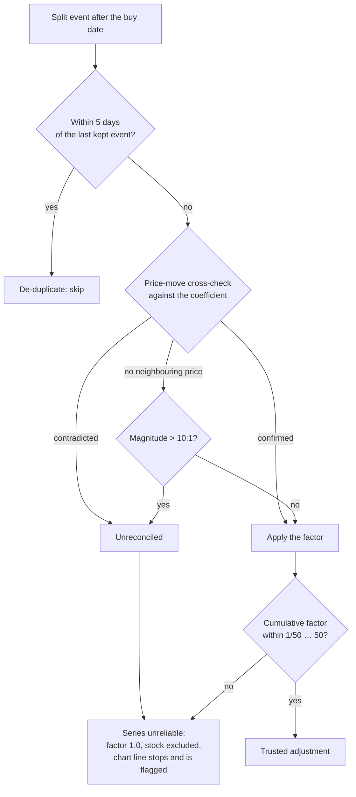

## Summary

The NASDAQ:MVIS chart for prediction date 2026-02-19 jumped from about −60% to
about +400% in early August. MVIS had a **genuine** 1-for-15 reverse split on
2026-08-03 (`split_coefficient = 0.0667`, correctly recorded in
`docs/scores/2026/February/19.csv`), but its magnitude (15) exceeded the 10:1
`MAX_PLAUSIBLE_COEFFICIENT` cap, so the series was flagged unreliable, **no**
factor was applied, and raw post-split prices (~$3.85) were plotted against the
raw pre-split buy price (~$0.78).

Two changes, mirrored in `docs/projection.js` and `src/utils.rs` as the existing
design requires:

1. **A single split above 10:1 is now trusted when the ±15% price-ratio
   cross-check confirms it.** For MVIS the observed ratio is 0.0637 against the
   0.0667 coefficient (~4.5% apart), so the split is corroborated real market
   data and the factor is applied. The magnitude cap alone no longer condemns a
   series. An **unavailable** cross-check (no neighbouring price to compare) is
   *not* confirmation — an above-cap event with nothing to corroborate it stays
   untrusted, so the change cannot silently wave through an unverifiable split.
2. **A split that genuinely cannot be reconciled no longer fails silently.**
   `computeSplitAdjustment` now also returns `unreconciledDate` (the earliest
   offending split), and the single-stock chart **stops** its Actual line there
   and marks the break with a red "Unreconciled Split (line stops)" triangle,
   instead of plotting raw unadjusted prices as if nothing happened.

The de-duplication window and the 1/50 … 50 cumulative-factor bound are
unchanged; only the single-event cap's interaction with the cross-check moved.

Closes #831.

## Evidence

No screenshot: the Playwright MCP browser is not available in this container
(no browser binary is installed either), so the visual change is evidenced by
the real shipped kernels instead. Running `GRQProjection.getBuyPrice` /
`adjustHistoricalPriceToCurrent` / `calculatePerformanceReturn` over the frozen
MVIS extract reproduces the reported artefact and shows it gone — the "before"
column is the old behaviour (unreliable series ⇒ factor suppressed to 1.0, raw
prices both sides):

| Plotted date | Before (raw, as reported) | After (split applied) |
| ------------ | ------------------------: | --------------------: |
| 2026-07-31   |                    −68.1% |                −68.1% |
| 2026-08-03   |                **+401.7%** |            **−66.6%** |
| 2026-08-13   |                   +442.5% |                −63.8% |
| 2026-08-14   |                   +176.7% |                −81.6% |

The +401.7% at the split date is the ~400% cliff in the issue's screenshot; with
the confirmed factor applied, both sides of the ratio sit on the post-split basis
and the line stays continuous through a real ~−81.6% loss.

Reconciliation flow after this change (also folded into the README's
*Split-reconciliation thresholds*):

`./quality.sh` passes cleanly (cargo fmt/clippy/check/test, hermetic-test check,
tarpaulin, release build, Deno test/fmt/lint/check).

## Test Plan

New regression tests — `tests/mvis_reverse_split_test.ts`, against the frozen
extract `tests/fixtures/mvis_reverse_split_feb19.csv` (real committed MVIS data):

- `MVIS 2026-02-19 - 1-for-15 reverse split confirmed by the price move is
  trusted` — factor 1/15, `reliable: true`, `unreconciledDate: null`, factor
  applied rather than suppressed.
- `MVIS 2026-02-19 - the ~+400% chart jump becomes the real ~-81.6% loss` — buy
  price restated to 11.73825, current 2.165, return −81.56%, stock included.
- `MVIS - an UNCONFIRMED 1-for-15 split stops the actuals line and flags it` —
  the same series with split-day quotes left on the pre-split basis: unreliable,
  `unreconciledDate` = 2026-08-03, factor 1.0, the plotted series is cut at the
  split and the flag anchors on 2026-07-31.

New kernel tests in `tests/projection_kernels_test.ts`:

- `computeSplitAdjustment: large split confirmed by the price move -> reliable`
- `computeSplitAdjustment: large split with no price to cross-check ->
  unreliable`
- `truncateActualsAtUnreconciledSplit` — stops the line and flags it; leaves a
  reconciled series untouched; handles empty, all-after-cut and missing series.

New Rust mirror tests in `src/utils.rs`:

- `test_compute_split_adjustment_large_split_confirmed_by_price_is_reliable`
- `test_compute_split_adjustment_large_split_without_prior_price_unreliable`

### Existing tests modified (business-logic change, documented)

The 10:1 cap alone no longer condemns a series, so three fixtures that paired an
above-cap coefficient with a **matching** price move (previously "unreliable")
would now be trusted. Each was re-pointed at the behaviour it was written to
guard — an above-cap split the price move does **not** confirm — rather than
removed:

- `tests/projection_kernels_test.ts` — `computeSplitAdjustment: implausible
  coefficient …` renamed to `… with no confirming price move -> unreliable`; the
  50:1 coefficient now sits against a ~5-fold fall (100 → 19.5 midpoint), and the
  test additionally asserts the surfaced `unreconciledDate`.
- `src/utils.rs` — `test_compute_split_adjustment_implausible_coefficient_unreliable`
  changed the split-day price from 2.0 to 22.0 for the same reason.
- `src/utils.rs` — `test_portfolio_performance_excludes_implausible_split`'s
  `NYSE:BADSPLIT` fixture falls 100 → 20 (not 100 → 2), so its 50:1 coefficient
  is still contradicted and the stock is still excluded from the portfolio.

No test was commented out or deleted. `tests/ciss_reverse_split_test.ts` is
unchanged behaviourally: its 1-for-20 event *is* confirmed by the price move, but
the cumulative factor still breaches the 1/50 floor, so the series remains
unreliable — only the explanatory comments/assertion messages were corrected.

### Documentation

- `README.md` — *Split-reconciliation thresholds* rewritten for the confirmation
  rule, the `unreconciledDate` / chart-stop behaviour, and the decision flowchart
  above.
- `tests/fixtures/README.md` — new MVIS fixture documented; the CISS jan23 entry
  corrected to name the cumulative floor as the reason it is rejected.
