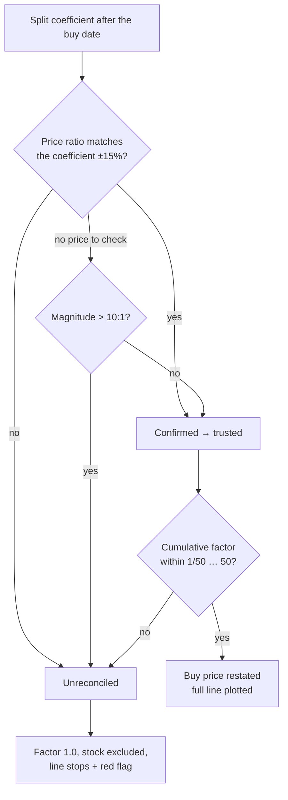

# 1-for-15 reverse split unadjusted — MVIS chart jumps ~400% after day 90

## Summary

NASDAQ:MVIS had a genuine 1-for-15 reverse split on 2026-08-03
(`split_coefficient = 0.0667`), but the split-reconciliation logic condemned any
single event above the 10:1 `MAX_PLAUSIBLE_COEFFICIENT` on magnitude **alone**.
The factor was therefore suppressed to `1.0`, raw post-split prices (~$3.90) were
plotted against the raw ~$0.78 buy price, and the 2026-02-19 chart jumped from
about −30% to about +400% the day the split landed.

Two changes, in both mirrored implementations (`docs/projection.js`,
`src/utils.rs`):

1. **A split above 10:1 is trusted when the price move confirms it.** The
   existing ±15% price-ratio cross-check is now the deciding test: MVIS's
   observed ratio 0.25 / 3.92575 = 0.0637 against the 0.0667 coefficient passes,
   so the buy price is restated onto the post-split basis and the real ~−81%
   outcome is plotted. Magnitude alone no longer condemns a series; an oversized
   event the prices **contradict** — or one with no pre-split price available to
   confirm it — is still unreconciled. Every other threshold (5-day
   de-duplication, the 1/50 … 50 cumulative bound, ±15% tolerance) is unchanged.
2. **An unreconciled split no longer fails silently on the chart.**
   `computeSplitAdjustment` now returns `unreconciledDate` — the first split it
   could not reconcile (the first split of the series when the cumulative bound
   is what breaks). The single-stock actuals line **stops** there
   (`truncateAtUnreconciledSplit`) and a red dashed
   _"Unreconciled split — actuals stop"_ annotation
   (`unreconciledSplitAnnotation`) marks it, instead of drawing prices across an
   unadjusted split. The aggregate view is unaffected — an unreliable series is
   already dropped from every aggregate by `isStockIncluded` / `is_priceable`.

Closes #831.

## Evidence

**Before** — NASDAQ:MVIS, prediction date 2026-02-19, 180-day window: the grey
"Actual (After 90 Days)" line leaps to ~+440% in August, an artefact of the
unadjusted 1-for-15 split.

**After** — the same chart with the split reconciled: the line stays on one
basis and settles at the real ~−81%.

**Unreconciled split is flagged** — NASDAQ:CISS, prediction date 2026-01-23,
whose cumulative factor (0.00714) breaches the 1/50 floor. The actuals line stops
at the 2026-01-26 split and the red dashed marker names why.

Screenshots were captured against the real dashboard served from `docs/`, driven
by the container's headless Chromium.

## Test Plan

New:

- `tests/mvis_reverse_split_test.ts` — frozen extract of the committed MVIS data
  (`tests/fixtures/mvis_reverse_split_feb19.csv`) run through the real kernels:
  the 1-for-15 split is reliable and applied; the buy price restates to
  $11.73825; the 2026-08-13 point that used to plot at +442% is a −63.8% loss;
  no plotted point moves more than 100 pp day-to-day; and an MVIS-shaped split
  the prices do **not** confirm stays unreliable, reports its date and stops the
  line. Mutation-checked: reverting the trust rule in `docs/projection.js` fails
  three of the four tests.
- `tests/unreconciled_split_chart_stop_test.ts` — `truncateAtUnreconciledSplit`
  (market-data and Chart.js point shapes, no-op when reconciled, no input
  mutation), `unreconciledSplitAnnotation` (line on the split date, visible
  label, none when there is nothing to flag) and `unreconciledSplitDate`
  (reconciled → null; contradicted split → its date; cumulative-bound breach →
  the first split).
- `src/utils.rs` — Rust mirrors: confirmed 50:1 → reliable, unconfirmed 50:1 →
  unreliable, oversized split with no confirming price → unreliable, and the
  real MVIS 1-for-15 → reliable with factor 1/15.

Modified (business-logic change, documented deliberately — no test was disabled):

- `tests/projection_kernels_test.ts` — the old
  `computeSplitAdjustment: implausible coefficient -> unreliable` case used a
  50:1 coefficient the prices **confirmed** (99 / 1.95 ≈ 50.8), which is now
  correctly trusted. It is split into an unconfirmed case (still unreliable, and
  now asserting the reported `unreconciledDate`) plus new confirmed and
  no-price-to-confirm cases.
- `src/utils.rs` — `test_compute_split_adjustment_implausible_coefficient_unreliable`
  renamed to `..._unconfirmed_...` with a price series that genuinely
  contradicts the coefficient, and `test_portfolio_performance_excludes_implausible_split`'s
  `NYSE:BADSPLIT` fixture changed to a 50:1 coefficient the prices contradict
  (98 → 98) so it remains the unreconcilable case the test is about.
- `tests/ciss_reverse_split_test.ts` — assertions unchanged; only the comments
  and one assertion message, which credited the 10:1 cap for a verdict the 1/50
  cumulative floor actually delivers.

Gate: `./quality.sh` — every Rust gate (fmt, clippy, check, tests, hermetic
tests, coverage, release build) passes and 1453 Deno tests pass. Two Deno tests
fail on `main` **before** this change and still fail after it, for an unrelated
reason: `docs/scores/2026/July/19.tsv` has no sibling `19.csv`, so
`tests/market_data_presence_test.ts` and `tests/score_data_pairing_test.ts` flag
the missing market data. That is a data-tree gap from the daily job, not a code
defect in this change.

Docs updated: README _Split-Aware Returns_ and _Split-reconciliation thresholds_
(now with a decision-flow Mermaid diagram; the previously documented
"−90% … +300% return bound" was removed because no such rule exists in either
implementation), plus `tests/fixtures/README.md` for the new MVIS fixture.

Dependency bump: `Cargo.lock` was refreshed by `quality.sh`'s `cargo update`
step; all Rust gates pass on the updated lock file.
