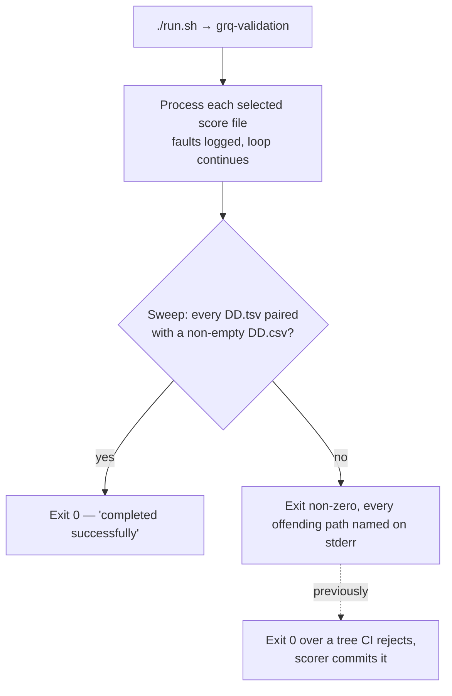

# Fail loud when a run leaves a prediction date without market data (Issue #833)

## Summary

`docs/scores/2026/July/19.tsv` reached `main` with no sibling `19.csv`, so the
data-presence gate and the promotion guard failed on every PR cut from `main`.
Closes #833.

The issue offered two fixes: backfill the market data for 2026-07-19, or make
the promotion fail loud rather than leave the tree in a state the gate rejects.

**The backfill already landed on `main`** in commit `59820c3f` ("Backfill market
data for promoted July 19 prediction"), which added
`docs/scores/2026/July/19.csv` (395 rows) and `19-dividends.csv`. Both tests the
issue names pass against the committed tree today (see Evidence). This PR closes
the remaining hole — the root cause — so the same half-populated date cannot
reach `main` again.

### What actually happened

The market-data CSVs are not written by the promotion commit. Git history shows
the two-step pipeline plainly: every "Daily market data + embargoed score
promotion" commit adds only `DD.tsv`, `DD-analysis.csv` and an `index.json`
entry, and the sibling `DD.csv` arrives in a later "Auto commit models" run of
`./run.sh`. On 2026-08-17 that second run happened the same day and `18.csv`
landed within hours; on 2026-08-18 it did not, and `main` sat unpaired.

The processor is what should have caught it, and it did not. Two silent-failure
paths in `src/main.rs` let a run finish over an unpaired tree and still exit `0`:

- every fault inside the per-score-file loop — unreadable tickers, a failed
  market-data write, a failed performance calculation — was logged with
  `log::error!` and stepped over, so one bad file could not abandon the rest of
  the run; and
- a score entry the default 180-day age filter never selected (or that was
  appended to `index.json` after the run) was never visited at all.

Either way `./run.sh` printed "Program completed successfully" and exited zero,
so nothing downstream refused the commit. Absence of an explicit failure is not
success.

### The fix

Before it reports completion, the processor now sweeps the committed score tree
and applies the same rule as the CI gate and the `#821` promotion guard: any
day-numbered `DD.tsv` whose sibling `DD.csv` is missing or carries nothing
beyond the header is a fault. It exits non-zero naming every offender, so the
operator sees the gap on the run that caused it rather than on an unrelated PR's
CI. An empty score tree, and an unreadable one, fail loud too — the sweep can
never pass vacuously.

The loop keeps logging-and-continuing, deliberately: one bad score file must
still not abandon the rest of the run. What changed is the *outcome* check, so a
transient upstream gap that leaves an already-populated CSV intact (the `#687`
"preserve existing rows" path) still exits zero, while a genuinely unpaired date
does not.

New in `src/utils.rs`: `collect_prediction_score_files` and
`find_unpaired_prediction_dates`.

## Evidence

Backend/CLI change — no web interface to screenshot.

**The data gap named in the issue is already fixed on `main`.** Both tests it
cites pass against the committed tree:

```text
$ deno test --allow-read tests/market_data_presence_test.ts tests/score_data_pairing_test.ts
data-presence gate: every committed prediction date has a non-empty sibling market-data CSV ... ok (64ms)
checkScoreDataPairing: the committed tree passes the guard ... ok (74ms)
ok | 21 passed | 0 failed (175ms)
```

**The root-cause fix, run against the offending tree.** `0a625f04` is the
promotion commit that shipped `19.tsv` with no `19.csv`, checked out into a
scratch worktree with empty data roots:

```text
$ ./target/release/grq-validation --docs-path /tmp/grq-833-repro/docs \
    --market-data-path <empty-root> --dividend-data-path <empty-root>
Error: 1 prediction date(s) have no market data after processing — the tree is in
a state the data-presence gate rejects. Run with --regenerate-empty once the
upstream data is available:
  /tmp/grq-833-repro/docs/scores/2026/July/19.csv (header-only/empty)
exit=1
```

Before this change the same run exited `0` with "GRQ Validation processor
completed successfully", which is why the scorer committed the tree. Against the
current tree it passes:

```text
$ ./target/release/grq-validation --docs-path /tmp/grq-833-now/docs ...
[INFO grq_validation] GRQ Validation processor completed successfully
exit=0
```

Where the check sits in the daily flow:



`./quality.sh < /dev/null` passes cleanly (exit 0), including the 1481 Deno tests
and the hermetic-integration gate. `cargo update` proposed no dependency change,
so there was nothing to quarantine-check.

## Test Plan

New — `tests/prediction_pairing_gate_test.rs` (8 tests, hermetic: synthetic
fixtures in `tempfile::tempdir()`, both data roots passed explicitly):

- **Regression** — `processor_fails_loud_when_a_promoted_date_has_no_market_data`
  reproduces the July 19 shape (a prediction TSV the age filter never selects,
  with no sibling CSV) by running the real binary end to end, and asserts a
  non-zero exit whose stderr names `19.csv (missing)`. Verified failing against
  the unfixed `src/main.rs` ("a run leaving a prediction date unpaired must exit
  non-zero") and passing after it.
- Happy path — `processor_succeeds_when_every_promoted_date_is_paired` (exit 0)
  and `no_offenders_when_every_prediction_date_is_paired`.
- Error paths — `a_missing_market_data_csv_is_reported_as_missing`,
  `a_header_only_market_data_csv_is_reported_as_empty`,
  `an_empty_score_tree_is_a_fault_not_a_pass`, and
  `an_unreadable_score_tree_is_a_fault`.
- `collect_prediction_score_files_recurses_and_ignores_helper_files` — recurses
  every year/month directory and collects only day-numbered TSVs, ignoring
  `-analysis.csv`, `-dividends.csv` and non-day TSVs.

No existing test was removed, weakened or modified.

Documentation — README gains "Processor pairing gate: the run's exit code is
honest (issue #833)" beside the existing #821 promotion-guard section, with a
Mermaid diagram of the new exit-code contract.
