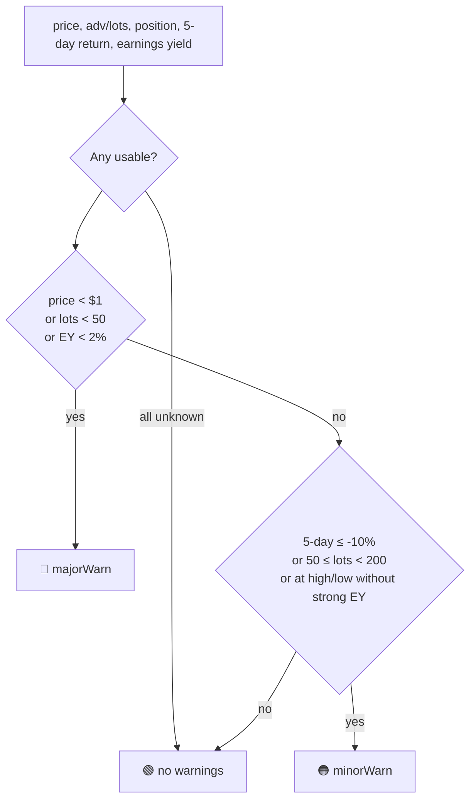

# Shared stock-pick metrics helper (lots, EY, 5-day return, 52-week position, traffic light)

## Summary

Adds `docs/pick_details.js`, the shared maths module every other #835 sub-issue
consumes, so the thresholds behind the user's manual stock-pick spreadsheet live
in exactly one tunable place. Closes #836.

The module is a classic `<script>` (no `import`/`export`) publishing
`globalThis.GRQPickDetails`, mirroring `docs/volume_recommend.js` (#576) and
`docs/format.js` — the browser dashboard and the Deno tests run the same file.

What it provides:

- **Threshold constants**, adopted verbatim from the user's formula:
  `PARCEL_DOLLARS = 20000`, `MIN_RED_LOTS = 50`, `MIN_AMBER_LOTS = 200`,
  `HIGH_CUT = 0.85`, `LOW_CUT = 0.15`, `DROP_CUT = -0.10`,
  `EY_WEAK_CUT = 0.02`, `EY_STRONG_CUT = 0.06`, `DELIST_PRICE = 1`.
- **Pure metric functions** — `lotsFromAdv`, `earningsYield` (not clamped
  positive, so a negative EPS gives a negative yield), `fiveDayReturn` and
  `fiftyTwoWeekPosition`. Each returns `null` on unusable input rather than
  `NaN` or a throw, matching the `toFinitePositive` defensiveness in
  `docs/volume_recommend.js`; `fiftyTwoWeekPosition` returns `null` when
  `high52 <= low52` instead of dividing by zero.
- **`pickTrafficLight({ price, adv, lots, position, fiveDayReturn,
  earningsYield })`** → `{ light, warnings, majorWarn, minorWarn }`, with
  `warnings` an ordered list of `{ emoji, label }` entries (not one pre-joined
  string) so the table cell and the accessible text render independently. An
  unknown input never fabricates a warning and never turns a light red.
- **Compact formatters** — `formatCompactMoney` / `formatCompactCount` with
  k/M/B/T suffixes and two decimals (whole units below 1000), `""` for a
  non-number. Checked first: `docs/format.js` has no compact formatter to
  reuse (it offers `formatNumber`, `formatIndexLevel`, `formatPercent`,
  `formatTooltipValue`), so these are new here.

Scope held to the maths: no table columns, no popovers, no CSS, no data
loading, no Rust. Dollar ADV is still owned by `docs/volume_recommend.js`
(`averageDollarVolume`, the #576 single source of truth) — this module takes an
already-computed ADV as input and never re-derives it.

Two behaviours the issue left implicit, decided and documented in the module:

- `📈`/`📉` are reported whenever the price sits at a 52-week extreme, even when
  a strong earnings yield stops it tripping the light — the reviewer still wants
  to see where the price sits, and `💰` alongside explains why it stayed green.
- An explicit `lots` wins over `adv`; a missing/blank `lots` falls back to
  `lotsFromAdv(adv)`.

## Evidence

Backend/helper change with no web interface of its own — this sub-issue ships no
UI (that is the rendering sub-issue), so there is nothing to screenshot. The
evidence is the new unit suite exercising the shipped file directly.

```
deno test --allow-read --allow-env tests/pick_details_test.ts
ok | 44 passed | 0 failed (5ms)
```

Traffic-light decision flow:



## Test Plan

New `tests/pick_details_test.ts` (44 cases) importing the real
`docs/pick_details.js`:

- **Constants** — every threshold asserted against the user's value.
- **Metrics** — happy paths, numeric-string cells, and `null` for blank,
  `not-a-number`, `NaN`, `Infinity`, zero/negative divisors; `lotsFromAdv(0)`
  is a genuine zero, not a gap.
- **`fiftyTwoWeekPosition`** — `high52 == low52` and an inverted range both
  return `null`.
- **Traffic light** — green; red via each of the three major causes; amber via
  each minor cause; a major cause outranking a minor one.
- **Boundaries** — `lots` at exactly 50 (amber, inclusive) and 200 (green,
  exclusive), `position` at exactly 0.85 and 0.15 (both inclusive),
  `fiveDayReturn` at exactly −0.10 (inclusive), `ey` at exactly 0.02 (no longer
  weak) and 0.06 (strong, inclusive).
- **Negative EPS** — `earningsYield(-1.5, 10)` → `-0.15`, a `🔥` warning and a
  red light; `ey === 0` gives `🩸`, not `🔥`.
- **Unknown inputs** — every blank form leaves the light green with no
  warnings; an unknown EY is neither weak nor strong.
- **Warning order** — the emoji sequence asserted against the documented order.
- **Formatters** — each k/M/B/T boundary, sub-$1k whole units, negative sign
  placement, two-decimal rounding, and `""` for non-numbers.

Tests are hermetic (no network, no data roots), so
`scripts/check_hermetic_tests.sh` is unaffected. `./quality.sh` passes.
