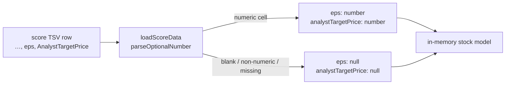

## Summary

The score TSVs already carry `eps` (column 9) and `AnalystTargetPrice`
(column 10), but the dashboard's parser in `loadScoreData` (`docs/app.js`)
stopped at `intrinsicValuePerShareAdjusted` and silently dropped both. This
change parses them onto the in-memory stock model — no UI, no TSV-format and no
Rust-writer changes. Closes #837.

- `eps` and `analystTargetPrice` are now present on every parsed stock object.
- A local `parseOptionalNumber` helper inside `loadScoreData` returns `null` —
  never `NaN` — for a blank, missing or non-numeric cell, so the earnings-yield
  traffic light gets the documented "unknown ⇒ don't judge" fallback rather than
  a `NaN` leaking into a comparison.
- Older score files that predate these columns (the 2024 dates) have short rows;
  those yield `null` for both fields, never throw, and leave `notes` /
  `intrinsicValuePerShare*` untouched.

## Evidence

Backend/data-model change only — nothing renders `eps` yet (that is the
rendering sub-issue of #835), so there is no visual surface to screenshot. The
evidence is the test run.



New tests, before the fix (6 failed) and after (6 passed):

```text
running 6 tests from ./tests/score_tsv_eps_parsing_test.ts
loadScoreData parses eps and analystTargetPrice from a full row ... ok
loadScoreData keeps a negative eps (real data has them) ... ok
loadScoreData yields null for blank eps / analystTargetPrice cells ... ok
loadScoreData yields null (never NaN) for non-numeric eps / analystTargetPrice cells ... ok
loadScoreData handles a short pre-eps row without shifting earlier fields ... ok
loadScoreData exposes eps and analystTargetPrice on every parsed stock ... ok

ok | 6 passed | 0 failed
```

Full Deno suite (collateral guard for `basic_score_table_test.ts`,
`score_data_pairing_test.ts`, `score_selection_test.ts`):
`ok | 1532 passed (79 steps) | 0 failed`. `./quality.sh` passes.

## Test Plan

Added `tests/score_tsv_eps_parsing_test.ts`. It extracts the **real** shipped
`loadScoreData` body from `docs/app.js` (app.js bootstraps a live DOM at import
time, so it cannot be imported headlessly) and runs it with `fetch` shadowed by
a stub serving fixture TSV text — so the assertions pin production behaviour,
not a re-implementation. Cases:

- full 10-column row → `eps` and `analystTargetPrice` parse as numbers;
- negative `eps` (`-0.1802`, taken from real data) is preserved;
- blank cells → `null`;
- non-numeric cells (`N/A`, `unknown`) → `null`, asserted not `NaN`;
- short pre-`eps` row → `null` for both, with `notes` and
  `intrinsicValuePerShare*` unchanged;
- both fields present on every parsed stock, including a mixed-length file.
