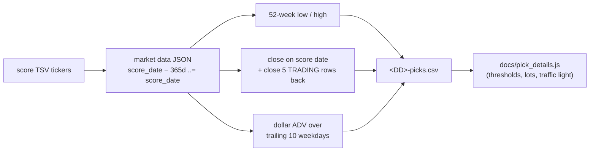

# PR Summary — Backend pick-details sidecar (#838)

## Summary

The three pick details that are **as at the score date** — 52-week range
position, 5-day return and trailing dollar ADV — need price history from
_before_ the score date, which `docs/scores/<YYYY>/<Month>/<DD>.csv` does not
carry: that file starts on the score date and only looks forward. Widening it
backwards would add ~250 rows per ticker to every committed per-date CSV for
data read only as a handful of summary numbers.

This adds a per-score-date **sidecar** instead: `src/picks_sidecar.rs` writes
`<DD>-picks.csv` beside the existing per-date CSVs, one row per ticker:

```text
ticker,week52_low,week52_high,close_score_date,close_5d_prior,adv_dollar_10d
```

- Computed from the market-data JSON tree over
  `score_date - 365 days ..= score_date`.
- `close_5d_prior` is five **trading rows** back, not five calendar days, so the
  5-day return is comparable across weekends and holidays.
- `adv_dollar_10d` reuses — never re-invents — the `averageDollarVolume`
  definition of `docs/volume_recommend.js` (the #576 single source of truth):
  the mean of `volume × low` over the trailing ten weekday rows, skipping days
  without a usable volume and low rather than counting them as zero.
- **Raw inputs only.** No thresholds, lots or traffic light — those stay in
  `docs/pick_details.js` so they remain tunable in one place.
- **Blank, never zero** for anything that cannot be computed (missing symbol,
  fewer than six rows for `close_5d_prior`, fewer than ten for
  `adv_dollar_10d`). A blank cell reads as "unknown"; a `0` would read as a
  real, terrible number and wrongly turn a traffic light red.
- The same non-destructive posture as `create_market_data_long_csv` (#687 and
  its recurrences): the CSV is buffered in memory and only replaces the file
  atomically once the run has rows, so an upstream outage can never truncate a
  populated sidecar to a header-only file.
- The upstream path is built through the traversal-guarded `read_market_data` /
  `extract_symbol_from_ticker` readers (#182), since a ticker is
  attacker-influenceable, and a ticker whose upstream JSON is missing is skipped
  with a warning rather than failing the run.

No frontend work, no backfill of historical dates, and no change to the existing
`<DD>.csv` window or columns — those are the issue's stated non-goals and remain
separate sub-issues.

Closes #838.

## Evidence

This is a backend/CLI change with no web interface to screenshot; the evidence
is the hermetic test suite and the cross-language parity gate.



Rust behaviour tests (synthetic fixtures under `tempfile::tempdir()`):

```text
running 6 tests
test derive_picks_csv_output_path_names_the_sidecar_beside_the_score_file ... ok
test picks_sidecar_dollar_adv_matches_the_shared_parity_fixture ... ok
test picks_sidecar_preserves_an_existing_populated_file_when_no_rows_are_found ... ok
test picks_sidecar_skips_a_missing_symbol_without_failing_the_run ... ok
test picks_sidecar_blanks_values_it_cannot_compute_from_short_history ... ok
test picks_sidecar_reports_52_week_range_and_five_trading_rows_back ... ok

test result: ok. 6 passed; 0 failed; 0 ignored; 0 measured; 0 filtered out
```

JavaScript half of the dollar-ADV parity gate, over the same committed window:

```text
running 3 tests from ./tests/adv_dollar_volume_parity_test.ts
dollar-ADV parity fixture describes a trailing ten-weekday window ... ok
averageDollarVolume matches the sidecar's adv_dollar_10d for the shared window ... ok
dollar-ADV skips unusable days rather than counting them as zero ... ok

ok | 3 passed | 0 failed
```

`./quality.sh` passes end to end (fmt, clippy, `cargo test`, the hermetic gate,
coverage, release build, 1535 Deno tests, `deno lint`/`deno check`), and
`scripts/check_hermetic_tests.sh` now runs `picks_sidecar_test` with no data
root configured alongside the four existing integration binaries.

### Pre-PR security self-check

- **Input validation** — ticker and date inputs are parsed/validated before use
  (`NaiveDate::parse_from_str`, `finite_positive`); non-numeric or non-positive
  upstream values become blanks, never sentinels.
- **Injection surface** — the upstream symbol path is built with `Path::join`
  over validated components via the existing traversal-guarded reader (#182);
  no string interpolation of a ticker into a path.
- **Error handling** — a run that writes no rows fails loud with an operator-
  actionable message and preserves the existing file; per-ticker faults are
  warnings naming the ticker only.
- **Secrets / dependencies** — no new dependencies, no credentials, no hidden
  files staged.

## Test Plan

Added:

- `tests/picks_sidecar_test.rs` — hermetic behaviour tests:
  - a symbol with a full year of weekday history produces the correct 52-week
    high/low (in-window extremes win, out-of-window extremes are ignored) and a
    `close_5d_prior` taken five _trading_ rows back across an intervening
    weekend (asserted to differ from the five-calendar-days-back row);
  - a symbol with only a few months of history still yields a 52-week high/low
    over what exists, with blank `close_5d_prior` (fewer than six rows) and
    blank `adv_dollar_10d` (fewer than ten rows) — blank, not `0`;
  - a symbol missing upstream is skipped with a warning while a present ticker
    still gets its row and the run succeeds;
  - a run that finds no rows leaves an existing populated sidecar byte-for-byte
    intact, returns an error, and leaves no `.tmp` file behind;
  - the parity case: the shared fixture window through the real writer.
- `src/picks_sidecar.rs` unit tests — `average_dollar_volume` (mean, skip
  unusable days, unknown when nothing usable), `finite_positive` (blank, zero,
  negative, rubbish, infinity) and the sidecar path derivation.
- `tests/adv_dollar_volume_parity_test.ts` — the JavaScript half of the parity
  gate: `buildTrailingVolumeWindow` + `averageDollarVolume` over
  `tests/fixtures/adv_dollar_10d_parity.json` must produce the same
  `expected_adv_dollar_10d` the Rust sidecar writes.
- `tests/fixtures/adv_dollar_10d_parity.json` — the shared twelve-row window
  (two rows outside the trailing ten, one zero-volume day inside it) both sides
  are pinned to, documented in `tests/fixtures/README.md`.

Changed:

- `scripts/check_hermetic_tests.sh` — `picks_sidecar_test` added to the
  hermetic-test gate.
- `src/main.rs` — the processor writes the sidecar for each score date.
- `src/lib.rs`, `README.md`, `CHANGELOG.md`, `tests/fixtures/README.md` — docs
  for the new module, file and fixture.
