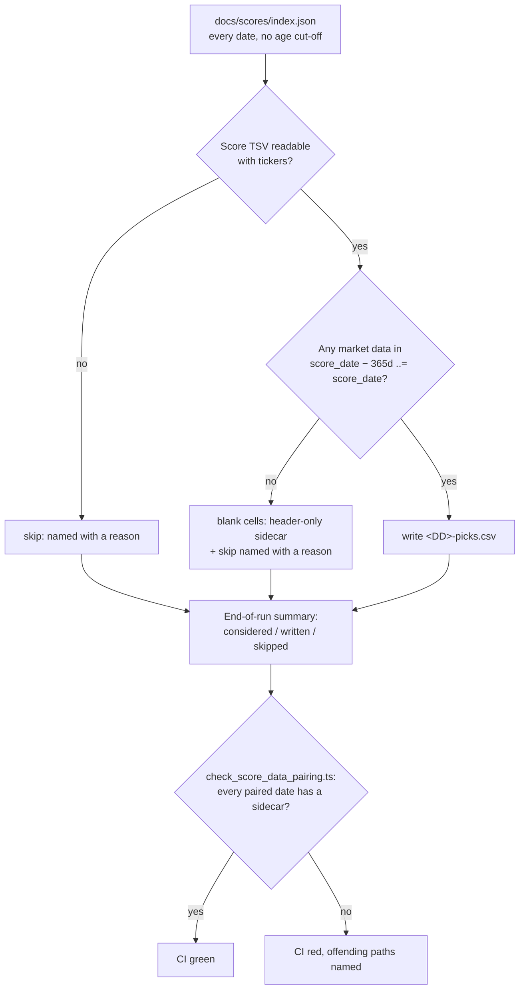

# [#839] Backfill the pick-details sidecar for every historical score date

## Summary

The sidecar writer added in #838 only runs for the dates a normal processor run
selects, so every historical date in `docs/scores/index.json` — back to
2024-10-15 — would have kept blank pick-detail columns, which is exactly where
the dashboard's "review past picks" purpose lives. This adds the pass that fills
them, commits the generated sidecars, and adds the guard that stops the backfill
silently regressing later. Closes #839.

- **`--regenerate-picks` (`src/picks_backfill.rs`)** — rebuilds **only**
  `<DD>-picks.csv`, for every entry in `docs/scores/index.json` including dates
  far older than the 180-day cut-off `--process-all` exists to bypass. Each
  date's `<DD>.csv`, `<DD>-analysis.csv` and `<DD>-dividends.csv` are left
  exactly as committed. `--date` narrows the run to one date; a date the index
  does not list, and an empty index, both fail loud rather than passing
  vacuously.
- **Reads share prices only.** The mode resolves the market-data root alone
  (`DataRoots::resolve_market`) rather than failing an operator for a dividend
  root the run would never open.
- **Upstream gaps never abort it.** A date with no pre-score-date history leaves
  blank cells (a header-only sidecar) and is recorded as a skip *with a reason*;
  so is an index entry whose score TSV was never committed. Every considered
  date must appear in exactly one of the written/skipped lists — a date in
  neither fails the run loud — and a run that writes no sidecar at all exits
  non-zero rather than reporting a clean, empty backfill.
- **380 sidecars committed** — one for every prediction date in the committed
  score tree. 379 came from the whole-history pass; `2026-07-22` was promoted
  from `main` afterwards and was backfilled with
  `--regenerate-picks --date 2026-07-22`, which is precisely the gap the new
  pairing check reported.
- **`scripts/check_score_data_pairing.ts`** now reports a prediction date paired
  with market data but missing its `<DD>-picks.csv`, so a backfill that was never
  run — or a later change that stops emitting sidecars — turns `./quality.sh` and
  CI red instead of quietly blanking the dashboard columns. A *header-only*
  sidecar passes: an older date with no upstream history legitimately backfills
  to blanks; only an absent file means the date was never covered.

## Evidence

Backend/CLI change — no web interface to screenshot. The evidence is the run
itself, the tests, and the idempotency check.

**The documented backfill command, run over the real market-data tree:**

```text
$ ./target/release/grq-validation --docs-path docs \
      --market-data-path "$GRQ_MARKET_DATA_PATH" --regenerate-picks
Pick-details sidecar backfill
  dates considered: 389
  sidecars written: 379
  dates skipped:    10
    2025-08-10 — score file docs/scores/2025/August/10.tsv unreadable: No such file or directory (os error 2)
    2025-08-11 — score file docs/scores/2025/August/11.tsv unreadable: No such file or directory (os error 2)
    … (2025-08-12 … 2025-08-19, same reason)
```

The ten skipped dates are index entries the scorer never wrote a score TSV for
(`2025/August/10.tsv` … `19.tsv` are absent from the tree); they are named
individually so a partial backfill cannot hide behind a count.

**The single-date form, run for `2026-07-22`** (promoted from `main` after the
whole-history pass, so it shipped a score TSV and market-data CSV with no
sidecar):

```text
$ ./target/release/grq-validation --docs-path docs \
      --market-data-path "$GRQ_MARKET_DATA_PATH" \
      --regenerate-picks --date 2026-07-22
Pick-details sidecar backfill
  dates considered: 1
  sidecars written: 1
  dates skipped:    0
```

**Idempotency** — a second run over unchanged upstream data left the working
tree clean, and the `2026-07-22` sidecar was byte-identical between the two
runs (`cmp` over the first and second outputs):

```text
$ ./target/release/grq-validation --docs-path docs \
      --market-data-path "$GRQ_MARKET_DATA_PATH" --regenerate-picks
$ git status --porcelain
(no output)
```

**The guard, before and after that single-date backfill:**

```text
$ deno task check-score-data          # before
check_score_data_pairing: REFUSING to promote — the following prediction dates
are missing market data or their pick-details sidecar:
  docs/scores/2026/July/22-picks.csv (missing)

$ deno task check-score-data          # after
check_score_data_pairing: market data paired for 380 committed prediction dates
```

**A backfilled sidecar** (`docs/scores/2024/October/15-picks.csv`, the oldest
indexed date):

```text
ticker,week52_low,week52_high,close_score_date,close_5d_prior,adv_dollar_10d
NYSE:RKT,7.17,21.38,18.48,17.56,57309169.83
NYSE:PFSI,62.15,119.13,108.95,106.97,26954144.25
```



### Quality gate

`./quality.sh` passes cleanly on this branch: `cargo fmt --check`,
`cargo clippy -D warnings` (all targets and tests), the full `cargo test` suite,
`./scripts/check_hermetic_tests.sh`, the release build, 1623 Deno tests,
`deno lint` and `deno check`. The `2026-07-21` market-CSV failure noted on an
earlier attempt (issue #847) no longer reproduces — `main` has since committed
`docs/scores/2026/July/21.csv`, and this branch is merged up to
`milestone/835-show-stock-pick-details-adv-lots-earnings-yiel`.

## Test Plan

Added `tests/picks_backfill_test.rs` (hermetic — synthetic score tree, index and
market-data tree inside `tempfile::tempdir()`; registered in
`scripts/check_hermetic_tests.sh`):

- `backfill_picks_missing_history` — a score date with no pre-score-date market
  data does **not** abort the run, produces a header-only (blank-cell) sidecar,
  and is named with a skip reason in the summary.
- `backfill_writes_a_sidecar_for_every_indexed_date` — every indexed date is
  written, with a row per ticker.
- `backfill_skips_a_date_whose_score_file_was_never_written` — the real
  2025-08-10…19 case: skipped with a reason, no sidecar invented, the remaining
  dates still written.
- `backfill_accounts_for_every_considered_date` — every considered date appears
  exactly once across written and skipped.
- `backfill_is_idempotent_over_unchanged_upstream_data` — a second run is
  byte-identical.
- `backfill_for_a_single_date_touches_only_that_date`,
  `backfill_for_an_unindexed_date_fails_loud`,
  `backfill_over_an_empty_index_fails_loud`.

Added unit tests in `src/picks_backfill.rs` for the summary contract: the render
names every skip with its reason, and `verify_accounted` fails loud on a date in
neither list.

Added to `tests/score_data_pairing_test.ts`:

- a paired date with no `<DD>-picks.csv` is reported (`… 05-picks.csv (missing)`);
- a header-only sidecar passes — an upstream gap is blanks, not a gap in the
  backfill;
- `siblingPicksCsv` maps a prediction TSV to its sidecar path.

Existing pairing fixtures that expect a clean pass were extended with a sidecar,
so each still targets exactly one fault. No test was removed or disabled.
