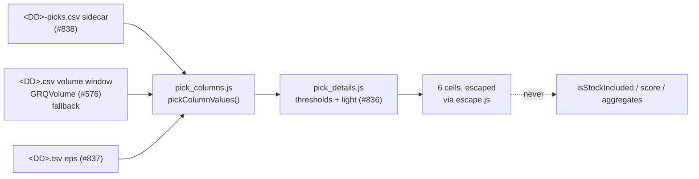

# [#840] Dashboard: pick-detail columns on the stock table

## Summary

Adds the six pick-detail columns #835 asked for to the dashboard's aggregate
stock table, so a reviewer can answer _"is there a reason we didn't manually
pick this stock?"_ without leaving the page: the 🔴/🟠/🟢 **Pick** traffic light
(with warning emojis) beside **Stock**, and **ADV**, **Lots**, **5-Day
Return**, **Earnings Yield** and **52-Week Position** after the existing 90-day
block. Closes #840.

New `docs/pick_columns.js` does the rendering and nothing else:

- every threshold, the light and the warning vocabulary come from
  `docs/pick_details.js` (#836);
- dollar ADV comes from `GRQVolume.averageDollarVolume` (#576);
- every interpolated value goes through `docs/escape.js`.

`loadMarketData` now loads the `<date>-picks.csv` sidecar (#838) beside the
market CSV. A **missing** sidecar degrades (blank cells, neutral ⚪ light); a
**fetched-but-unusable** one fails loud on the console with a classified reason
rather than being reconciled as "no picks".

The columns are display-only: they never touch `GRQProjection.isStockIncluded` /
`is_priceable`, the displayed score, the star filter or any aggregate.

### Decisions a reviewer should check

- **⚪ is a new, deliberate state.** `pickTrafficLight` correctly refuses to
  judge an unknown value, which means a row where nothing is known comes back
  🟢 — reading as "healthy" when the truth is "we have no idea". So the light is
  downgraded to ⚪ only when **no warning fires and some input is unknown**. A
  known-thin ADV still shows 🔴 even with the 52-week range unknown, so an
  unknown value never manufactures a warning and never suppresses one.
- **The issue's example "at the top of its range with a weak yield → 🟠" does
  not match the shared helper**, where a weak yield is a _major_ warning (🔴).
  The helper is the single source of truth, so the test uses a yield between
  the weak and strong cuts (🟠 + 📈), which is the case the example describes.
- **ADV fallback ordering.** The committed per-date CSV is score-date-_forward_
  by design, so on most dates it holds no row on or before the score date and
  the prescribed `buildTrailingVolumeWindow` fallback is empty. Order is
  therefore: sidecar → trailing window → the earliest ten-day window the page
  has (the ten trading days _after_ the score date). The last is flagged
  `Approximate:` in the cell's `title` rather than passed off as an as-at
  figure, and the sidecar supersedes it as soon as one exists.
- **52-week position renders as a percentage** (`0.0%`–`100.0%`), matching the
  other percentage columns rather than a `0.00–1.00` fraction.
- **`tests/totals_row_alignment_test.ts` was updated**, not weakened: the
  expected column count moved 9 → 15 with the widened view. The 1:1 alignment
  invariant it protects is unchanged and still asserted.



## Evidence

**Real score date, no sidecar committed yet.** ADV, Lots and Earnings Yield
populate from the in-page CSV and the score TSV; 5-Day Return and 52-Week
Position stay blank because nothing in the page can supply them, and the light
falls back to ⚪ where no warning fires. Every existing column is unchanged.


**With a sidecar present.** All six columns populate — 🟢/🟠/🔴 with warning
emojis, compact-dollar ADV, Lots, signed 5-day return, signed earnings yield
(negative for the loss-making names) and the 52-week position.

> The `<DD>-picks.csv` used for this shot was generated locally and **not
> committed** — the backfill is #839, which has not landed. Its values are
> computed from the committed `19.csv` over the forward window, so they are real
> market numbers over the wrong window; they illustrate the rendering, not the
> figures.


**2024 date — no `volume` column, no `eps`, no sidecar.** All six cells blank,
every row ⚪, every existing column untouched.


No `console.error` was emitted by application code on any of the three loads.
The 2024 load shows two browser-level network 404s (`15-picks.csv` and the
pre-existing `15-analysis.csv`) — both are optional per-date files fetched the
same way, and the sidecar miss is handled as `console.log` + blank columns.

### Quality gate

`./quality.sh` passes every Rust stage (fmt, clippy, check, test, tarpaulin,
release build) and every Deno stage except two **pre-existing** data failures
that also fail on `main`:

```text
data-presence gate: ... docs/scores/2026/July/21.csv (missing)
checkScoreDataPairing: the committed tree passes the guard
```

`docs/scores/2026/July/21.tsv` is committed on `main` without its sibling
market CSV. That is a data-pipeline gap unrelated to this change, filed
separately as #847 (it needs a data run against the upstream share-price tree,
which CI cannot reach).

## Test Plan

New — `tests/stock_table_pick_columns_test.ts` (24 cases over the real shipped
module):

- **Sidecar loading**: well-formed parse; a blank cell is unknown, never `0`; a
  404 is `absent` (degrade); a wrong header and a header-only file are `error`
  (fail loud).
- **Populated fixture**: the six cells render (`$8.00M`, `400`, `+2.0%`,
  `+8.0%`, `50.0%`); 🟢 + 💰 for a healthy liquid name; 🔴 + 🫗 for a thin ADV;
  🟠 + 📈 at the 52-week high without a strong yield; a **negative** EPS renders
  `-2.5%`, not blank; a 5-day fall renders signed and trips 🪃.
- **Partly-populated fixture**: ADV/Lots/yield fall back to the in-page CSV; a
  post-score-date row never leaks into the window; a known thin ADV still warns
  with the range unknown; the score-date-forward fallback is flagged
  `Approximate:` and a real trailing window is not; the sidecar always wins.
- **Empty fixture**: blank cells, ⚪ (not 🟢, not 🔴), zero manufactured
  warnings, zero `console.error` during render, full cell complement for a
  wholly absent row.
- **Formatting/escaping**: signed and unsigned percentages, and the light's
  title escaped through `docs/escape.js`.

New — `tests/pick_columns_isolation_test.ts`: over the committed
`docs/scores/2026/July/19` fixture, renders every pick cell and asserts the
portfolio Actual, every per-stock 90-day figure, the inclusion predicate (which
drives the star filter and the chart's Actual line) and the chart's series
inputs are byte-identical; and that a deliberately awful pick verdict changes no
inclusion decision.

New — `tests/stock_table_pick_columns_markup_test.ts`: both header rows carry
all six columns with matching labels; `index.html` loads the modules before
`dashboard_boot.js`; `sw.js` precaches them in the core shell;
`docs/projection.js` references none of the pick helpers.

Updated — `tests/totals_row_alignment_test.ts`: expected column count 9 → 15.

Full suite: `1561 passed | 2 failed` (both pre-existing, as above).
