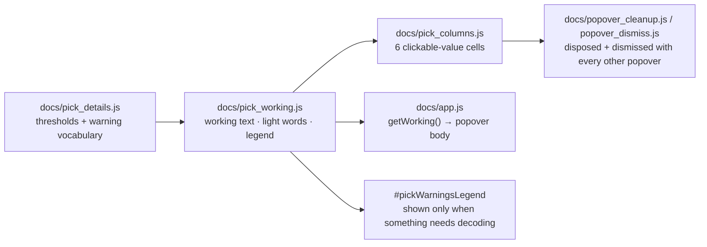

## Summary

The pick-detail columns (issue #840) rendered a bare `🟠 🥃` with no way to find
out what it meant. This makes every one of the six values explain itself, the
way every other number on the dashboard already does, and adds a legend that
decodes the glyphs. Closes #841.

- **New `docs/pick_working.js`** — the explanation kernel. It owns the popover
  body for each field, the light vocabulary (🟢/🟠/🔴/⚪ and what each means),
  the accessible wording behind the emoji, and the legend entries. It EXPLAINS
  and never calculates: every threshold is quoted from `docs/pick_details.js`
  (issue #836), so retuning a threshold retunes its wording with it.
- **Every cell is a popover trigger.** `docs/pick_columns.js` now renders each
  `<td>` as a `.clickable-value` carrying `data-field` / `data-stock`, so
  `docs/app.js` picks them up with the existing loop and the shared lifecycle
  helpers (`docs/popover_cleanup.js`, `docs/popover_dismiss.js`) dispose and
  dismiss them — no second mechanism. The `<td>` itself is the trigger, not an
  inner span, because a blank cell has no clickable content otherwise.
- **What each popover says** — Lots: `$8.00M ÷ $20,000 = 400 lots` and the band
  that falls in; ADV: the window, whether it came from the sidecar or the
  in-page CSV fallback (flagged `APPROXIMATE` when it is the forward window),
  and `mean(volume × low)`; Earnings Yield: `eps ÷ score-date price` with both
  inputs; 52-Week Position: the range arithmetic with the actual high and low
  and their window; 5-Day Return: both closes; Traffic light: every warning that
  fired with the threshold it tests, the value that met it, and whether it
  turned the light red or amber, plus both rule sets spelled out.
- **A blank cell says why it is blank** — no sidecar for this date, a pre-`eps`
  score file, no usable volume window — rather than opening an empty body.
- **Accessibility** — the emoji run is `aria-hidden` and sits beside
  visually-hidden text ("Amber: at least one minor warning… Thin liquidity:
  under 200 parcels traded per day."), so the meaning is never colour- or
  glyph-only. Popover headers use the human-readable field label (issue #542):
  `Field: Earnings Yield`, never `pick-earnings-yield`.
- **Legend** — `#pickWarningsLegend` below the table decodes the four lights and
  all nine warnings, rendered from the shared vocabulary and shown only when at
  least one stock in the loaded report carries something to decode, following
  the Low-volume legend pattern (issue #599).

**Behaviour change worth a reviewer's eye:** the pick cells no longer carry a
`title` attribute. Bootstrap 5.1 promotes a trigger's `title` to
`data-bs-original-title` and renders it as the popover **heading**, which left
these cells headed by "Thin liquidity: under 200 parcels traded per day" while
every other value on the dashboard reads "Field - Stock". That wording now lives
in the popover body and the visually-hidden text instead. Two issue #840
assertions moved with it (see Test Plan).

No maths changed: thresholds, the light and the warning derivation stay in
`docs/pick_details.js`, and no table layout changed.

## Evidence

Traffic-light popover open on `NASDAQ:III` (2026-02-21), headed
`Pick - NASDAQ:III`, listing the warning that fired with its threshold and the
value that met it, and both the red and amber rules:


The legend below the table, decoding the four lights and all nine warnings:


Popovers are disposed on re-render. Driving the live page (headless Chromium,
`http://127.0.0.1:8931`) — open a traffic-light popover, change the score date,
repeat three times — leaves no orphaned tip:

```text
[ { opened: 1, orphaned: 0, date: "2026/February/22.tsv" },
  { opened: 1, orphaned: 0, date: "2026/February/23.tsv" },
  { opened: 1, orphaned: 0, date: "2026/February/24.tsv" } ]
```



`./quality.sh` passes apart from two **pre-existing** failures on the milestone
branch, unrelated to this change and already tracked as
`stSoftwareAU/GRQ-validation#847`: `market_data_presence_test.ts` and
`score_data_pairing_test.ts` both fail because `docs/scores/2026/July/21.tsv`
has no sibling `21.csv`. Both fail identically with this change stashed
(verified on the parent commit).

## Test Plan

Added:

- `tests/pick_working_test.ts` (29 tests) — the explanation contract over the
  real shipped kernel: each field's popover shows its inputs, formula and
  result; an unknown value says why it is blank; the traffic light names every
  warning with its threshold, the value that met it and its severity (including
  a 52-week extreme excused by a strong earnings yield); every one of the nine
  warnings produces a working line; the accessible text names the light in
  words; the legend decodes four lights and nine warnings; `hasAnyWarning` gates
  it; and the wording is checked to quote the shared thresholds.
- `tests/pick_popover_wiring_test.ts` (12 tests) — all six cells are
  `.clickable-value` triggers with `data-field` / `data-stock`; a blank cell is
  still a trigger; an untrusted ticker is escaped in every attribute; the light
  cell carries `aria-hidden` glyphs plus visually-hidden wording; each field id
  maps to its column header label; `clearAllPopovers` disposes all six and
  sweeps orphans; the dismiss selector matches; and the committed markup loads
  and precaches `pick_working.js` and carries the hidden legend.

Modified (documented):

- `tests/stock_table_pick_columns_test.ts`,
  `tests/pick_columns_isolation_test.ts`,
  `tests/stock_table_pick_columns_markup_test.ts` — import the new
  `docs/pick_working.js` dependency.
- `tests/stock_table_pick_columns_test.ts` — the two `"Approximate:"`
  assertions now assert on the ADV popover body (`APPROXIMATE`) instead of the
  cell's `title` attribute, because that caveat moved into the working (see the
  Bootstrap heading note above). Both assertions keep the same guarantee: a
  forward-window ADV is flagged approximate, a trailing one is not. No test was
  removed or commented out.

Full suite: `deno test --allow-read --allow-env tests/*.ts` — 1602 passed, 2
failed (the pre-existing #847 data-presence pair described above).
