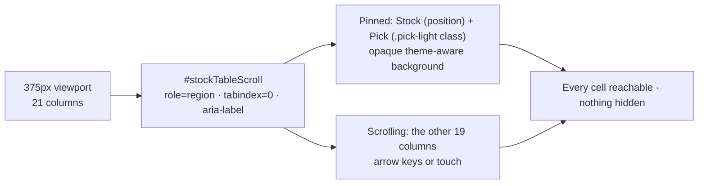

## Summary

Made the widened (21-column) stock table usable and accessible on a phone.
Closes #842.

**The approach chosen** (the issue asks for one coherent choice): keep ONE
table and scroll it sideways, with the **Stock column and the traffic light
pinned** to the left edge so a row is always identifiable and the lights stay
scannable straight down, and make the scroller a **keyboard-reachable, labelled
region**. No column is hidden.

What changed:

- **Removed the mobile column hiding.** `docs/styles.css` previously did
  `display: none` on the third and sixth columns below 768px. That does not
  make a wide table responsive — it makes those cells *unreachable*, on the one
  device where the reader cannot fall back to a wider window. (After #840
  inserted `Pick` at position 2, it was also hiding the wrong two columns:
  Score and 90-Day Target.)
- **Pinned pair.** The first column (always Stock, in all three header
  layouts) is pinned by position with a width the layout cannot renegotiate,
  because the light's `left` offset must land exactly on its right edge. The
  light is pinned by **class** (`.pick-light`) — the basic no-market-data view
  has no Pick column, so its second column must not be pinned. The `Pick` `<th>`
  gained that class in both header rows (`docs/index.html`, the aggregate
  rebuild in `docs/app.js`). Both pinned cells paint an opaque, theme-aware
  background, so the scrolling columns pass *under* them, not through them.
- **Keyboard-reachable scroll region.** The `.table-responsive` wrapper is now
  `role="region" tabindex="0"` with an accessible name and an explicit
  `:focus-visible` outline — a scroll region that only answers to touch is an
  accessibility failure. Verified in the browser: focusing it and pressing
  `ArrowRight` pans the table.
- **Readable light.** The traffic-light column keeps a floor width (so the
  lights line up whatever warning emoji trail them) and the cells draw the emoji
  at `1.15rem` — root-relative, so the smaller mobile table font does not shrink
  it — because 🔴 and 🟠 differ only in hue. The header keeps the header type
  size.
- **Ticker on one line.** The pinned Stock cell renders at the same `0.7rem`
  the mobile headers already use, which fits every ticker in the loaded report
  on one line inside the pinned width (measured in-browser: 0 of 21 tickers
  wrap), with `overflow-wrap: anywhere` as the break of last resort.
- Refreshed `docs/screenshots/desktop-screenshot.png` (1280×720) and
  `docs/screenshots/mobile-screenshot.png` (720×1280) — the sizes
  `docs/manifest.json` declares — so the committed PWA screenshots match the
  shipped table.
- README: new "The widened table on a phone" subsection under the pick-detail
  columns.

Not changed: what the columns contain or compute, and the desktop layout
(pinning is inside the ≤768px media query only). The single-stock detail view
hides the table outright and renders `#stockDetailCard` instead, so its
`display: none` column rules cannot obscure a visible cell and were left alone.



## Evidence

Captured with the container's headless browser (Playwright MCP) against
`helpers/server.ts` on `127.0.0.1:8080`, at a **375px** viewport.

Light theme, scroll region focused (blue focus ring), table unscrolled — Stock,
Pick, Buy Price, Stars visible; every ticker on one line:


Light theme, scrolled sideways — Stock and the traffic light stay pinned while
Gain/Loss, Return above Cost of Capital and Judgement scroll past underneath:


Dark theme, same scrolled state — the pinned cells keep the dark surface, so
nothing shows through:


Refreshed committed screenshots:


**Measured in the browser at 375px** (`browser_evaluate`, not eyeballed):

| Check | Result |
| --- | --- |
| Page-level horizontal overflow | none — `document.scrollWidth` 375 = `innerWidth` 375; only the table scroller scrolls |
| Pinned cells while scrolled 400px | Stock stays at x=24, Pick at x=112 |
| Every scrolling cell reachable | widest scrolling cell 117px fits the 146px window between the pinned pair and the right edge |
| Keyboard panning | focus `#stockTableScroll`, `ArrowRight` → `scrollLeft` 0 → 40 |
| Focus indicator | `:focus-visible` matches, `outline: rgb(102, 126, 234) solid 2px` |
| Tickers wrapping in the pinned column | 0 of 21 |
| Contrast, dark theme | cell `#e8eaed` on `#1e2228`, header `#e8eaed` on `#262b33` |

**pa11y (WCAG 2.1 AA)** — `pa11y-ci --config pa11yci.json` against the same
server, driving the container's Chromium:

```text
Running Pa11y on 10 URLs:
 > http://localhost:8080/index.html?date=2026-02-21 - 0 errors
 > http://localhost:8080/index.html?theme=dark&date=2026-02-21 - 0 errors
 > http://localhost:8080/trend.html - 0 errors
 > http://localhost:8080/trend.html?theme=dark - 0 errors
 > http://localhost:8080/index.html?date=2026-02-21 - 0 errors          (390px)
 > http://localhost:8080/index.html?theme=dark&date=2026-02-21 - 0 errors (390px)
 > http://localhost:8080/trend.html - 0 errors                          (390px)
 > http://localhost:8080/trend.html?theme=dark - 0 errors               (390px)
 > http://localhost:8080/index.html?stock=NASDAQ%3AMGRC&date=2026-03-23 - 0 errors
 > http://localhost:8080/index.html?theme=dark&stock=NASDAQ%3AMGRC&date=2026-03-23 - 0 errors

✔ 10/10 URLs passed
```

**`./quality.sh`** — the cargo half (fmt, clippy, check, test, hermetic-test
gate, coverage, release build) and the Deno half (`deno fmt`, `deno lint`,
`deno check`) pass. `deno test` reports **1611 passed, 2 failed**, and both
failures are the pre-existing data gap already tracked as **#847**
(`docs/scores/2026/July/21.tsv` has no sibling `21.csv`, promoted by the
2026-08-20 daily commit `8ded4509`): `market_data_presence_test.ts` and
`score_data_pairing_test.ts`. Both fail identically on `main` and on the
milestone branch without this change, and neither touches the dashboard.

Note on the screenshots: no `<date>-picks.csv` sidecar is committed yet (that is
the #839 backfill), so several lights render ⚪ "not enough data" — the layout
being evidenced here is unaffected, and rows with warnings (🔴 + 🔥 🥃 🩸 💰)
appear throughout.

## Test Plan

New — `tests/stock_table_responsive_layout_test.ts` (9 tests). These parse the
real committed markup/stylesheet and call the real shipped render helper:

- the scroll region carries `tabindex="0"`, `role="region"` and an accessible
  name;
- the focused region declares an outline/box-shadow;
- **no** column is hidden by `display: none` at a phone width (the regression
  this PR removes);
- the Stock column is sticky at `left: 0` and the traffic light is sticky at an
  offset **equal to the Stock column's `max-width`** — the two can never drift
  apart;
- both pinned rules paint a background, and the resolved colours clear WCAG 2
  AA (≥4.5:1) in **both** themes, using the shipped contrast helper in
  `docs/series_label_colour.js` — the dark palette is read out of the committed
  stylesheet, so a palette change that breaks contrast fails here;
- the traffic-light cell keeps `white-space: nowrap`, a floor `min-width` and a
  font-size ≥ 1rem;
- every one of the six pick-detail headers declares `scope="col"` in **both**
  header rows (extended per the acceptance criteria);
- the `Pick` header carries `pick-light` in both header rows;
- `GRQPickColumns.trafficLightCell(...)` still renders the `pick-light` class
  and its visually-hidden text equivalent (the "never colour alone" pairing with
  #841).

Existing suites re-run green, including
`tests/stock_table_header_scope_test.ts`,
`tests/stock_table_pick_columns_markup_test.ts`,
`tests/pwa_screenshots_test.ts` and `tests/manifest_test.ts` (which pin the
refreshed screenshots to the sizes declared in `docs/manifest.json`).

### Security self-check

No new input, secret, query, endpoint or dependency: the change is CSS, three
static HTML/JS attributes and a test. `pa11y-ci` was installed with
`--no-save --ignore-scripts` for the local run only and removed afterwards — no
`node_modules/` or `package-lock.json` is staged.
