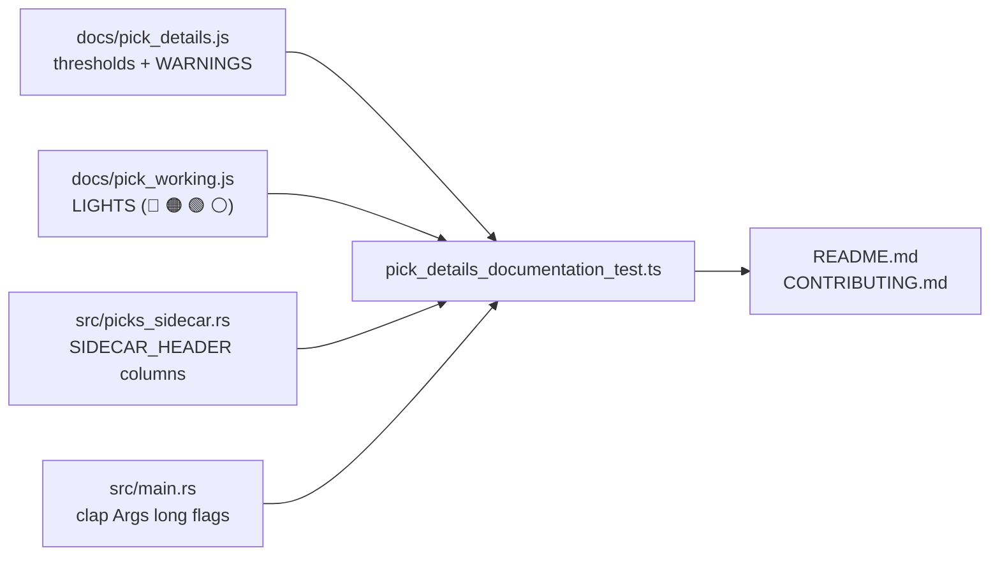

# PR Summary — Document the pick-detail columns, thresholds and `-picks.csv` sidecar (#843)

## Summary

The pick-detail columns shipped across #836–#842 added a whole user-facing rule
set — a traffic light, nine warning emojis, seven thresholds and a `$20,000`
parcel size — plus a new committed artefact (`<date>-picks.csv`). None of it was
explained in the README's _Features_ section, where every other behavioural rule
(Low-Volume Exclusion, Negative-Score Exclusion, the Low-Volume Valuation Cap,
Split-Aware Returns) states its threshold, its single source of truth and its
"insufficient data" fallback. A reader who cannot find out _why_ a name shows 🔴
cannot trust the light. Documentation only — no behaviour changed. Closes #843.

- **README _Features_ — new "Pick-Detail Columns" entry.** What the columns are
  and the question they answer, every threshold verbatim from the picking
  spreadsheet (`$20,000` parcel; `50`/`200` lot floors, i.e. dollar ADV under
  roughly $1M red and $4M amber; `$1` delisting price; `0.85`/`0.15` 52-week
  cut-offs; `-10%` five-day drop; `2%` weak / `6%` strong earnings yield), a
  marker key decoding all four lights and all nine warnings, and three standing
  rules: one place per number (`docs/pick_details.js` for the thresholds and the
  light, `averageDollarVolume` in `docs/volume_recommend.js` for dollar ADV —
  never a second definition), figures **as at the score date** rather than live
  quotes, and **unknown ⇒ blank, never a warning** for dates predating the
  `volume` column, the `eps` column and the sidecar.
- **README — sidecar data format.** The `-picks.csv` section now shows where the
  sidecar sits relative to `<DD>.tsv`, `<DD>.csv`, `<DD>-analysis.csv` and
  `<DD>-dividends.csv`; its columns, windows and the blank-means-unknown rule
  were already documented under #838 and are unchanged.
- **README + CONTRIBUTING — the backfill.** A new _Backfilling the pick-details
  sidecar_ section gives the command and the two data roots it needs. The
  sidecar is written as part of processing a date (`src/main.rs:354`), so the
  backfill today is the ordinary full pass (`--process-all`, or `--date` for one
  date), with both `--market-data-path` and `--dividend-data-path` supplied. A
  sidecar-only pass does not exist yet and is **not** documented as if it did —
  the section names issue #839, which is still open, as where that lands.
- **CHANGELOG.md** — an `[Unreleased] / Added` entry in the existing style.

## Evidence

Documentation-only change with no web interface to screenshot: the surfaces
touched are `README.md`, `CONTRIBUTING.md` and `CHANGELOG.md`. The evidence is
the new drift gate and the markdown linter.

The acceptance criterion "every threshold quoted in the README matches the
constants in `docs/pick_details.js`" is enforced rather than reviewed by eye.
`tests/pick_details_documentation_test.ts` derives every documented value from
the shipped source and looks it up in the document — it hard-codes no threshold,
emoji or column name of its own:



Mutation check — retuning `MIN_AMBER_LOTS` from `200` to `250` in
`docs/pick_details.js` without touching the README fails the gate (the constant
was restored immediately afterwards):

```text
README Features documents every pick-detail threshold => FAILED
  README Features entry must quote the threshold '250 lots' from docs/pick_details.js
FAILED | 6 passed | 1 failed
```

With the docs in place, the suite passes:

```text
deno test --allow-read --allow-env tests/pick_details_documentation_test.ts
ok | 7 passed | 0 failed
```

`npx markdownlint-cli2` under `.markdownlint-cli2.jsonc` reports
`Summary: 0 issues in 0 files` across all 311 markdown files.

**Pre-existing failure, unrelated to this PR:** `tests/market_data_presence_test.ts`
and `tests/score_data_pairing_test.ts` fail on this branch and on `main`, because
`docs/scores/2026/July/21.tsv` has no sibling `21.csv`. That is already tracked
as open issue #847 and is untouched here — verified by stashing this change and
re-running the two tests, which still fail.

## Test Plan

- **Added** `tests/pick_details_documentation_test.ts` (7 tests), which reads
  `README.md`, `CONTRIBUTING.md`, `docs/pick_details.js`, `docs/pick_working.js`,
  `src/picks_sidecar.rs` and `src/main.rs` and asserts derivable relationships:
  - every threshold constant is quoted in the README _Features_ entry;
  - every light and warning emoji in `LIGHTS` / `WARNINGS` is decoded there;
  - the entry names both single sources of truth and states the
    as-at-the-score-date and blank-for-unknown rules;
  - every column in `SIDECAR_HEADER` is documented in the sidecar section, and
    that section places the sidecar beside `-analysis.csv` / `-dividends.csv`;
  - every `--flag` shown in the backfill section is a long flag the clap `Args`
    struct actually accepts (so the docs cannot name a flag that does not
    exist), and both data roots appear;
  - CONTRIBUTING documents the backfill next to the processor invocations.
- **Modified** no existing tests.
- Full Deno suite: 1618 passed, plus the two pre-existing #847 failures noted
  above. `./quality.sh` run locally.
