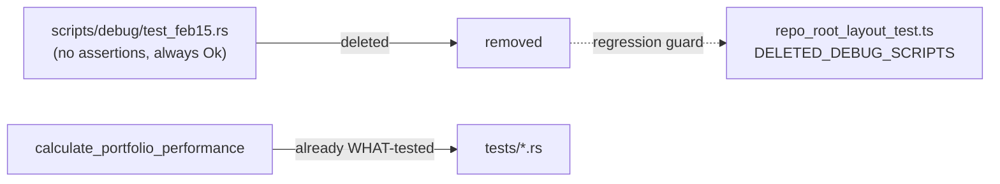

## Summary

Deleted `scripts/debug/test_feb15.rs`, an assertion-free pseudo-test, and
added a deletion regression test. Closes #85.

`test_feb15.rs` was a scratch `fn main()` (the Rust twin of the
already-deleted `test_formula_verification.js`, #83). It called the
production helper `grq_validation::utils::calculate_portfolio_performance`
for the 2025-02-15 score file, `println!`'d the results and **asserted
nothing** — the `Err` arm printed the error and still returned `Ok(())`, so
no input could ever make it fail. It was not under `tests/`, so `cargo test`
never ran it; it was a debugging `main` masquerading as a test that kept a
second, untested invocation path of the performance maths alive.

Following the precedent set by #83 (its JS twin was deleted, not rewritten),
this PR **deletes** the file. The performance maths is already WHAT-tested
under `tests/` (e.g. `tests/market_data_tests.rs`,
`tests/dividend_tests.rs`) and `calculate_annualized_performance` is unit
tested in `src/utils.rs`, so deleting the demo removes the false-green file
name and the duplicate invocation path without losing any real coverage.

## Evidence

Backend/CLI change only — no web interface to screenshot.

`tests/repo_root_layout_test.ts` already tracked the moved debug scripts and
the #83 deletion. It was extended to assert `test_feb15.rs` is deleted from
both the repository root and `scripts/debug/`. The test was confirmed to
fail before the deletion (TDD red) and pass after it (TDD green):

```
assertion-free demo scripts are deleted (issues #83, #85) ... ok
ok | 5 passed | 0 failed
```

Full Deno suite: `194 passed | 0 failed`. `cargo check` and
`cargo clippy --all-targets -- -D warnings` both pass — the deleted file was
a standalone script never declared in `Cargo.toml`, so the Rust build is
unaffected.



## Test Plan

- Modified `tests/repo_root_layout_test.ts`:
  - Moved `test_feb15.rs` from `DEBUG_SCRIPTS` to `DELETED_DEBUG_SCRIPTS`.
  - Renamed the deletion test to `assertion-free demo scripts are deleted
    (issues #83, #85)` so it now guards both files against reappearing at
    the root or under `scripts/debug/`.
  - Added an explanatory note for Issue #85.
- Deleted `scripts/debug/test_feb15.rs`.
- Verified: `deno test --allow-read tests/*.ts` → 194 passed;
  `cargo check`/`cargo clippy` clean.
