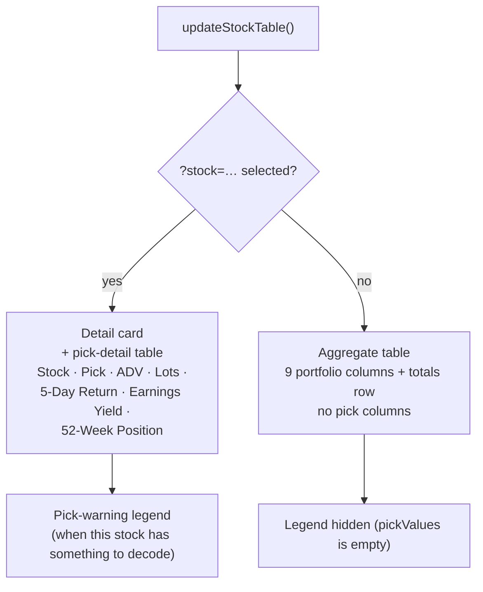

## Summary

The six pick-detail columns added by issue #840 (Pick traffic light, ADV,
Lots, 5-Day Return, Earnings Yield, 52-Week Position) crowded the aggregate
(portfolio) stock table, especially on a phone. They now render on the
single-stock view only (`?stock=…`, the `.stock-detail-view` state), as the
same table columns they were before — no separate details card. The aggregate
table carries none of them at any viewport width, and its totals row is back
from 15 to 9 cells. The pick-warning legend follows the columns: visible only
when the pick details are visible.

`docs/pick_columns.js` now owns the single-stock header/body row
(`pickDetailHeaderRow()`, `pickDetailRowCells()`), so the two can never fall
out of alignment — previously the header lived as separate literal markup in
`docs/index.html` and a rebuild in `docs/app.js`. This is a display-only
change: the portfolio maths, the inclusion predicate and the `<DD>-picks.csv`
sidecar load (`loadPickDetails`) are untouched.

Closes #855.

## Evidence

This is a display-only change verified through the Deno test suite (below),
not through browser rendering. `ToolSearch` returned no `browser_navigate` /
`browser_take_screenshot` tool in this session (only `WebFetch`, which
converts to markdown and cannot capture a screenshot), so no Playwright MCP
browser was available to attach a screenshot. The new
`tests/pick_columns_single_stock_view_test.ts` parses the real committed
markup and calls the real shipped `pickDetailHeaderRow()` /
`pickDetailRowCells()` helpers, asserting the header/body alignment, the
`scope="col"` and `pick-light` pinning, the popover wiring, ticker escaping,
and that neither aggregate header row (`docs/index.html` static markup, the
`docs/app.js` rebuild) carries a pick column.

## Test Plan

- `tests/pick_columns_single_stock_view_test.ts` (new) — single-stock header
  row carries Stock + all six pick columns with `scope="col"`, titles and
  `pick-light` pinning; body row aligns 1:1 with the header and escapes an
  untrusted ticker; every pick cell is a popover trigger; neither aggregate
  header row carries a pick column; the aggregate row template calls neither
  `trafficLightCell` nor `pickDetailCells`; the single-stock branch renders
  through the shared helpers and leaves the table on screen; `pickValues` is
  cleared (and the legend hidden) on the aggregate and basic renders.
- `tests/stock_table_pick_columns_markup_test.ts` — updated: no longer asserts
  both header rows carry the six columns (they don't any more); still checks
  script load order and service-worker precache of the pick modules.
- `tests/stock_table_responsive_layout_test.ts` — updated: the
  `.stock-detail-view` carve-out from the "no column hidden on a phone" check
  is removed (that view now shows real pick data, not a hidden table); the
  `scope="col"`/`pick-light` header assertions now read the single header row
  from `pickDetailHeaderRow()` instead of two copies of markup.
- `tests/totals_row_alignment_test.ts` — updated: aggregate totals row is
  9 cells (was 15).
- `tests/pick_columns_isolation_test.ts`, `tests/pick_popover_wiring_test.ts` —
  unmodified, still passing (isolation from portfolio maths and popover wiring
  are unaffected by where the columns render).
- Full `./quality.sh` run: 1634 tests passed, 0 failed.
