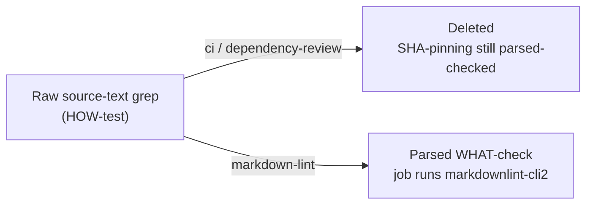

## Summary

Removed the raw source-text greps from the workflow YAML tests, replacing the
grep-as-assertion / source-formatting anti-pattern with parsed WHAT checks (or
removing it where no real invariant existed). Closes #86.

Three brittle cases were addressed:

- **`tests/ci_workflow_test.ts`** and **`tests/dependency_review_workflow_test.ts`** —
  removed the "carries a version comment above each pinned action" tests. These
  split the file into lines and required a `# org/action@tag` comment textually
  *immediately above* every `uses:` line. That asserts a layout convention, not
  behaviour: moving the annotation inline (`uses: x@sha # x@tag`), reformatting,
  or blank-lining between the comment and `uses:` would break the test while CI
  behaves identically. The genuine supply-chain guard — SHA pinning — is still
  enforced by the parsed "pins every action to a 40-char commit SHA" test, which
  is untouched. A short explanatory comment was left in place of each deleted
  test noting the convention belongs in a dedicated lint/`actionlint` rule.

- **`tests/markdown_lint_workflow_test.ts`** — rewrote "installs markdownlint-cli2
  and runs it" (previously two whole-file `assertStringIncludes` greps for the
  exact strings `npm install -g markdownlint-cli2` and `markdownlint-cli2`) into
  a WHAT/policy check. The new test parses the YAML, reads the `markdownlint`
  job's steps, and asserts that one of their `run` blocks invokes
  `markdownlint-cli2`. This keeps the real invariant (the lint job runs the
  linter) while tolerating behaviour-preserving install changes (pinning a
  version, `npm i -g`, or a setup action).

### Documented test modification

Per the TDD guidance, this issue is specifically about removing/rewriting brittle
HOW-tests. Two version-comment tests were deleted (the issue lists deletion as an
acceptable resolution) and one grep test was rewritten as a parsed check. No
behaviour-verifying coverage was lost: SHA pinning and the linter invocation
remain asserted through parsed config.

## Evidence

Backend/CLI/test-only change — no web interface to screenshot. Verified via the
test suite and the full quality gate.



Targeted run of the three affected files — 21 passed, 0 failed:

```
ok | 21 passed | 0 failed (614ms)
```

`./quality.sh` completes successfully (`✅ Quality checks completed successfully!`).

## Test Plan

- `tests/ci_workflow_test.ts` — removed the brittle version-comment test; the
  remaining parsed SHA-pinning, permissions, concurrency, and `set -euo pipefail`
  tests still pass.
- `tests/dependency_review_workflow_test.ts` — removed the brittle version-comment
  test; the parsed SHA-pinning test still passes.
- `tests/markdown_lint_workflow_test.ts` — replaced the literal-install-string
  greps with "Markdown Lint workflow runs markdownlint-cli2 in its job", a parsed
  check on the `markdownlint` job's `run` steps; passes against the current YAML.
- Full `./quality.sh` run passes (fmt, lint, type-check, all Deno tests, Rust
  tests, coverage).
