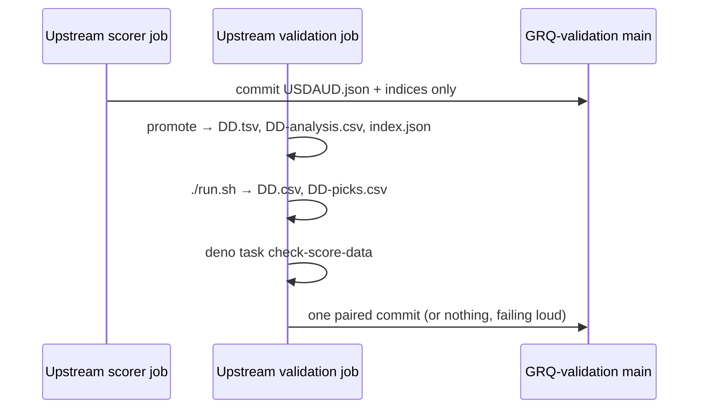

## Summary

The fault was in the private upstream pipeline. The daily scorer job promoted an embargo-aged
`DD.tsv` into this repo and committed it alone; its `DD.csv` only arrived when
the separately scheduled validation job next ran `./run.sh`. In between, `main`
was unpaired and both committed-tree gates failed every PR (`2026/July/27`,
`2026/August/26`, and now `2026/August/29`).

- **Root-cause fix (upstream, internal repo `stSoftwareAU/GRQ`)**, pushed as
  branch `fix/grq-validation-860-pair-promotion` and declared for a PR:
  promotion moves from the scorer job into the validation job, immediately
  before `./run.sh`. `deno task check-score-data` then gates that job's single
  commit, and the job fails loud with a `[stage] FAIL:` marker if the pairing is
  incomplete. The scorer job now commits only `USDAUD.json` and the benchmark
  indices.
- **This repo**: the README's promotion-guard section claimed the scorer already
  called `check-score-data` before committing, which was never true. It now
  describes the one-commit ordering, with a sequence diagram, at concept level:
  `tests/private_repo_scorer_reference_test.ts` forbids naming private repos or
  scripts.

Closes #860

## Evidence

Backend/pipeline change — there is no UI to screenshot.

Upstream tests run in the GRQ checkout:

- `worker/shared/test_validation_promotion_pairing.sh` (via
  `test/worker/ValidationPromotionPairing.ts`): 12 passed. It runs the real
  `validation.sh` and checks two things:
  - (a) the aged day is promoted before `run.sh`, and the check-in carries
    `DD.tsv`, `DD-analysis.csv`, `DD.csv` and `DD-picks.csv` together;
  - (b) an unpaired day is refused: exit non-zero, `[stage] FAIL:
    validation-score-data-pairing`, no check-in, no heartbeat.
- The existing fixtures for `test_validation_data_roots.sh`,
  `test_validation_csv_row_guard.sh` and `test_validation_scores_index_guard.sh`
  were updated for the new step order; all pass (8, 13 and 12 assertions).
- `worker/test/test_score_tail_prefetch.sh`: 35 passed. Its "score.sh promotes"
  assertions were changed to "score.sh no longer promotes / publishes no TSV".
  That behaviour is exactly what this fix removes; no test was deleted.
- GRQ `quality/shellcheck.sh`, `bash_syntax.sh`, `portability_guard.sh` and
  `shell_source_chain.sh` all pass.

**Still red on `main`, and outside this diff:** `docs/scores/2026/August/29.csv`
is missing, so `tests/market_data_presence_test.ts` and
`tests/score_data_pairing_test.ts::checkScoreDataPairing: the committed tree passes the guard`
fail on a clean checkout. Backfilling it needs the private share-price data root
(~40 GB, not cloneable in this container), and inventing price rows is not
acceptable. The existing validation job fills this gap on its next run, as it
did for July 27 and August 26. Once the upstream change lands, that gap can no
longer open.

## Reproduction

- **symptom** — a promoted score date reached `main` without its sibling `DD.csv`, so `deno task check-score-data` and the data-presence gate failed on every PR
- **status** — `verified` — `test_validation_promotion_pairing.sh` ran against the unfixed `validation.sh` and failed 10 of 12 assertions: nothing promoted before `run.sh`, and an unpaired day was checked in and marked healthy. It passes 12/12 after the fix
- **regression test** — `stSoftwareAU/GRQ` `worker/shared/test_validation_promotion_pairing.sh` (Deno wrapper `test/worker/ValidationPromotionPairing.ts::worker/validation.sh — commits promoted scores paired with their market data (GRQ-validation #860)`)

## Test Plan

- Added (GRQ): `worker/shared/test_validation_promotion_pairing.sh` and
  `test/worker/ValidationPromotionPairing.ts`.
- Modified (GRQ): fixtures in the three validation guard tests;
  `worker/test/test_score_tail_prefetch.sh` now asserts the scorer job no longer
  promotes.
- This repo: `tests/private_repo_scorer_reference_test.ts` passes with the new
  README section, and `markdownlint-cli2` reports 0 issues.
- `./quality.sh`: Rust build, clippy and tests all pass. The Deno suite has two
  failures, both from the pre-existing `August/29.csv` gap described above.
