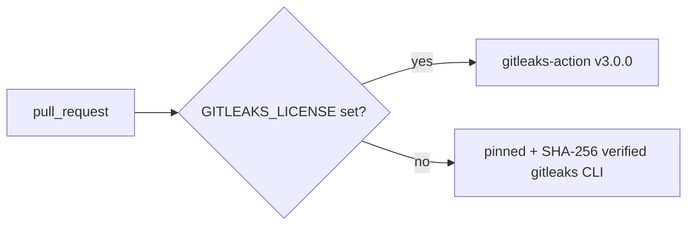

# PR Summary — Issue #868: Gitleaks licence-less fallback

## Summary

Closes #868

`gitleaks-action` exits with `ErrLicense` before scanning whenever the org
licence is absent (Dependabot and fork PRs). This change adds the free,
open-source gitleaks CLI as a fallback, matching the canonical template in
stSoftwareAU/VibeCoder and GRQ-FX-validation.

- `GITLEAKS_LICENSE` is now in the job-level `env` so step `if:` can branch
  on it. The `secrets` context is unavailable in `if:`.
- The licensed action runs `if: env.GITLEAKS_LICENSE != ''`. Its version
  comment is corrected to `v3.0.0`, which SHA `e0c47f4…` resolves to.
- The CLI fallback runs `if: env.GITLEAKS_LICENSE == ''`. It downloads
  gitleaks `8.30.1`, verifies it with `sha256sum --check --strict` against the
  published checksum (`551f6fc…`, cross-checked with the release's
  `gitleaks_8.30.1_checksums.txt`), then scans `BASE_SHA..HEAD_SHA`. The range
  is passed via `env:`.
- The job-level Dependabot skip from Issue #219 is removed. Dependabot PRs are
  now scanned by the fallback rather than skipped. The #219 test is replaced by
  one asserting the job is not skipped.
- The checkout sets `persist-credentials: false`, since the job never pushes.

**Human action (not done by the worker):** making the Gitleaks check required
in the repository rulesets.

## Evidence

This is a CI-only change with no visual surface. The evidence is
`tests/gitleaks_workflow_test.ts`, whose new tests all failed before the
change and pass after it:

- The job is not skipped for Dependabot.
- `GITLEAKS_LICENSE` is exposed at job level.
- The licensed action and the CLI fallback are gated on complementary
  conditions.
- The fallback runs `gitleaks git --redact --exit-code --log-opts` using the
  env-sourced commit range.
- The fallback runs in strict mode.
- The version is pinned and the checksum is verified before the scan.
- The checkout does not persist credentials.
- Every action is SHA-pinned.

## Test Plan

- [x] `deno test --allow-read tests/gitleaks_workflow_test.ts` (15 passed)
- [x] `actionlint .github/workflows/gitleaks.yml` is clean
- [x] `./quality.sh` passes (1652 passed, 0 failed)
