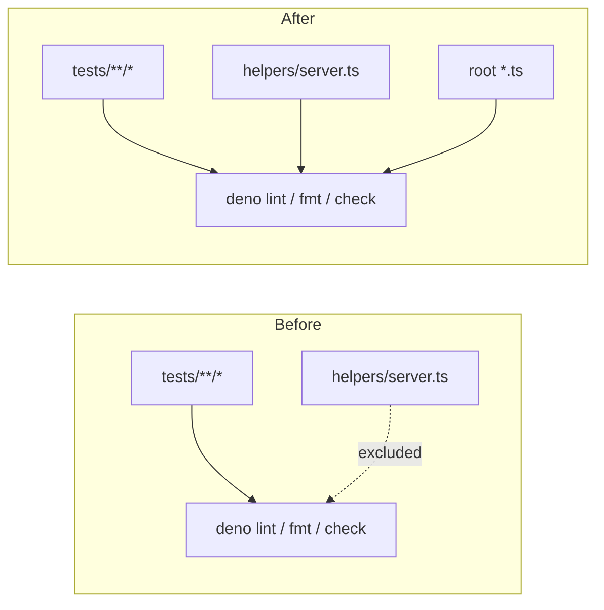

# Broaden Deno quality scope to cover application code (Issue #88)

## Summary

`deno.json` scoped `lint`, `fmt`, `test` and the top-level `include` to the
`tests/**/*` tree only, so the application code in `helpers/server.ts` was
never linted, formatted, or type-checked. Both runners confirmed the gap: the
`deno-quality.yml` CI workflow type-checked `tests/*.ts` only, and `quality.sh`
ran `deno fmt`/`deno lint`/`deno check` over `tests/*.ts` only. A regression in
the security-sensitive path-traversal logic (`getFilePath`) would have passed
CI green.

This PR broadens the scope so application code is covered:

- `deno.json` — added `helpers/**/*.ts` and `*.ts` to the top-level `include`,
  `lint.include` and `fmt.include` (the `exclude` of `docs/**/*` and `src/**/*`
  is unchanged, so generated/Rust-side code stays out of scope).
- `quality.sh` — `deno fmt`/`deno lint`/`deno check` now cover `helpers/*.ts`
  alongside `tests/*.ts`.
- `.github/workflows/deno-quality.yml` — the type-check step now runs
  `deno check helpers/*.ts tests/*.ts`.

Broadening the scope immediately surfaced a real `no-import-prefix` lint
violation in `helpers/server.ts`: it imported `@std/path` via a full
`https://deno.land/std@0.208.0/...` URL instead of the bare specifier already
declared in `deno.json` imports. Fixed by switching to `import { ... } from
"@std/path"`. With that fix, `deno lint`, `deno fmt --check` and
`deno check` all pass cleanly across the broadened 39-file scope.

The `test.include` stays scoped to `tests/**/*` — test discovery should not
pull non-test helper modules into the runner — which is asserted by a
regression test.

Closes #88.

## Evidence

Backend/config change with no web interface to screenshot. Verified via the
Deno quality commands and the test suite:

- `deno lint` → `Checked 39 files`, now including `helpers/server.ts`.
- `deno fmt --check` → `Checked 42 files`, no drift.
- `deno check helpers/*.ts tests/*.ts` → passes.
- `deno test --allow-read --allow-env tests/*.ts` → `200 passed | 0 failed`.

## Test Plan

Added `tests/deno_scope_config_test.ts` (TDD — failed before the config change,
passes after):

- `deno.json` top-level `include`, `lint.include` and `fmt.include` each cover
  `helpers/**/*.ts` and `*.ts`.
- `test.include` still covers `tests/**/*` (no regression in test discovery).
- `quality.sh` runs `deno check`, `deno lint` and `deno fmt` over `helpers/*.ts`.
- `deno-quality.yml` runs `deno check` over `helpers/*.ts`.

Existing `tests/server_path_traversal_test.ts` continues to pass, confirming the
`server.ts` import change did not alter behaviour.
