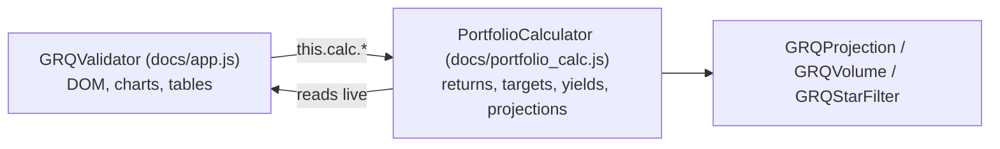

# PR Summary — Issue #881: split the calculations out of GRQValidator

## Summary

Closes #881

`GRQValidator` in `docs/app.js` mixed DOM rendering with portfolio maths, so
both halves changed for unrelated reasons. The DOM-free calculation methods now
live in a new `PortfolioCalculator` class in `docs/portfolio_calc.js`, and
`app.js` keeps only the wiring and rendering.

- The moved methods include `calculatePortfolioData`,
  `calculateStockPerformance`, `calculatePortfolioTargetPercentage`,
  `calculateHybridProjection`, `calculatePortfolioDividendYield`,
  `calculateTrendLine`, and the helpers they depend on: score dates, buy
  prices, split restatement, inclusion gates and the judgement.
- The calculator holds no state of its own. It reads `marketData`,
  `dividendData`, `scoreData` and the other loaded data live from a source
  object, so a reload in `app.js` shows up on the next call.
- Like `projection.js`, it is a plain classic script published on
  `globalThis.GRQPortfolioCalc`. The browser and the Deno tests therefore run
  the same code.
- `GRQValidator` now builds `this.calc = new GRQPortfolioCalc.PortfolioCalculator(this)` and
  calls every figure through `this.calc.*`. `app.js` is 1,197 lines shorter.
- `docs/index.html` loads the new script with a version-busted tag, and
  `docs/sw.js` precaches it.
- The calculations were moved without behaviour changes.

## Evidence

The dashboard renders normally after the extraction:

`./quality.sh < /dev/null` passes: 1,669 Deno tests passed and 0 failed, plus
fmt, lint, check and the Rust suites.

## Test Plan

- New `tests/portfolio_calc_test.ts` (15 tests) calls the real
  `PortfolioCalculator` against fixture data. It covers:
  - happy paths: 90-day return, portfolio performance, dividend yield, target
    percentage and the cost-of-capital window;
  - error paths: a missing source and a bad score file name;
  - edge cases: no market data, no included stocks, dividends outside the
    window, and live reads after a reload.
- `tests/dashboard_actual_horizon_basis_test.ts` used to extract
  `getStockReturnBreakdown` from the `app.js` source text. It now imports
  `portfolio_calc.js` and calls the method directly, keeping the same
  assertions.
- `tests/pick_columns_single_stock_view_test.ts` changes its slice end marker
  to the method that now follows `updateBasicStockTable`.
- `tests/script_version_busting_test.ts` lists `portfolio_calc.js` among the
  version-busted scripts.
- `./quality.sh < /dev/null`

🤖 Generated with [Claude Code](https://claude.com/claude-code)
