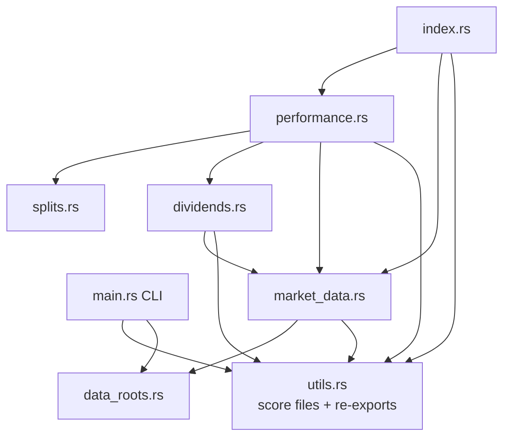

# PR Summary — Issue #882: split `src/utils.rs` into one-concern modules

## Summary

Closes #882.

`src/utils.rs` (3,886 lines) bundled five unrelated concerns. Each now has its
own module; `utils` keeps only the score-file helpers and re-exports every moved
item, so existing `grq_validation::utils::…` call sites (including `main.rs`)
compile unchanged.

| Module | Concern | Lines |
| --- | --- | --- |
| `data_roots.rs` | data-root env vars, resolution, repository check (+ shared test fixtures) | 426 |
| `splits.rs` | split-coefficient guard, correct-or-exclude adjustment | 352 |
| `market_data.rs` | market-data paths, reading/filtering, per-score price CSVs | 933 |
| `dividends.rs` | dividend paths, reading/filtering, per-score dividend CSVs | 359 |
| `performance.rs` | priceability, annualisation, portfolio, hybrid projection | 1,533 |
| `index.rs` | `docs/index.json` score index, safe score-file paths | 254 |
| `utils.rs` | score-file helpers + re-exports | 299 |

Code was moved, not rewritten: no behaviour change.



- [x] Split `utils.rs` into `splits`, `market_data`, `dividends`, `performance`, `index`; data-root items into `data_roots`
- [x] Re-export moved items from `utils`
- [x] Integration test `tests/module_split_test.rs` pinning the layout and re-exports
- [x] README (module list, Mermaid diagram, file references) and comment paths updated
- [x] `./quality.sh` green

## Evidence

`timeout 900 ./quality.sh < /dev/null` → exit 0:

```text
test result: ok. 105 passed; 0 failed   (lib unit tests)
test result: ok. 8 passed; 0 failed     (tests/module_split_test.rs)
76.71% coverage, 919/1198 lines covered
ok | 1654 passed (79 steps) | 0 failed (8s)   (deno test)
✅ Quality checks completed successfully!
```

`cargo clippy --all-targets --all-features -- -D warnings -D clippy::uninlined_format_args`: clean.

## Test modifications

No test was removed, disabled or changed in behaviour. The 92 unit tests from
the old `utils` test module moved into their new modules' `#[cfg(test)]` blocks
(a before/after name diff shows none missing). Only their `use` lines changed.
The shared fixtures `absent_data_root` / `configured_market_root` now live in
`data_roots::test_fixtures`. Comments in `tests/*.ts` and `scripts/*.ts` that
cite a moved function now name its new file.

## Test Plan

- `cargo test` — all unit, integration and doc tests pass.
- `cargo test --test module_split_test` — each new module is reachable and
  `utils::` re-exports resolve to the same items.
- `deno test --allow-read --allow-env tests/*.ts` — passes, including
  `private_data_root_reference_test.ts`.

## Security self-check

- [x] Input validation: the path-traversal guards (`build_score_file_path`,
  `get_market_data_path_in`, `get_dividend_data_path_in`) moved unchanged and
  are exercised in the new integration test.
- [x] Secrets: no hidden or credential files staged.
- [x] Injection surface: no new SQL, shell, filesystem or HTTP calls.
- [x] Output encoding / auth / error handling: not affected (pure module move).
- [x] Dependencies: none added.
