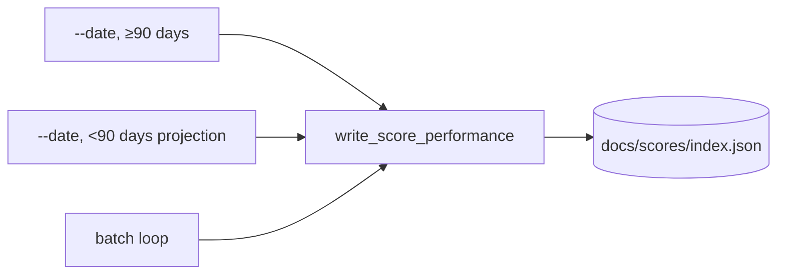

# PR Summary — #883 Extract the triplicated index.json update

## Summary

`main()` in `src/main.rs` repeated the same read → update-entry → write
`index.json` block three times (single-date performance, single-date
projection, and the batch loop). The three sites now call one function,
`write_score_performance(docs_path, date, performance)` in `src/index.rs`
(re-exported through `grq_validation::utils`).

Behaviour change: an unknown date used to rewrite the index unchanged while
`main()` still reported "Updated index.json". It now returns an error and
leaves the file as it was (fail loud).

Closes #883

- [x] Failing unit tests for `write_score_performance`
- [x] Extract the function and replace all three call sites
- [x] `cargo fmt`, `cargo clippy -D warnings`, `./quality.sh` green

## Evidence

This is a backend/CLI change with no visual surface. New unit tests in
`src/index.rs` cover it:

- `test_write_score_performance_updates_matching_entry_only`: the matching
  entry gets all three figures, and the neighbouring entry is untouched.
- `test_write_score_performance_overwrites_existing_figures`: figures that are
  already there get replaced.
- `test_write_score_performance_unknown_date_fails_loud_and_leaves_index`:
  the error names the date, and the file is left byte-identical.
- `test_write_score_performance_missing_index_errors`: a missing `index.json`
  returns an error.

These tests failed to compile (`cannot find function`) before the function
existed, and pass afterwards.

## Test Plan

- `cargo test --lib index::tests`: 9 passed
- `cargo clippy --all-targets -- -D warnings`: clean
- `./quality.sh < /dev/null`: passed

🤖 Generated with [Claude Code](https://claude.com/claude-code)
