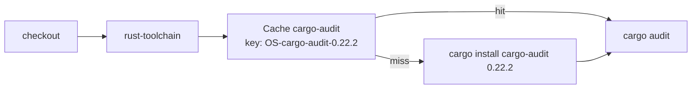

# PR Summary — Issue #884

## Summary

Closes #884. The `audit` job in `cargo-audit.yml` no longer compiles
cargo-audit from source on every run (~3.3 min). An `actions/cache` step,
reusing the `actions/cache@v6.1.0` SHA pin from `ci.yml`, restores
`~/.cargo/bin/cargo-audit`, `~/.cargo/registry` and `~/.cargo/git` under the key
`${{ runner.os }}-cargo-audit-0.22.2`. `cargo install` runs only on a cache
miss. The key embeds the pinned version, so bumping the install invalidates the
cache, and the weekly `schedule` run stays in place as a backstop.

## Evidence

This is a CI-only change, so there is no visual surface to screenshot. New tests
in `tests/cargo_audit_workflow_test.ts`:

- `restores cargo-audit from cache before installing`: the cache step comes
  before the install and covers all three paths.
- `cache key is tied to the pinned cargo-audit version`: the key contains
  `runner.os` and the `--version` parsed from the install command, and has no
  `restore-keys`.
- `skips the install on a cache hit`: the install step is conditional on
  `cache-hit != 'true'`.
- `actions/cache pin carries a node24-era annotation`

## Test Plan

- [x] Wrote the four new tests first and confirmed they failed against the
  unchanged workflow.
- [x] `deno test --allow-read tests/`: 1661 passed.
- [x] `deno fmt --check` and `deno lint` pass.
- [x] `./quality.sh` passes.
