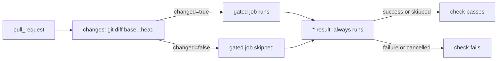

# PR Summary — Issue #885

## Summary

Closes #885.

The actionlint, Cargo Audit, Dependency Review and Markdown Lint PR gates now
skip a pull request that touches none of the files they check. Each workflow
gains:

- a `changes` job that diffs `base...head` (base and head SHAs passed via
  `env:`, `set -euo pipefail`, checkout with `persist-credentials: false`). A
  failed diff fails the job rather than skipping the gate;
- a `needs: changes` / `if: needs.changes.outputs.changed == 'true'` gate on
  the existing job (job ids unchanged);
- an always-run `*-result` aggregator that fails unless every needed job
  succeeded or was skipped, so the check always reports a conclusion.

There is no workflow-level `paths:` filter, which would leave required checks
pending. Scheduled and manual runs have no diff base, so they always run in
full.

**Deliberately left ungated:** `gitleaks.yml` and `semgrep.yml`, as the issue
asked, and also `deno-quality.yml`. The Deno suite reads most of the tree:
`docs/` assets, `src/*.rs`, every workflow, the Cargo files and the top-level
docs. A path scope would silently skip tests that guard those files. A test
pins all three as ungated.

| Workflow            | Runs when the PR touches                                   |
| ------------------- | ---------------------------------------------------------- |
| `actionlint`        | `.github/workflows/`                                       |
| `cargo-audit`       | `Cargo.toml`, `Cargo.lock` or its own workflow             |
| `dependency-review` | Cargo, Deno or npm manifests/lockfiles, or any workflow    |
| `markdown-lint`     | any `*.md`, `.markdownlint-cli2.jsonc` or its own workflow |

## Evidence

- `tests/pr_gate_change_detection_test.ts` (new, 27 tests) failed before the
  workflow edits (20 failures) and passes after. It compiles each
  `PATHS_REGEX` from the parsed YAML and checks sample paths that should and
  should not trigger the gate.
- `actionlint .github/workflows/*.yml` reports no issues.
- Smoke-tested the extracted scripts in bash:
  - aggregator: `success skipped` → 0; `success failure`,
    `cancelled skipped` and empty results → 1;
  - filter: an unknown base SHA exits 128 and writes no output (fails loud);
  - filter: a `schedule` event outputs `changed=true`.

## Test Plan

- [x] `deno test --allow-read --allow-env --allow-run tests/pr_gate_change_detection_test.ts`
      plus the existing actionlint, cargo-audit, dependency-review,
      markdown-lint, deno-quality, timeout and milestone workflow tests (105
      passing)
- [x] `actionlint` on all workflows
- [x] `markdownlint-cli2` on the changed docs
- [x] `./quality.sh < /dev/null`
