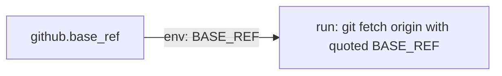

# PR Summary — Issue #888: quality gate red on the default branch

## Summary

Closes #888

On the untouched default branch, the only red check was `semgrep` (`p/default`). This PR fixes each finding at its source:

- **ERROR `run-shell-injection`** in `.github/workflows/gitleaks.yml`: the "Fetch base branch" step spliced `${{ github.base_ref }}` straight into `run:`. The value now arrives through `env: BASE_REF` and is quoted in the shell.
- **MEDIUM `dependabot-missing-cooldown`** in `.github/dependabot.yml`: this rule flags any `default-days` below 7. The repo's documented policy is a 24h quarantine (`VIBE_BUMP_QUARANTINE_HOURS`, deno.json `"P1D"`, README). Instead of changing that policy, each of the two lines carries a `nosemgrep` marker with a header comment explaining why.
- **INFO `unsafe-formatstring`** in `docs/app.js`: 19 `console.*` calls used an interpolated template literal (containing stock symbols and labels) as the format string. Each one now passes a literal `"%s"` first, so a `%` in the data can't be read as a format directive. The logged text is unchanged.

## Evidence

- `semgrep scan --config p/default --error --metrics=off .`: exit 1 before the fix (1 ERROR, 2 MEDIUM, 19 INFO), exit 0 with no findings after it.
- `./quality.sh < /dev/null`: exit 0 (1685 Deno tests passed; cargo fmt, clippy, tests and tarpaulin, then deno fmt, lint and check).

`docs/app.js` starts a live `GRQValidator` at import time, so it can't be imported headless. The semgrep scan is the regression check for these call sites, not a source-grep test.

## Test Plan

- [x] Semgrep `p/default` is clean locally
- [x] `./quality.sh` passes
- [ ] CI `semgrep` check is green on this PR

## Security self-check

- [x] Injection surface: the workflow expression moved to `env:` and is quoted
- [x] No secrets or hidden files staged beyond `.github/`

🤖 Generated with [Claude Code](https://claude.com/claude-code)
