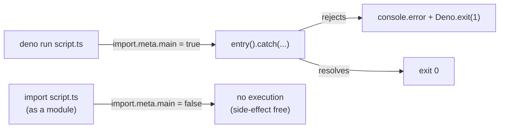

# Fix floating promises in debug helper scripts

## Summary

Three debug helper scripts invoked an `async` entry function at the top level
without awaiting it or attaching a `.catch` handler — a floating promise. A
floating promise fails silently: a rejection outside the function's own
`try`/`catch` becomes an unhandled rejection and the process may exit `0`
despite doing nothing useful.

Each script now exports its entry function and only invokes it behind an
`import.meta.main` guard with a `.catch` that logs the error and exits non-zero:

- `scripts/debug/check_syntax.ts` — `checkSyntax()`
- `scripts/debug/debug_schw_current_price.ts` — `debugSCHWCurrentPrice()`
- `scripts/debug/test_page_load.ts` — `testPageLoad()`

This makes failures visible (non-zero exit) and makes the modules safe to
import without side effects.

Closes #89.

## Evidence

Backend/CLI change — no web interface to screenshot.

- New behavioural test `tests/floating_promises_guard_test.ts` imports each
  module under `deno test --allow-read` (no `--allow-net`/`--allow-run`) and
  asserts the entry function is exported. A clean import proves the
  `import.meta.main` guard prevents the old auto-run: were the body still
  invoked on import it would hit a permission error or `Deno.exit` and fail.
- Ran `scripts/debug/check_syntax.ts` directly to confirm it still executes
  when run as the main module.
- `./quality.sh` passes (Rust + Deno lint/fmt/check/test, 207 Deno tests).

## Test Plan

- Added `tests/floating_promises_guard_test.ts`:
  - `check_syntax.ts - imports without running the check`
  - `debug_schw_current_price.ts - imports without running the debug`
  - `test_page_load.ts - imports without booting the server`
  - `entry functions are async (return a promise)`
- Confirmed the test fails against the unfixed code (functions not exported,
  `TS2339`) and passes after the fix.
- Full Deno suite: 207 passed, 0 failed.
