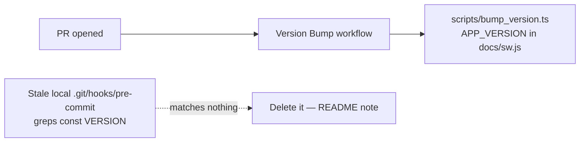

## Summary

Documented that the legacy local version-bump pre-commit hook is obsolete and
must not be reinstalled. Closes #898.

The dashboard version is bumped by the tracked, CI-driven **Version Bump**
workflow (`scripts/bump_version.ts`, Issue #323). The old hook greps
`const VERSION="…"` in `docs/index.html`. That constant has gone: the version is
now `APP_VERSION` in `docs/sw.js`. A stale copy in a clone's `.git/hooks/` now
matches nothing, prints `Version auto-incremented to ..1` and changes nothing.
The README _Dashboard versioning_ section now tells contributors not to install
a local hook. It also says how to delete a stale one and how to bump by hand
(`deno run --allow-read --allow-write scripts/bump_version.ts`).

## Spec

### Intent and Rationale

The issue offered three fixes. This PR takes option (c), the README note. A
tracked, portable bump already exists and runs on every PR, so a second
mechanism (option b) would duplicate it.

### Essential Design Decisions

- **No new hook or script.** `scripts/bump_version.ts` already reads
  `APP_VERSION` and keeps all the aligned locations in step. It runs portably on
  Deno, so it has no `sed -i ''` macOS dependency.
- **No host-side deletion (option a).** The worker host's clone has no
  `pre-commit` hook. The stale hook lives in an untracked `.git/hooks/` on
  another host, and no repo change can reach it. The README now gives the
  one-line removal step for that host.

### Undiscoverable Facts

- The hook's tracked source (`setup-hooks.sh`, `scripts/pre-commit`) was removed
  in #323; see `CHANGELOG.md`. Any surviving copy is untracked local state.

## Evidence

This is a documentation-only change, so there is no UI to screenshot.

- I checked the bump-by-hand command against `scripts/bump_version.ts`. With no
  `--base-version`, it bumps unconditionally. It only reads and writes under
  `docs/`, so `--allow-read --allow-write` is all it needs.
- `markdownlint-cli2@0.22.1`, the version pinned in `markdown-lint.yml`, reports
  0 errors.

## Test Plan

- [x] Read the README note against `scripts/bump_version.ts` behaviour.
- [x] Ran markdownlint on README.md (clean).
- [x] Added no new test. Bump behaviour is already covered by
      `tests/bump_version_test.ts` and `tests/script_version_busting_test.ts`;
      this change only adds prose.
