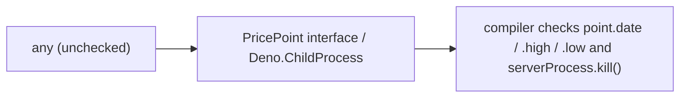

## Summary

Replaced bare `any` annotations with concrete types in two debug scripts so the
TypeScript compiler can check the property accesses that were previously
unchecked. Closes #90.

- `scripts/debug/debug_schw_current_price.ts` — added a small `PricePoint`
  interface (`{ date: string; high: number; low: number }`) and used it for the
  `forEach` (line 26) and `map` (line 84) callbacks that read `point.date`,
  `point.high`, and `point.low`. A typo such as `point.hihg` is now a compile
  error instead of a silent runtime `undefined`.
- `scripts/debug/test_page_load.ts` — typed `serverProcess` as
  `Deno.ChildProcess | null` (line 11). It is assigned a
  `new Deno.Command(...).spawn()` result, so `serverProcess.kill()` in the
  `finally` block is now checked against the real `Deno.ChildProcess` API.

No behaviour changes — these are type annotations only.

## Evidence

This is a CLI/type-safety change with no web interface, so there is no
screenshot. Verification is the type checker and linter:

```
$ deno check scripts/debug/debug_schw_current_price.ts scripts/debug/test_page_load.ts
Check scripts/debug/debug_schw_current_price.ts
Check scripts/debug/test_page_load.ts

$ deno lint scripts/debug/debug_schw_current_price.ts scripts/debug/test_page_load.ts
Checked 2 files
```

`deno lint` enforces the `no-explicit-any` rule, so a clean run confirms no
`any` remains in the two files. The full `./quality.sh` gate (cargo fmt/clippy/
check/test, the Deno test suite, fmt, lint, and check) also passes cleanly.



## Test Plan

- These debug scripts are not part of the importable test suite (they perform
  network calls and spawn a server as side effects), so there is no pure
  function to unit-test without faking it. The meaningful regression guard for a
  type-only fix is the type checker: `deno check` and `deno lint` (with
  `no-explicit-any`) both pass on the two changed files, and the full
  `./quality.sh` gate passes.
- Scope kept tight: the debug scripts live outside the `deno.json` lint/fmt
  scope and use a 4-space / single-quote style, so they were not reformatted or
  added to the quality gate — only the `any` annotations called out in the issue
  were changed.
