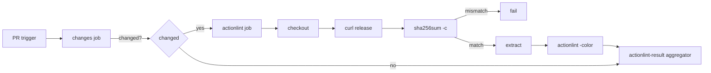

# PR Summary — Issue #903

## Summary

- The Actionlint PR gate (`.github/workflows/actionlint.yml`) has ended in
  `startup_failure` with zero jobs on every trigger since about 2026-09-27.
- Root cause: not #887. The workflow file is byte-identical at the last good
  head (7e40111f) and the first failing head (37d5c528), and #887's own
  branch runs passed. An org/repo Actions allow-list policy was tightened
  between 2026-09-26T17:31Z and 2026-09-27T09:30Z. The failing run page's
  annotation (run 36860325109) reads:

  > The action
  > docker://rhysd/actionlint:1.7.9@sha256:a0383f60… is not allowed in
  > stSoftwareAU/GRQ-validation because all actions must be from a
  > repository owned by stSoftwareAU, created by GitHub, or match one of the
  > patterns: codecov/codecov-action@*, denoland/setup-deno@*,
  > dtolnay/rust-toolchain@*, gitleaks/gitleaks-action@*,
  > ludeeus/action-shellcheck@*, peter-evans/create-pull-request@*. All
  > actions must also be pinned to a full-length commit SHA.

- Fix: replace the `docker://` step action with a `run:` step that downloads
  the pinned actionlint 1.7.9 linux_amd64 release tarball, verifies its
  sha256 with `sha256sum -c`, extracts it to `$RUNNER_TEMP` and runs it with
  `-color`. A plain download is not an action, so the allow-list doesn't
  apply.

Closes #903.

## Spec

### Intent and Rationale

Restore a working actionlint PR gate without weakening supply-chain pinning
(Issue #72).

### Essential Design Decisions

- Download plus sha256 verification, not a job-level `container:` (the
  semgrep.yml pattern). The rhysd/actionlint image is alpine with
  `USER guest` and no git, so `actions/checkout` inside it yields no `.git`
  and actionlint exits 3 with "no project was found". This was reproduced
  locally.
- Not reverting #887, which didn't cause the failure.
- Trade-off: Dependabot can no longer track the version (the #871 image-tag
  pin). The version and checksum must be bumped by hand together, as the
  workflow comment says.

### Undiscoverable Facts

- The repo and org Actions permission APIs return 403 to the worker token;
  the policy text is only visible in the run annotation.
- The sha256
  `233b280d05e100837f4af1433c7b40a5dcb306e3aa68fb4f17f8a7f45a7df7b4` was
  cross-checked against both the GitHub release asset digest and
  `actionlint_1.7.9_checksums.txt`.
- The ubuntu-latest runner image ships shellcheck, so actionlint's
  shellcheck integration of `run:` blocks keeps working.

## Evidence

- Local `actionlint -color` exits 0 on the edited workflows.

## Test Plan

- [x] `tests/actionlint_workflow_test.ts`: the Issue #871 docker-tag test is
      replaced by two Issue #903 tests. One asserts no `docker://` step
      anywhere; the other asserts an exact-version `ACTIONLINT_VERSION`, a
      64-hex `ACTIONLINT_SHA256` and `sha256sum -c` in the install step.
- [x] `deno test --allow-read tests/actionlint_workflow_test.ts tests/pr_gate_change_detection_test.ts`:
      40 passed.
- [x] `actionlint -color` locally: clean.
- [ ] The Actionlint check on this PR runs (not `startup_failure`).
- [x] `./quality.sh`: all stages green except the 2 pre-existing data tests
      that also fail on `main` (`tests/market_data_presence_test.ts:82`,
      `tests/score_data_pairing_test.ts:252` — missing
      `docs/scores/2026/August/30.csv`, `31.csv`, `September/01.csv`),
      tracked by #896 and unrelated to this change; 1699 passed, 2 failed.

## Pre-PR Security Self-Check

A brief checklist:

- No secrets.
- No `${{ }}` interpolation in `run:`.
- The download is over TLS from the GitHub release and checksum-verified
  before execution.
- Permissions are unchanged (contents: read).
- `persist-credentials: false` is unchanged.
