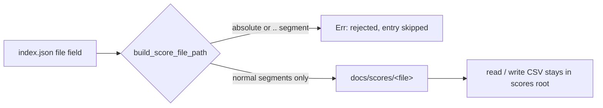

## Summary

Fixed a path-traversal weakness where the `file` field read from
`docs/scores/index.json` was concatenated straight into a filesystem path with
no sanitisation, allowing a crafted entry such as `"../../../../tmp/evil.csv"`
to escape the intended `docs/scores/` directory for both reads and writes.

A new `build_score_file_path(docs_path, file)` helper in `src/utils.rs` now
validates the `file` value before joining: it rejects any absolute path or
parent-directory (`..`) segment and builds the result with `Path::join`,
keeping only normal path segments. With neither traversal nor absolute
components present, the joined path is lexically guaranteed to stay within
`<docs_path>/scores`. This mirrors the containment guard already used in
`helpers/server.ts::getFilePath`.

Both unsanitised call sites now route through the helper and skip (with a
logged warning) any entry whose `file` value fails validation:

- `src/main.rs` — the `--process-all` processing loop.
- `src/utils.rs::update_index_with_performance`.

Closes #91.

## Evidence

This is a backend/CLI change with no web interface, so there is no screenshot.
The fix is verified by unit tests that call the real `build_score_file_path`
function with malicious and benign inputs and assert on the result.

## Test Plan

Added the following unit tests in `src/utils.rs` (`mod tests`):

- `test_build_score_file_path_valid` — a nested file and a `./`-prefixed file
  both resolve cleanly within `docs/scores`.
- `test_build_score_file_path_rejects_parent_traversal` — `../`-based and
  mid-path `..` traversal attempts are rejected.
- `test_build_score_file_path_rejects_absolute` — an absolute `/etc/passwd`
  value is rejected.
- `test_build_score_file_path_rejects_empty` — empty/whitespace values are
  rejected.

All existing tests continue to pass; no tests were removed or disabled.
