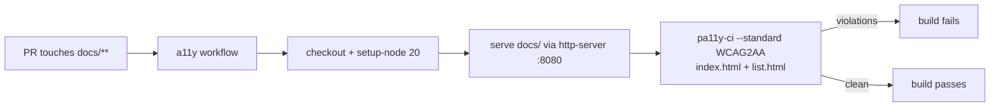

## Summary

Wired an automated accessibility (a11y) check into CI for the `docs/` dashboard
UI. The repo ships an interactive "GRQ Validation Dashboard" (`docs/index.html`,
`docs/list.html`, `docs/app.js`, `docs/list.js`) published to GitHub Pages, but
no workflow exercised the rendered UI for accessibility — so regressions
(missing form labels, insufficient colour contrast, missing alt text,
non-keyboard-navigable controls) could ship unnoticed.

A new `.github/workflows/a11y.yml` workflow now runs `pa11y-ci` against the
rendered dashboard pages on every pull request that touches `docs/`, failing the
build on WCAG 2.1 AA violations. This gives accessibility the same automated
gate the existing `semgrep`/`gitleaks` checks provide. Third-party actions are
pinned to 40-character commit SHAs (reusing the repo's existing pins for
`actions/checkout` and `actions/setup-node`) per the supply-chain rule.

Closes #92.

## Evidence

This is a CI/configuration change — it adds a workflow and does not modify the
dashboard UI, so there is no visual change to screenshot. Verification is via
the Deno test suite plus the workflow's own job structure:

The new `tests/a11y_workflow_test.ts` asserts the workflow exists, parses as
YAML, is named `Accessibility`, triggers on `pull_request` scoped to `docs/**`,
declares read-only `contents` permission, bounds the job with a timeout, serves
`docs/` over HTTP, runs `pa11y-ci` over both dashboard pages with the `WCAG2AA`
standard, and pins all actions to 40-character commit SHAs. The existing
`tests/workflow_timeout_test.ts` and `tests/documentation_accuracy_test.ts`
continue to pass with the new workflow (README updated to reference it).

## Test Plan

- Added `tests/a11y_workflow_test.ts` (9 tests) verifying the new workflow's
  structure, trigger scope, permissions, pa11y-ci invocation, WCAG2AA standard,
  and SHA-pinned actions.
- `deno test --allow-read tests/*.ts` — full suite passes (214 tests).
- `tests/documentation_accuracy_test.ts` — README references `a11y.yml`.
- `tests/workflow_timeout_test.ts` — the new job declares a sane timeout.
- `markdownlint-cli2 README.md` — clean.
