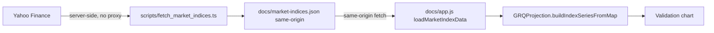

# Remove untrusted public CORS proxies from benchmark data fetch

## Summary

The published dashboard fetched S&P 500, NASDAQ and Russell 2000 benchmark data
at runtime in every visitor's browser through three uncontrolled public CORS
relays (`api.allorigins.win`, `corsproxy.io`, `thingproxy.freeboard.io`), racing
them and charting whichever responded first. Any operator who controlled,
compromised or MITM'd the highest-priority reachable relay could observe every
visitor and feed the "validation" dashboard fabricated benchmark prices, and the
request metadata of every visitor was disclosed to three third parties.

This change removes the runtime dependency on untrusted relays entirely, per the
issue's suggested fix:

- Benchmark data is now fetched **first-party, server-side** — directly from
  Yahoo Finance with no browser and therefore no CORS restriction and no
  proxy — by a new script, `scripts/fetch_market_indices.ts`, which writes the
  same-origin static file `docs/market-indices.json` (a `{date: close}` map per
  index, mirroring the existing committed `docs/USDAUD.json`).
- The dashboard (`docs/app.js`, `loadMarketIndexData`) now reads that
  same-origin file with a plain `fetch('market-indices.json')` — **no runtime
  cross-origin call and no untrusted intermediary**. The three proxy chains and
  the now-dead `processYahooFinanceData` parser were deleted.
- Slicing and shaping of each index series moved into a pure, unit-tested kernel
  `GRQProjection.buildIndexSeriesFromMap` in `docs/projection.js`, so the browser
  and the Deno tests exercise identical code.
- The stale "CORS proxies may be down" user-facing message was corrected.

Closes #93.

## Evidence

This is a dashboard change. Playwright MCP was unavailable in this environment,
so verification was done by serving `docs/` and by exercising the real kernel
against the real committed data file:

- Static server returned `HTTP 200` for both `index.html` and the new
  `market-indices.json`.
- `node --check docs/app.js` parses cleanly; the `tests/js_syntax_test.ts` gate
  confirms the dashboard scripts parse.
- `tests/market_indices_test.ts` runs the **real** `buildIndexSeriesFromMap`
  kernel over the **real** committed `docs/market-indices.json` and asserts a
  well-formed, ordered series with finite prices.

Data flow after the change — every dashboard input is now same-origin:

## Test Plan

New `tests/market_indices_test.ts` (11 cases, all calling real functions):

- `buildIndexSeriesFromMap` — happy path (ordered series), date-range filtering,
  inclusive boundaries, skipping null/non-finite/non-numeric closes,
  empty/`null` map, and all-out-of-range input.
- `toUnixSeconds` / `toPriceMap` (the server-side fetcher's pure helpers) —
  ISO→UTC conversion, finite-close extraction with cent rounding, and
  empty/malformed payloads.
- The committed `docs/market-indices.json` is same-origin, well-formed
  (`sp500`/`nasdaq`/`russell2000`, ISO date keys, finite numeric closes) and
  flows through the dashboard kernel.

Full suite: `deno test --allow-read tests/*.ts` → 227 passed, 0 failed.
`deno lint` and `deno check` clean. Existing tests were not modified.

## Security self-check

- **Input validation**: the kernel rejects non-object maps and non-finite
  closes; the fetcher validates HTTP status and non-empty payloads.
- **Injection surface**: no new HTML/script sink — data is numeric and charted
  only. The symbol is `encodeURIComponent`-escaped in the server-side URL.
- **Supply chain**: removed three untrusted third-party relays from the runtime
  trust boundary; benchmark data is now first-party and committed.

### Deno regression avoided

The server-side fetcher and its tests are written for Deno's native toolchain
(`deno run`/`deno test`), with no Node tooling introduced.
