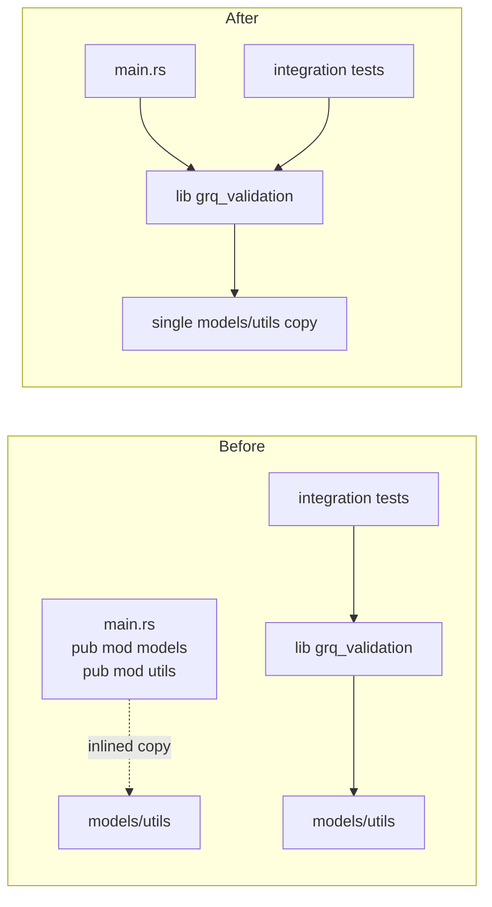

# Binary now consumes the `grq_validation` library crate

## Summary

The binary (`src/main.rs`) re-declared `pub mod models;` and `pub mod utils;`,
compiling its own private copy of both modules even though the package already
exposes them through the `grq_validation` library crate (`src/lib.rs`,
`[lib] name = "grq_validation"`). The whole library was therefore compiled
twice, and — more importantly — the binary did **not** consume the same crate
the integration tests exercise (`tests/dividend_tests.rs` and
`tests/market_data_tests.rs` import `grq_validation::utils::…`). The two copies
could drift, so behaviour verified by tests was not guaranteed to match the
behaviour shipped by the binary. The duplication was also why several `pub`
items carried `#[allow(dead_code)]`: functions reached only through the
library/tests looked "dead" to the binary crate.

This PR makes the binary depend on the library crate:

- Dropped `pub mod models;` and `pub mod utils;` from `main.rs`.
- Changed `use utils::…` to `use grq_validation::utils::…` and rewrote every
  remaining `utils::…` path as `grq_validation::utils::…`.
- Removed the now-redundant `#[allow(dead_code)]` attributes from `src/utils.rs`
  (9 occurrences) and `src/models.rs` (1 occurrence). Pub items in the library
  crate are public API and are no longer flagged as dead code.

The binary and the integration tests now share a single compiled copy of the
modules.

Closes #94.

## Evidence

This is a backend/CLI structural change with no web interface to screenshot.
Verification was done via the build, linter and test suite:

- `cargo build` — compiles cleanly.
- `cargo clippy --all-targets --all-features -- -D warnings` — passes with zero
  warnings, confirming no `dead_code` warnings resurfaced after removing the
  `#[allow(dead_code)]` attributes.
- `cargo test --all-targets --all-features` — 25 unit tests + 2 integration
  tests pass.
- `./quality.sh < /dev/null` — completed successfully (Rust + Deno checks).

## Test Plan

No behavioural change was introduced, so the existing test suite is the
regression guard — and it is the right one here: the integration tests
(`tests/dividend_tests.rs`, `tests/market_data_tests.rs`) import the binary's
functions via `grq_validation::utils::…`, which is exactly the crate path the
binary now consumes. After this change the binary and the tests exercise the
same compiled code.

- `cargo test --all-targets --all-features` — all 27 tests pass (25 unit, 2
  integration).
- `cargo clippy --all-targets --all-features -- -D warnings` — confirms the
  removed `#[allow(dead_code)]` attributes are no longer needed.
