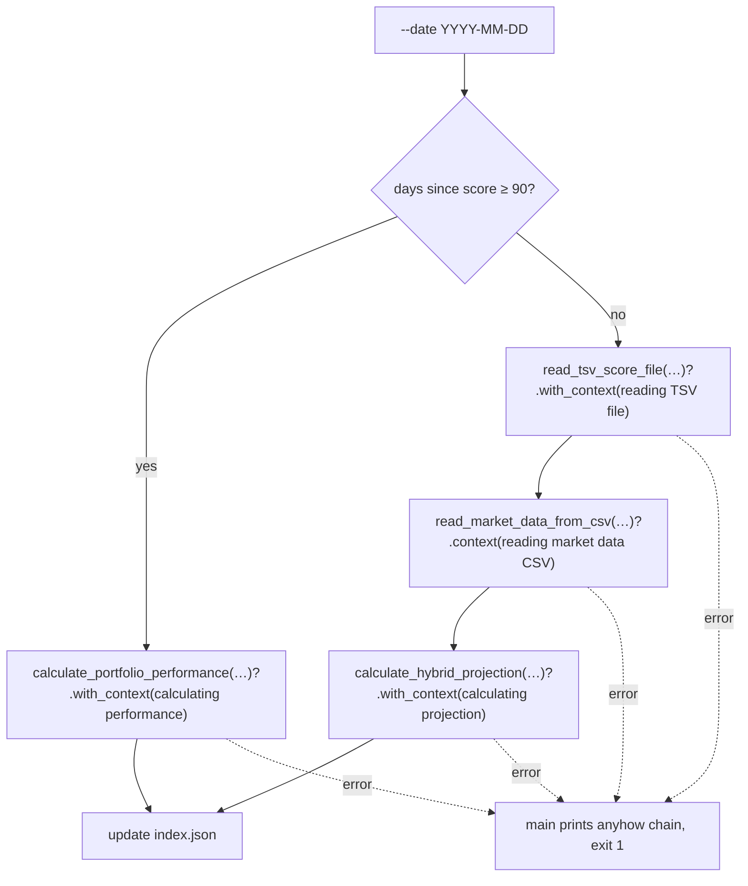

## Summary

Replaced the nested `match { Ok(v) => …, Err(e) => { log::error!(…); return Err(e) } }`
ladders in the single-date branch of `src/main.rs` with `?` propagation plus
`anyhow` context. Both the regular-date branch (≥ 90 days) and the
hybrid-projection branch (< 90 days) now read at one indentation level, so the
happy-path projection logic is no longer buried under ~28 columns of rightward
drift. Each fallible call carries a `.with_context(…)`/`.context(…)` message,
which `main` (already `anyhow::Result<()>`) prints as a full error chain on exit
— preserving the per-call diagnostics the old `log::error!` lines provided.

Added `use anyhow::Context;` to enable the context combinators. The
log-and-`continue` arms in the batch-processing loop were intentionally left
unchanged: they recover and carry on rather than propagate, so `?` does not
apply.

Closes #95.

## Evidence

Backend/CLI change — no web interface to screenshot. Verified via a new
integration test that drives the real binary end-to-end and asserts on the
observable behaviour (non-zero exit and a contextualised error chain), not the
implementation:



Test run:

```
running 3 tests
test invalid_date_format_is_rejected ... ok
test regular_branch_missing_file_propagates_with_context ... ok
test hybrid_branch_missing_tsv_propagates_with_context ... ok

test result: ok. 3 passed; 0 failed
```

Full `./quality.sh` passes (cargo fmt/clippy/check/test + coverage + Deno
checks).

## Test Plan

New `tests/main_error_propagation_test.rs`:
- `hybrid_branch_missing_tsv_propagates_with_context` — a recent date (< 90 days)
  with an absent TSV file exits non-zero and the error chain contains
  `reading TSV file`.
- `regular_branch_missing_file_propagates_with_context` — an old date (≥ 90 days)
  with no score file exits non-zero and the chain contains
  `calculating performance`.
- `invalid_date_format_is_rejected` — a malformed date (`2026-06`) is rejected
  before any file access (`Invalid date format`).

The two propagation tests were confirmed to fail against the pre-refactor code
(which emitted only the bare `No such file or directory` cause with no context)
and to pass after the refactor. All existing Rust and Deno tests continue to
pass.
