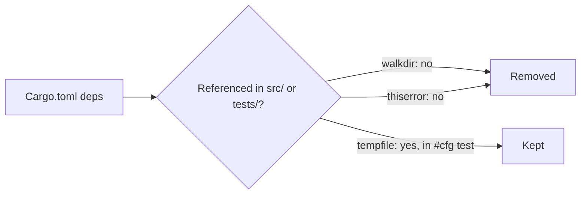

# Remove dead dependencies `walkdir` and `thiserror`

## Summary

Removed two declared-but-unused crates from `[dependencies]` in `Cargo.toml`
and refreshed `Cargo.lock`. A whole-crate search (`src/**/*.rs`,
`tests/**/*.rs`; there is no `build.rs` or `benches/`) found zero references to
either crate — no `use`, no `extern crate`, no fully-qualified path, and no
`thiserror` derive macro. Error handling is done entirely with `anyhow`.
Dropping them trims build time, the lockfile, and the supply-chain surface
(their transitives `same-file`, `thiserror-impl`, and `winapi-util` are gone
from `Cargo.lock` too). Closes #96.

**Correction to the issue:** the issue also asked to remove the
`tempfile` dev-dependency, but `tempfile` **is** in use — `src/utils.rs`
(`tempfile::NamedTempFile` inside the `#[cfg(test)]` module) and
`tests/main_error_propagation_test.rs` (`tempfile::tempdir`). The issue warned
its read-only grep might miss `cfg`-gated usage, and that is exactly what
happened. `tempfile` has therefore been **kept**; removing it would break the
test suite.

```diff
-# For file system operations
-walkdir = "2.4"
-
 # For error handling
 anyhow = "1.0"
-thiserror = "2.0"
```



## Evidence

Backend/CLI change only — no web interface to screenshot. Verified by build,
the full test suite, and the repository quality gate:

- `cargo build` — succeeds with the two crates removed.
- `cargo test` — all tests pass, including the `tempfile`-using tests
  (`test_read_market_data_from_csv_skips_unparseable_close`,
  `tests/main_error_propagation_test.rs`), confirming `tempfile` is genuinely
  required.
- `cargo update -p walkdir -p thiserror` — `Cargo.lock` no longer contains
  `walkdir`, `thiserror`, `thiserror-impl`, `same-file`, or `winapi-util`.
- `./quality.sh` — passes cleanly (fmt, clippy `-D warnings`, type checks,
  Rust tests, tarpaulin coverage, release build, Deno tests/lint/check:
  `227 passed | 0 failed`).

## Test Plan

No new test files were added — this is a build-manifest change whose correct
behaviour is "everything still compiles and every existing test still passes".
The existing suite provides the verification:

- The full `cargo test --all-targets --all-features` run is the regression
  guard: had any source path actually depended on `walkdir` or `thiserror`,
  compilation would fail.
- The `tempfile`-using tests prove `tempfile` must stay, justifying the
  deviation from the issue's suggested diff.
