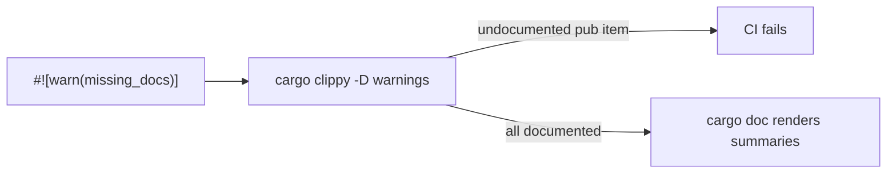

# Add `///` docs and a `missing_docs` lint to the `grq_validation` public API

## Summary

The library crate root carried no lint posture and most of its `pub` surface
shipped without `///` doc comments, so `cargo doc` rendered blank entries and CI
could not catch undocumented items. This change adds `#![warn(missing_docs)]`
plus a crate-level summary to `src/lib.rs`, then documents every public item:

- **`src/lib.rs`** — `#![warn(missing_docs)]`, a `//!` crate summary, and a
  one-line `///` summary on each public module.
- **`src/models.rs`** — `///` summaries on every public struct
  (`StockRecord`, `MarketDataMeta`, `DailyData`, `MarketData`, `IndexData`,
  `ScoreEntry`, `DividendRecord`, `DividendData`, `StockPerformance`,
  `PortfolioPerformance`) **and each of their public fields**, plus
  `StockRecord::new`.
- **`src/utils.rs`** — `///` summaries on the public constants and the
  functions that lacked them (`validate_stock_symbol`,
  `calculate_average_score`, `read_index_json`, `extract_ticker_from_symbol`,
  `get_market_data_path`, `read_tsv_score_file`,
  `extract_ticker_codes_from_score_file`, `extract_symbol_from_ticker`,
  `read_market_data`, `read_market_data_from_csv`,
  `filter_market_data_by_date_range`). Runnable `# Examples` doctests were added
  to `validate_stock_symbol` and `calculate_average_score`, and a `no_run`
  example to `calculate_portfolio_performance`, per the Rust API Guidelines
  (C-CRATE-DOC / C-EXAMPLE).

Because `quality.sh` runs `cargo clippy ... -- -D warnings`, the new
`#![warn(missing_docs)]` is effectively enforced — any future undocumented
public item now fails CI rather than rendering blank in `cargo doc`.

Closes #97.

## Evidence

CLI/library change — no UI to screenshot. Verified via the test suite and the
documentation lint:

- `cargo clippy --all-targets --all-features -- -D warnings` passes cleanly,
  proving the `missing_docs` warning surfaces nothing (every public item is
  documented).
- `cargo test --doc` runs the new examples as real tests:

  ```
  running 3 tests
  test src/utils.rs - utils::calculate_portfolio_performance (line ...) - compile ... ok
  test src/utils.rs - utils::calculate_average_score (line ...) ... ok
  test src/utils.rs - utils::validate_stock_symbol (line ...) ... ok
  test result: ok. 3 passed; 0 failed
  ```

- `./quality.sh` completes with `✅ Quality checks completed successfully!`.



## Test Plan

- Added runnable doctests (executed by `cargo test --doc`):
  - `validate_stock_symbol` — asserts a valid and an empty symbol.
  - `calculate_average_score` — asserts the mean and the empty-slice case.
  - `calculate_portfolio_performance` — `no_run` usage example (compiled).
- Existing unit, integration, and Deno tests continue to pass via `./quality.sh`.
- The `missing_docs` lint under `-D warnings` acts as a coverage gate ensuring
  no public item is left undocumented.
