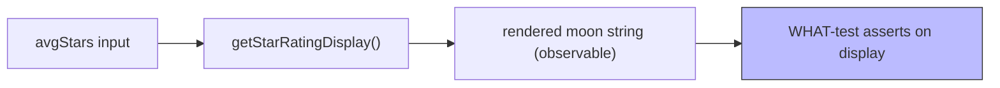

# PR Summary — Issue #98

## Summary

The `"Star Rating Calculation Details"` test in `tests/star_rating_test.ts`
asserted on the star-display algorithm's **internal intermediate variables**
(`hundredStars`, `fullStars`, `remainderStars`, `partialStars`, `moonPhase`)
rather than on anything a user can observe. These five fields are pure
implementation internals of the rounding maths — a behaviour-preserving
refactor (e.g. computing the partial-moon directly from the fractional part,
or dropping the "twentieths" intermediate representation) produces the **same**
rendered moon-string but would break every one of those assertions. The test
was a HOW-test that pinned the suite to one particular internal decomposition
while adding no signal beyond the four sibling WHAT-tests that already assert
on the rendered emoji string directly.

Applied resolution (a) from the issue: rewrote the test to assert on the
**observable contract** only — the upstream inputs (`msStars`, `tipsStars`,
`avgStars`) and the rendered `display` string. The now-dead intermediate
computation was removed from the inline mock so the test no longer reproduces
the algorithm's bookkeeping.

The observable outcomes asserted:

- BAC (`avgStars = 3.1`) → `"🌕🌕🌕🌑"` (three full moons + new-moon partial)
- JPM (`avgStars = 4.0`) → `"🌕🌕🌕🌕"` (four full moons)
- AAPL (`avgStars = 4.0`) → `"🌕🌕🌕🌕"` (four full moons)
- Non-existent stock → `null`

Closes #98.

## Evidence

Backend/test-only change — no web interface to screenshot. Verified via the
test suite and full quality gate.



Test run output:

```
running 6 tests from ./tests/star_rating_test.ts
Star Rating Display - Basic Cases ... ok
Star Rating Display - Quarter Star Cases ... ok
Star Rating Display - Rounding Cases ... ok
Star Rating Display - Edge Cases ... ok
Star Rating Display - Moon Phase Mapping ... ok
Star Rating Calculation Details ... ok

ok | 6 passed | 0 failed
```

`./quality.sh` completes successfully.

## Test Plan

- Modified `tests/star_rating_test.ts::"Star Rating Calculation Details"` to
  assert on the observable `display` string and upstream inputs instead of the
  internal `hundredStars`/`fullStars`/`remainderStars`/`partialStars`/`moonPhase`
  intermediates.
- Confirmed all 6 tests in `tests/star_rating_test.ts` pass.
- Confirmed the full `./quality.sh` gate passes cleanly.
