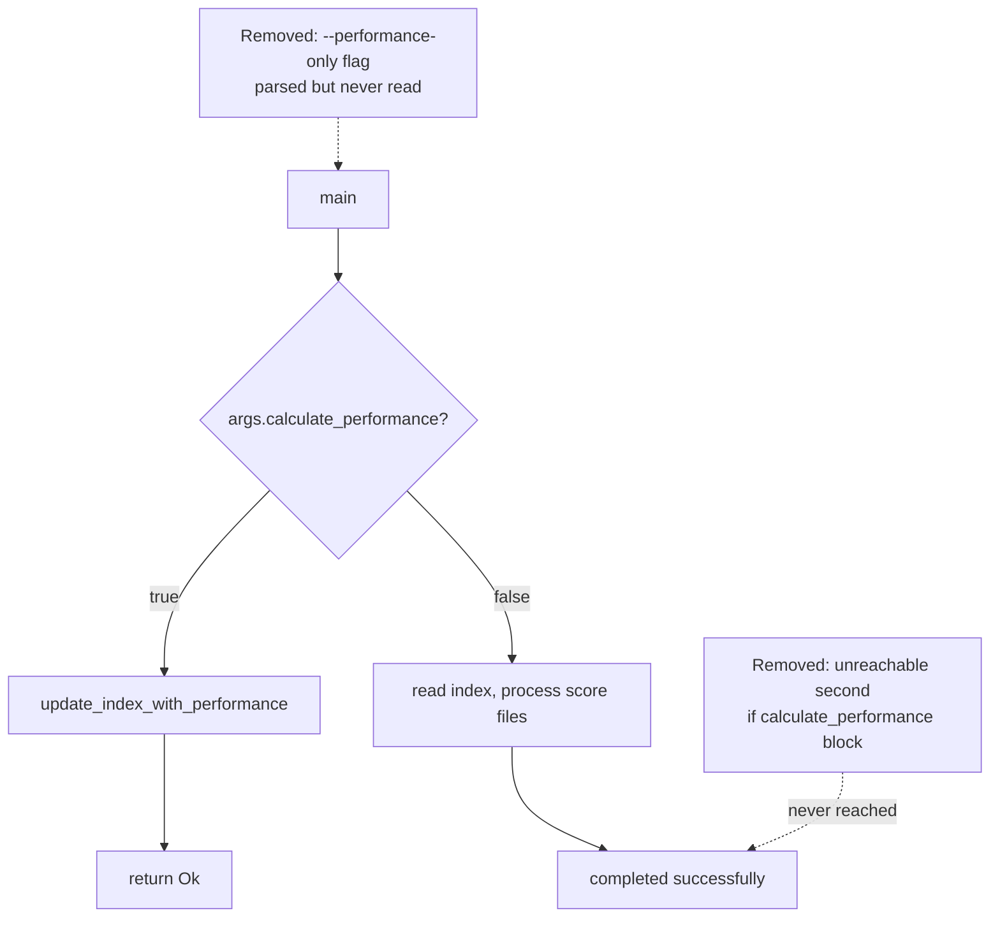

## Summary

Removed two pieces of dead CLI-flag code from `src/main.rs`. Closes #99.

1. **`--performance-only` flag** — declared on the `Args` struct but never
   read anywhere in the crate. A caller passing `--performance-only` got the
   full CSV-generation path regardless, so the documented flag silently did
   nothing. Removed the flag and its help text, and dropped the matching line
   from the README CLI options.
2. **Unreachable `--calculate-performance` re-check** — `main` early-returns
   inside the first `if args.calculate_performance { … return Ok(()); }`, so
   the later `if args.calculate_performance { … }` block (two `info!` lines)
   could never run. Removed the dead block.

Both removals are behaviour-preserving: neither item affected runtime
behaviour. The retained `--calculate-performance` flag is unchanged.

## Evidence

Backend/CLI change with no web interface to screenshot. Verified via the real
binary end-to-end in `tests/cli_flag_cleanup_test.rs`:

- `--performance-only` is now rejected by clap as an unknown argument
  (non-zero exit) instead of being silently accepted.
- `--calculate-performance` is still accepted and exits successfully, and the
  removed unreachable block's log messages never appear.

## Test Plan

- Added `tests/cli_flag_cleanup_test.rs`:
  - `performance_only_flag_is_no_longer_accepted` — asserts the removed flag
    is rejected with a non-zero exit (fails against the unfixed code).
  - `calculate_performance_flag_is_still_accepted` — asserts the retained flag
    still parses and that the unreachable block's messages are gone.
- Existing `tests/main_error_propagation_test.rs` continues to pass.
- `./quality.sh` passes cleanly.
