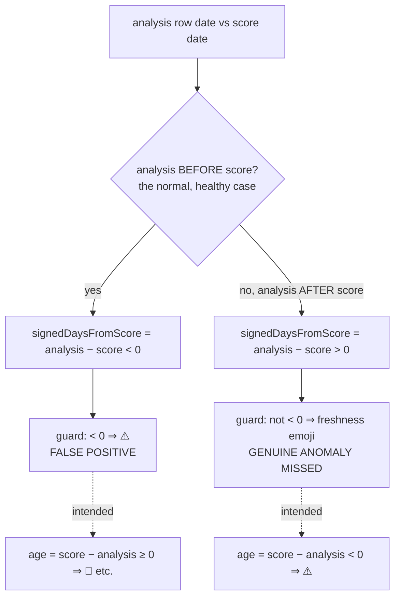

# Fair-value freshness ⚠️ — root-cause investigation (issue #587)

**Status:** RESOLVED in issue #600. This document is the written root-cause
analysis from the diagnose-only round (#587); the suggested fix below — flipping
the sign to `scoreDate − analysisDate` — was applied in `docs/app.js` and
shipped via the cache/app-version bump to **1.1.20**.

## Question

On the **2025-12-28** score date, **NYSE:DD**'s Buy Price shows a ⚠️ beside its
star rating. The ⚠️ is the fair-value **freshness indicator** added by #547
(`getFreshnessIndicator()` in `docs/app.js`). We must establish:

1. Is DD/2025-12-28 a **genuine mis-dated analysis row**, or a **false positive**
   from the indicator's date logic?
2. Resolve the **comment-vs-arithmetic sign discrepancy** the issue flags.
3. Establish whether the cause is **systemic** and **quantify the blast radius**.

## What the shipped code does

`docs/app.js`, `loadAnalysisData()` (~line 731):

```js
// "Negative when the analysis is dated *after* the score date — an invariant
//  the pipeline must never violate."   ← the inline comment
const signedDaysFromScore = Math.floor((analysisDate.getTime() - scoreDate.getTime()) / oneDay);
```

`getFreshnessIndicator()` (~line 933):

```js
if (analysis.signedDaysFromScore < 0) {
    return '⚠️';
}
```

So the indicator renders ⚠️ whenever `floor(analysisDate − scoreDate) < 0`, i.e.
whenever the **analysis row is dated earlier than the score date**.

## The worked example — DD / 2025-12-28

The score file is `docs/scores/2025/December/28.tsv`, so the **score date** is
**2025-12-28**. DD's row in `28-analysis.csv` is:

```text
NYSE:DD,23 Dec 2025,$48.24,5,$47.45,7,4.5,$41.26,...
```

The **analysis date** is **23 Dec 2025** — five days *before* the score date.
Therefore:

- `signedDaysFromScore = floor(23 Dec − 28 Dec) = −5` → `< 0` → **⚠️**.

A fair-value analysis is, in the normal case, **published before** the score
that consumes it — the analyst's fair value pre-exists the score. DD's analysis
predating its score date by five days is completely healthy data. **DD/2025-12-28
is a false positive, not a mis-dated row.**

## Resolving the sign discrepancy

The emoji scale (#547) maps a non-negative *age in days* onto emojis with
**positive** thresholds:

```text
age (whole days) | emoji
0–1  🌹 · 2–3  🌺 · 4–6  🥀 · 7–9  🍁 · 10–13  🍂 · 14+  🕸
```

For those thresholds to ever match, the "age" must be **positive for the normal
case** (analysis published before the score). The quantity that satisfies this is

```text
intended analysis age = floor(scoreDate − analysisDate)   // ≥ 0 for healthy data
```

— the **opposite sign** of the shipped `signedDaysFromScore =
floor(analysisDate − scoreDate)`.

So the **comment describes the intended invariant correctly** (⚠️ should mark
"analysis dated *after* the score date"), but the **arithmetic implements the
negation of it**. The sign is inverted. Consequences of the inversion:

- For healthy data (analysis **before** score) `signedDaysFromScore < 0` → the
  guard fires ⚠️ — a false positive.
- For DD the intended age is `floor(28 Dec − 23 Dec) = +5` → the scale would show
  **🥀** (the 4–6 bucket), never ⚠️.
- A **genuine** anomaly (analysis dated *after* the score) yields
  `signedDaysFromScore > 0`, which maps to a freshness *emoji* — so the indicator
  is **silent on exactly the case it was built to catch**.



## Blast radius (quantified)

`scripts/diagnose_freshness_indicator.ts` re-runs the shipped logic over every
score date in `docs/scores/index.json` and classifies each rated, in-window row.
Result over the committed dataset:

| Metric | Value |
| --- | ---: |
| Score dates scanned | 291 |
| Rated rows inside the 30-day window | 67,934 |
| Rows rendering ⚠️ | **67,709 (99.7%)** |
| · false positives (analysis before score) | 67,709 |
| · genuine anomalies among the ⚠️ rows | 0 |
| Genuine after-score anomalies **missed** by the indicator | 0 |
| Score dates with at least one ⚠️ | 291 (all of them) |

On **2025-12-28** alone, **231** rows render ⚠️ — DD is one of them. The
remaining ~0.3% of rated rows that *don't* show ⚠️ are same-day analyses
(`signedDaysFromScore = 0` → 🌹).

**Conclusion.** The ⚠️ is **systemic and almost universal**: ~99.7% of all rated
fair-value rows trip it, every one a false positive driven by the inverted sign
of `signedDaysFromScore`. DD/2025-12-28 is representative, not special. No row in
the dataset is dated after its score date, so the invariant the comment calls
"must never violate" is in fact never violated — the indicator should
essentially never fire, yet it fires almost always.

## Suggested fix (for the follow-up issue — not applied here)

Measure the analysis age with the sign the scale and the documented invariant
assume:

```js
const signedDaysFromScore = Math.floor((scoreDate.getTime() - analysisDate.getTime()) / oneDay);
```

i.e. `scoreDate − analysisDate`. ⚠️ then fires only when an analysis is genuinely
dated *after* the score date, and the emoji buckets receive the non-negative age
they were designed for. The `getFreshnessIndicator()` guard and the emoji scale
need no other change. (Applying and shipping this is deliberately left to the
separate fix issue.)

## Reproduce

```bash
deno run --allow-read scripts/diagnose_freshness_indicator.ts
```
