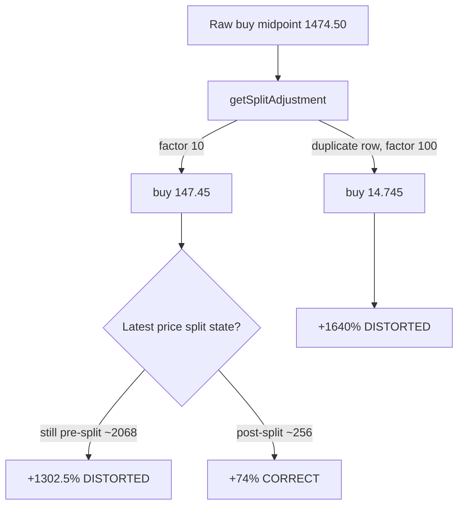

# KLAC split-distortion investigation (issue #291, parent #272)

Investigation/spike that de-risks the #272 code sub-issues by pinning the root
cause with exact numbers, freezing a deterministic regression fixture, and
agreeing the "implausible split coefficient" thresholds. **No production code
is changed by this issue** — the follow-up `projection.js` helper and backend
guard consume the fixture and thresholds documented here.

## 1. Root cause confirmed (with numbers)

KLAC's inflated "Capital" figure traces to the frontend split adjustment in
`docs/projection.js`:

- `getSplitAdjustment(marketData, historicalDate)` (L223-232) walks the stock's
  market data and does `cumulativeSplit *= point.splitCoefficient` for **every**
  point where `point.date > historicalDate && point.splitCoefficient > 1.0`.
  There is **no de-duplication, no plausibility bound, and no reconciliation**
  against the observed buy/current price ratio.
- `getBuyPrice` (L243-267) divides the historical buy midpoint by that
  cumulative factor; `currentPriceFromLatest` (L271-275) returns the raw latest
  midpoint and **assumes it is already post-split**.
- That return feeds the "Capital" column via
  `calculateProgressVsCostOfCapitalValue` (`docs/app.js:2981`) =
  `performance − costOfCapitalReturn`, so any inflation of `performance`
  propagates straight into the reported figure.
- The Rust backend `read_market_data_from_csv` (`src/utils.rs:294-325`) parses
  only `close` and **ignores** the `split_coefficient` column it writes
  (L518/541), so today there is no backend cross-check either.

### The exact mechanism

For a stock bought **before** a split, the buy price must be divided by the
split factor to compare it with the post-split current price. The defect is that
the buy price and the current price can be adjusted **inconsistently**:

| State | Cumulative factor | Buy price | Current price | Reported return |
| --- | --- | --- | --- | --- |
| Distorted (current still **pre-split**) | 10 | 1474.50 / 10 = **147.45** | 2068.00 | **+1302.5%** |
| Reconciled (split applied **both sides**) | 10 | 1474.50 / 10 = **147.45** | 256.63 | **+74.0%** |
| Duplicate split row (no de-dup) | 10 × 10 = **100** | 1474.50 / 100 = **14.745** | 256.63 | **+1640%** |

- Raw buy midpoint = `(1495.00 + 1454.00) / 2 = 1474.50` on the score date
  `2026-03-11`.
- The single recorded `split_coefficient = 10.0` (a 10:1 split) divides the buy
  price to **$147.45** — exactly the "$147.45 buy price" the reporter observed.
- When the latest market row has **not** yet been split-adjusted (still
  ~$2068), the buy price is divided by 10 but the current price is not, so the
  return inflates to **~+1302.5%** — the reported figure.
- Once the same 10:1 split is reflected on **both** sides (current ~$256), the
  figure collapses to the correct **~+74%**.
- A **duplicate** of the split row (the literal no-de-dup defect) compounds the
  factor to 100 and over-divides the buy price to **$14.745**, inflating the
  return even further (~+1640%).

### Live data has self-healed — reproduce from the frozen fixture

The committed `docs/scores/2026/March/11.csv` KLAC series now carries a single
`split_coefficient = 10.0` row **and** post-split latest prices (~$257), so the
real kernels already yield the correct **+74.4%**. The distortion is therefore
reproduced **only** from the frozen fixtures below, never from live state.

## 2. Deterministic fixture

Committed under `tests/fixtures/` (see its `README.md`) and exercised by
`tests/klac_split_distortion_test.ts`, which runs the **real**
`docs/projection.js` kernels:

- `klac_split_distorted.csv` — reproduces **+1302.5%** (factor 10, current
  pre-split).
- `klac_split_reconciled.csv` — the correct **+74.0%** control (factor 10,
  reconciled both sides).
- `control_clean_no_split.csv` — a clean no-split control (+15.0%) so the
  follow-up guard can prove it raises no false positives.

## 3. Proposed thresholds

These feed the `projection.js` helper (#272 follow-up) and the backend guard.

### "Bad / duplicate / implausible split coefficient"

1. **Per-coefficient plausible set.** A single `split_coefficient` is plausible
   only when `1.0 ≤ c ≤ 10.0`. Real splits cluster on small whole or simple
   fractional ratios (2:1, 3:1, 3:2, 4:1, 10:1); anything above 10:1 is rare
   enough to treat as suspect and require reconciliation (below) before use. A
   coefficient `≤ 0` or `NaN` is invalid and must be treated as `1.0`
   (no adjustment).
2. **No duplicate split event within N days.** Two `split_coefficient > 1.0`
   points within **`N = 5` trading days** of each other are treated as the
   **same** event recorded twice — de-duplicate to a single application. (Real
   corporate splits never recur within a week.) This directly prevents the
   factor-100 duplicate case above.
3. **Cumulative-factor plausibility bound.** The cumulative split factor applied
   to a single buy should not exceed **`MAX_CUMULATIVE_FACTOR = 50`** over a
   90-day validation window. A larger factor almost certainly means duplicated
   or spurious coefficients and must be rejected/clamped pending reconciliation.

### "Absolutely reliably reconcilable"

A split adjustment is reconcilable — safe to apply unguarded — only when **all**
hold:

1. **Price-ratio cross-check.** The cumulative factor `F` must be consistent with
   the observed price action: the pre-split price level immediately before the
   split date divided by the post-split level immediately after must equal `F`
   within **±15%** (`abs(observedRatio / F − 1) ≤ 0.15`). In the distorted
   fixture the recorded `F = 10` while the latest price never dropped
   (observed ratio ≈ 0.7), so the cross-check fails decisively.
2. **Implied-return sanity bound.** After applying `F`, the resulting 90-day
   price return must fall within **`−90% … +300%`**. The distorted fixture's
   +1302.5% (and the duplicate's +1640%) blow through the +300% ceiling, while
   the reconciled +74% and the clean control's +15% pass.
3. **Both sides adjusted.** The buy price and the current price must be expressed
   in the **same** split basis — i.e. if the buy price is divided by `F`, the
   latest price must already be post-split (the data-feed invariant the current
   code silently assumes). The recommended robust form is to derive the current
   price's split state from the same coefficient series rather than assuming it.

A coefficient that fails the plausible set or the duplicate window is
**clamped/de-duplicated**; a cumulative factor that fails the reconciliation
checks is **rejected** (treat as `1.0`) and surfaced as a data-quality warning
rather than silently inflating the return.
